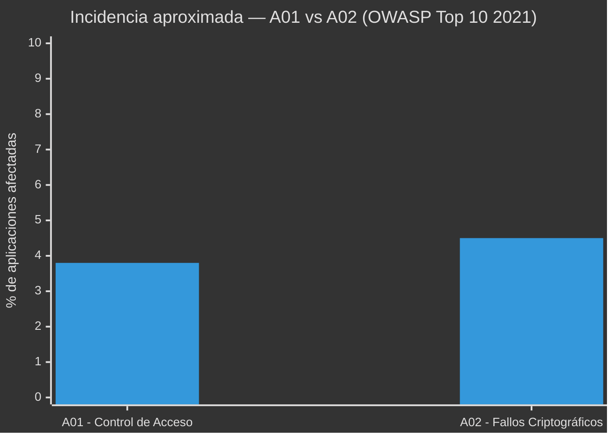
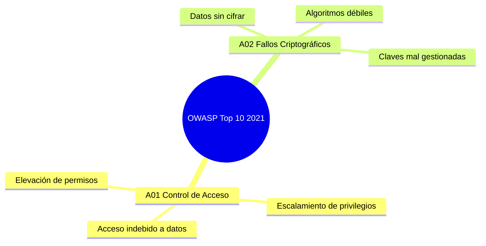
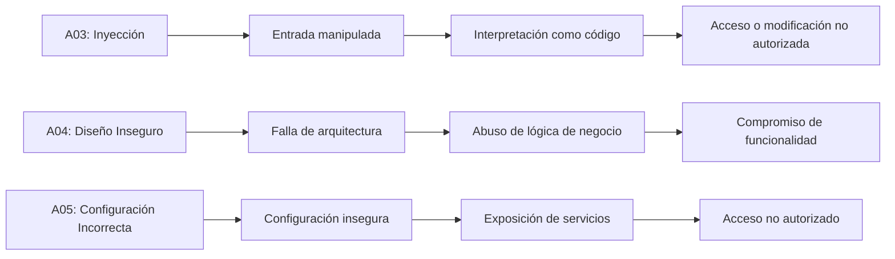
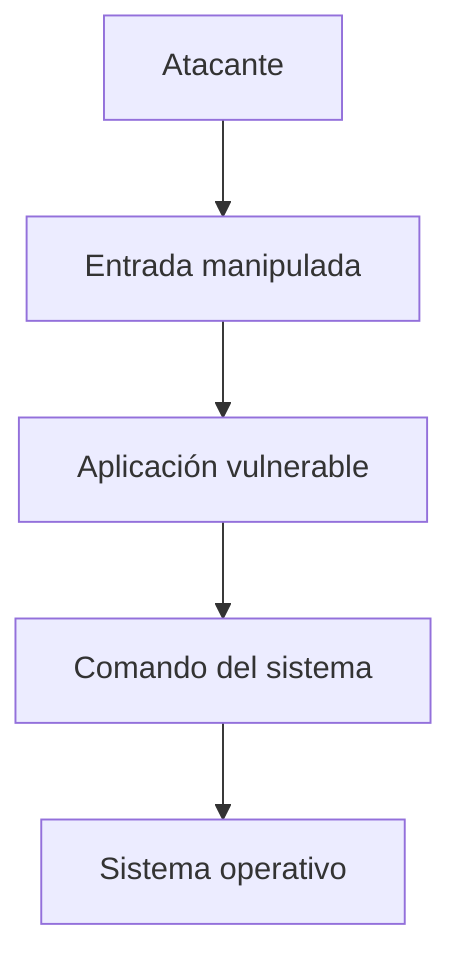
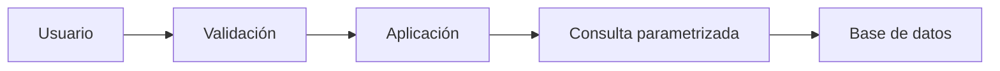
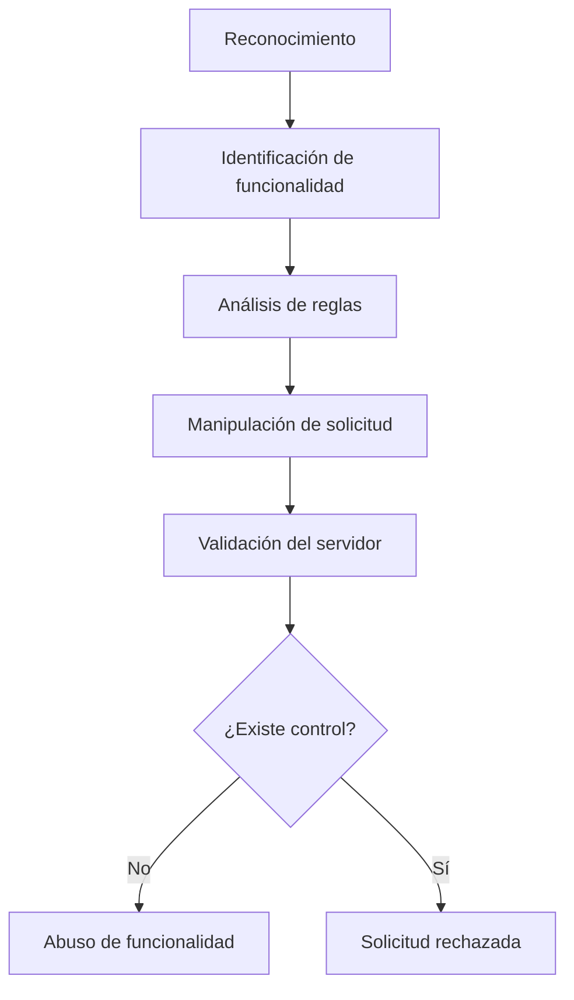
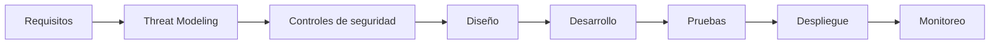
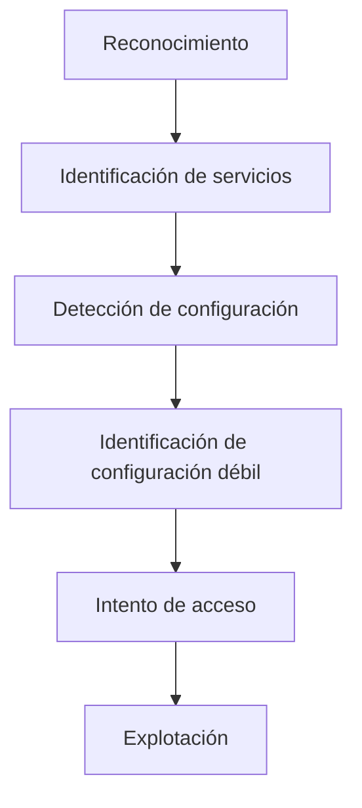
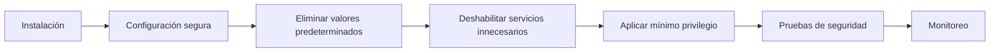
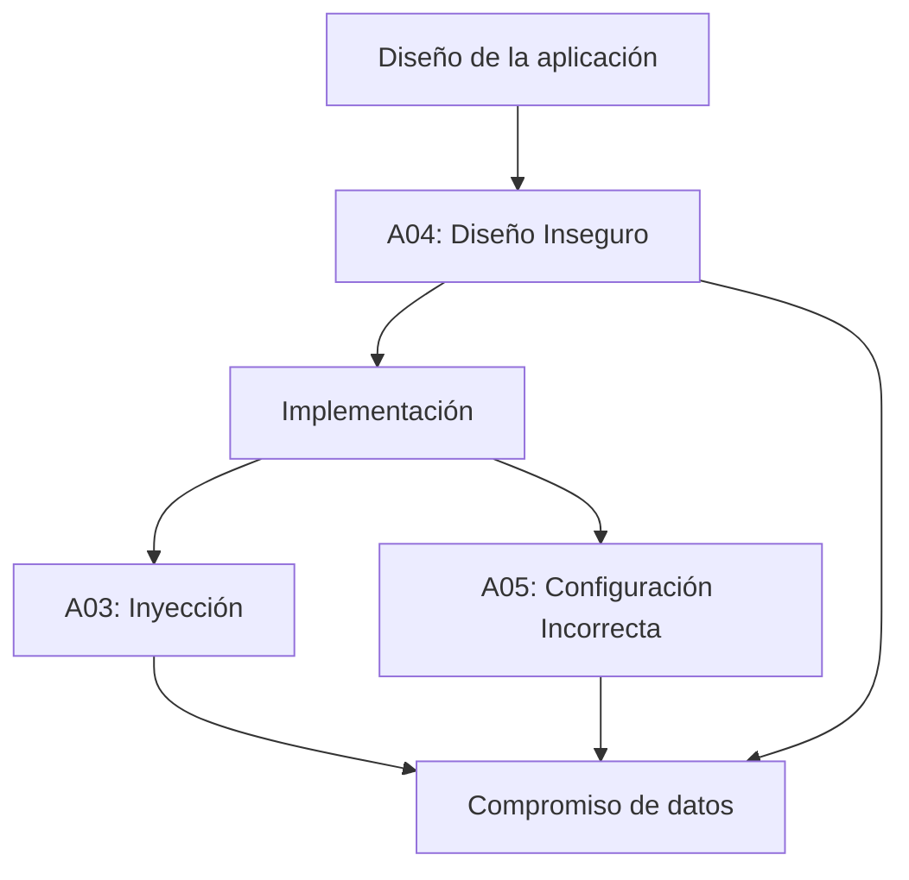

# 🔐 OWASP Top 10 (2021) — A01 y A02: Riesgos de Seguridad en Aplicaciones Web


---

## 👥 Integrantes

| Nombre |
|---|
| William Andres Mosquera Vela |
| Juan Nicolas Pineda Alvarado |
| Johnny Albeiro Mallama Mejia |
| Juan Esteban Contreras Gonzalez |

---

## 📖 Introducción

La seguridad en el desarrollo de software es hoy uno de los pilares fundamentales para proteger la información de los usuarios y la integridad de los sistemas. El **OWASP Top 10** es un documento de referencia elaborado por la *Open Web Application Security Project (OWASP)*, una fundación sin ánimo de lucro dedicada a mejorar la seguridad del software a nivel mundial.

Este documento resume, mediante un consenso amplio de expertos en seguridad, los **diez riesgos más críticos** que afectan a las aplicaciones web. Su propósito es concientizar a desarrolladores, arquitectos de software y equipos de seguridad sobre las vulnerabilidades más comunes y graves, para que puedan prevenirlas desde las primeras etapas del ciclo de vida del desarrollo (diseño, codificación, pruebas y despliegue).

En este repositorio se presenta un análisis detallado de las **dos primeras categorías** de la edición **2021** del OWASP Top 10:

- **A01:2021 — Fallos de Control de Acceso** (la categoría con más incidencia registrada en 2021)
- **A02:2021 — Fallos Criptográficos**

El objetivo es servir como material de estudio y consulta para proyectos académicos y profesionales relacionados con la seguridad informática.

> 📌 Fuente oficial: [owasp.org/Top10/2021](https://owasp.org/Top10/2021/)

---

## 📊 Panorama general

El siguiente gráfico ilustra, de forma aproximada, el porcentaje de aplicaciones analizadas que presentaron cada una de estas dos categorías de vulnerabilidad según los datos recopilados por OWASP para la edición 2021:





---

## 🧩 Detalle de las categorías

### 1️⃣ A01:2021 — Fallos de Control de Acceso

🔒 **¿Qué es?**
El control de acceso es el conjunto de mecanismos que determina qué puede hacer o ver un usuario dentro de una aplicación, según su rol o identidad (por ejemplo, un usuario normal no debería poder ver ni modificar datos de un administrador). Un fallo de control de acceso ocurre cuando estas restricciones no se aplican correctamente en el backend, permitiendo que un usuario actúe fuera de los permisos que le corresponden.

Esta categoría subió de la quinta posición (en la edición 2017) al **primer lugar** en 2021, lo que refleja lo extendido y crítico que es este problema: se detectaron ocurrencias en la gran mayoría de las aplicaciones analizadas por OWASP.

**🧠 Causas más comunes:**
- Verificar permisos solo en el frontend (interfaz visual) y no en el backend (servidor).
- Confiar en el identificador enviado por el propio usuario (IDOR — *Insecure Direct Object Reference*) sin validar si le pertenece.
- No aplicar el principio de "denegar por defecto": otorgar acceso amplio y luego restringir, en vez de al revés.
- Rutas o endpoints de administración accesibles sin autenticación adecuada.
- CORS mal configurado, permitiendo peticiones desde orígenes no autorizados.

**💥 Ejemplos:**
1. Un usuario cambia el valor `id=1023` por `id=1024` en la URL (`miapp.com/perfil?id=1024`) y accede a la información de otra persona.
2. Un empleado normal accede directamente a `/admin/panel` sin que el sistema verifique su rol.
3. Una API permite eliminar registros de otros usuarios simplemente conociendo su identificador (`DELETE /api/pedidos/58`).

**⚠️ Impacto:**
Exposición de datos privados, modificación o eliminación no autorizada de información, fraude, escalamiento de privilegios hasta llegar a comprometer cuentas administrativas.

**🛡️ Recomendaciones de prevención:**
- Aplicar el principio de mínimo privilegio: cada usuario solo accede a lo estrictamente necesario.
- Validar permisos en cada solicitud del lado del servidor, no confiar en el cliente.
- Registrar (loggear) los intentos de acceso denegados para detectar posibles ataques.
- Usar pruebas automatizadas que verifiquen los controles de acceso en cada rol.

---

### 2️⃣ A02:2021 — Fallos Criptográficos

🔑 **¿Qué es?**
Antes llamada "Exposición de Datos Sensibles" (2017), esta categoría fue renombrada para reflejar su causa raíz: fallos en el uso de la criptografía, más que el simple hecho de exponer datos. Ocurre cuando una aplicación no protege adecuadamente la información sensible —contraseñas, datos financieros, información médica, tokens de sesión— ya sea **en tránsito** (mientras viaja por la red) o **en reposo** (mientras está almacenada).

**🧠 Causas más comunes:**
- Transmitir datos sensibles sin cifrado (uso de HTTP en lugar de HTTPS).
- Almacenar contraseñas usando algoritmos débiles o sin "salt" (por ejemplo, MD5 o SHA-1 sin protección adicional) en vez de funciones diseñadas para contraseñas como bcrypt o Argon2.
- Uso de algoritmos de cifrado obsoletos o claves criptográficas demasiado cortas.
- Gestión deficiente de claves: claves cifradas guardadas junto con los datos que protegen, o "hardcodeadas" directamente en el código fuente.
- Certificados SSL/TLS vencidos, autofirmados o mal configurados.

**💥 Ejemplos:**
1. Un formulario de inicio de sesión que envía usuario y contraseña por HTTP en lugar de HTTPS, exponiendo las credenciales a cualquiera que intercepte el tráfico de red.
2. Una base de datos que almacena contraseñas en texto plano o con un algoritmo de hash débil y sin "salt".
3. Una aplicación móvil que guarda tokens de autenticación sin cifrar en el almacenamiento local del dispositivo.

**⚠️ Impacto:**
Robo de credenciales, exposición de datos financieros o médicos, suplantación de identidad, incumplimiento de normativas de protección de datos (como GDPR o leyes locales de habeas data), y pérdida de confianza de los usuarios.

**🛡️ Recomendaciones de prevención:**
- Forzar el uso de HTTPS/TLS en toda la aplicación (incluyendo redirecciones automáticas de HTTP a HTTPS).
- Cifrar los datos sensibles en reposo con algoritmos actualizados y robustos.
- Usar funciones de hash específicas para contraseñas (bcrypt, scrypt o Argon2) en lugar de algoritmos de propósito general.
- Clasificar los datos según su sensibilidad y aplicar controles proporcionales a cada nivel.
- No almacenar datos sensibles que no sean estrictamente necesarios.

---

## 🖼️ Recursos visuales

| Categoría | Icono | Enfoque principal | Ejemplo típico |
|---|---|---|---|
| A01 | 🔒 | Control de acceso | Modificar una URL para ver datos ajenos |
| A02 | 🔑 | Criptografía | Enviar contraseñas por HTTP sin cifrar |

---

## 🎯 Conclusión

Los **Fallos de Control de Acceso (A01)** y los **Fallos Criptográficos (A02)** representan, según OWASP, dos de los riesgos más críticos y frecuentes en las aplicaciones web actuales. El primero falla en decidir *quién puede hacer qué*, y el segundo falla en *proteger la información* una vez que se accede a ella; por eso suelen presentarse combinados en ataques reales. Aplicar controles adecuados —como validación estricta de permisos en el servidor y cifrado robusto de la información— es un primer paso fundamental para reducir la superficie de ataque de cualquier sistema.

---

## 📚 Referencias

- OWASP Foundation. *OWASP Top 10:2021*. Disponible en: https://owasp.org/Top10/2021/
- OWASP Foundation. *OWASP Top Ten Web Application Security Risks*. Disponible en: https://owasp.org/www-project-top-ten/

# 🔐 OWASP Top 10 (2021) — A03, A04 y A05: Vulnerabilidades en Aplicaciones Web


---

## 📖 Introducción

La seguridad en el desarrollo de software es fundamental para proteger la información, los usuarios y la infraestructura tecnológica de una organización. El **OWASP Top 10** es una referencia ampliamente utilizada para identificar los principales riesgos de seguridad presentes en aplicaciones web.

En este documento se presentan tres categorías de la edición **OWASP Top 10:2021**:

- **A03:2021 — Inyección**
- **A04:2021 — Diseño Inseguro**
- **A05:2021 — Configuración de Seguridad Incorrecta**

Para cada vulnerabilidad se analiza su naturaleza, principales causas, impacto potencial, métodos de explotación, herramientas utilizadas por los atacantes y las medidas recomendadas para su prevención y mitigación.

> 📌 **Fuente oficial:** [OWASP Top 10:2021](https://owasp.org/Top10/2021/)

---

## 📊 Panorama general

Las tres categorías analizadas representan diferentes etapas en las que puede aparecer un riesgo de seguridad:



### Comparación de las categorías

| Categoría | Problema principal | Ejemplo | Impacto |
| --- | --- | --- | --- |
| **A03 — Inyección** | Datos interpretados como código | SQL Injection | Robo o modificación de información |
| **A04 — Diseño Inseguro** | Fallas en la arquitectura o lógica | Bypass de reglas de negocio | Fraude o abuso de funcionalidades |
| **A05 — Configuración Incorrecta** | Sistemas configurados de forma insegura | Panel administrativo expuesto | Acceso no autorizado |

---

# 🧩 Detalle de las categorías

---

# 1️⃣ A03:2021 — Inyección

## 💉 ¿Qué es?

La **inyección** ocurre cuando una aplicación incorpora datos proporcionados por un usuario dentro de una instrucción, consulta o comando sin realizar una separación adecuada entre los datos y el código.

Esto puede provocar que una entrada controlada por un atacante sea interpretada como parte de una instrucción ejecutable.

Entre los tipos más conocidos se encuentran:

- SQL Injection (SQLi)
- NoSQL Injection
- OS Command Injection
- LDAP Injection
- XPath Injection
- Cross-Site Scripting (XSS), dependiendo del contexto de clasificación.

### 🧠 Causas más comunes

- Construcción de consultas mediante concatenación de cadenas.
- Falta de validación de las entradas.
- Ausencia de consultas parametrizadas.
- Uso inseguro de comandos del sistema operativo.
- Falta de controles sobre los datos enviados por los usuarios.
- Utilización de cuentas de base de datos con privilegios excesivos.
- Dependencia de mecanismos de seguridad únicamente del lado cliente.

---

## 💥 Impacto

Una vulnerabilidad de inyección puede permitir a un atacante:

- Obtener información almacenada en bases de datos.
- Modificar o eliminar información.
- Evadir mecanismos de autenticación.
- Ejecutar determinadas instrucciones.
- Acceder a información confidencial.
- Comprometer otros componentes de la infraestructura.

| Propiedad | Posible impacto |
| --- | --- |
| 🔒 Confidencialidad | Lectura de información privada |
| 📝 Integridad | Modificación de registros |
| ⚡ Disponibilidad | Eliminación o alteración de recursos |
| 👤 Autenticación | Bypass del inicio de sesión |
| 🖥️ Sistema | Ejecución de comandos en determinados escenarios |

---

## 🔍 Métodos de explotación

Los atacantes normalmente comienzan identificando entradas controladas por el usuario, como:

```text
Parámetros URL
      ↓
Campos de formularios
      ↓
Cookies
      ↓
Headers HTTP
      ↓
Datos enviados a APIs
```

Posteriormente analizan cómo responde la aplicación ante entradas inesperadas o manipuladas.

### SQL Injection

Una aplicación vulnerable puede construir una consulta de esta manera:

```sql
SELECT * FROM usuarios
WHERE usuario = 'entrada'
AND password = 'entrada';
```

El problema aparece cuando las entradas del usuario se incorporan directamente en la consulta.

Una implementación segura debe utilizar **consultas parametrizadas** para mantener separados los datos de la estructura SQL.

### Command Injection

Puede ocurrir cuando una aplicación utiliza información proporcionada por el usuario para construir comandos del sistema operativo.



---

## 🛠️ Herramientas utilizadas

| Herramienta | Utilización |
| --- | --- |
| **Burp Suite** | Interceptar y modificar solicitudes HTTP |
| **OWASP ZAP** | Análisis de seguridad de aplicaciones web |
| **sqlmap** | Automatización de pruebas de SQL Injection |
| **Nmap** | Reconocimiento de servicios |
| **Wireshark** | Análisis del tráfico de red |

> ⚠️ Estas herramientas deben utilizarse únicamente en sistemas propios, laboratorios o infraestructuras donde exista autorización explícita para realizar pruebas.

---

## 🛡️ Prevención y mitigación

Las principales medidas de seguridad son:

- Utilizar consultas SQL parametrizadas.
- Implementar validación de entradas en el servidor.
- Aplicar listas de valores permitidos (*allowlist*) cuando sea posible.
- Evitar concatenar directamente datos del usuario en comandos.
- Utilizar ORM de forma segura.
- Aplicar el principio de mínimo privilegio.
- Mantener actualizadas las dependencias.
- Implementar pruebas de seguridad automatizadas.
- Utilizar mecanismos de protección adicionales como WAF cuando sean apropiados.

### Arquitectura recomendada




---

# 2️⃣ A04:2021 — Diseño Inseguro

## 🏗️ ¿Qué es?

**Diseño Inseguro** hace referencia a vulnerabilidades originadas principalmente por decisiones deficientes de arquitectura, diseño o lógica de negocio.

En este caso, el problema puede existir incluso antes de escribir el código. Una aplicación puede estar correctamente implementada desde el punto de vista sintáctico, pero continuar siendo vulnerable porque su diseño no contempla determinados escenarios de ataque.

### 🧠 Causas más comunes

- Ausencia de análisis de amenazas.
- Falta de requisitos de seguridad.
- No considerar escenarios de abuso.
- Confiar en controles implementados únicamente en el frontend.
- Falta de mecanismos contra automatización.
- Ausencia de límites sobre operaciones sensibles.
- Arquitecturas que no aplican defensa en profundidad.
- Falta de separación entre funcionalidades y privilegios.

---

## 💥 Ejemplos

### Ejemplo 1 — Validación únicamente en frontend

Una aplicación podría impedir visualmente que un usuario introduzca un valor determinado.

```text
Frontend
   │
   ├── "No puede realizar esta operación"
   │
   ▼
Backend
```

Si el backend no realiza nuevamente la validación, un atacante puede enviar directamente una solicitud modificada.

Por esta razón, las restricciones de seguridad **no deben depender exclusivamente de la interfaz del usuario**.

### Ejemplo 2 — Abuso de lógica de negocio

Una plataforma de compras podría tener:

```text
Producto
   ↓
Cupón de descuento
   ↓
Pago
```

Si el diseño no contempla la reutilización indebida de cupones, un atacante podría intentar utilizar repetidamente una promoción.

El problema no necesariamente corresponde a un error de sintaxis o programación, sino a una **falla en el diseño de las reglas de negocio**.

---

## ⚠️ Impacto

| Problema | Posible consecuencia |
| --- | --- |
| Falta de validación backend | Bypass de restricciones |
| Falta de límites | Abuso automatizado |
| Reglas de negocio deficientes | Fraude |
| Recuperación de cuentas insegura | Toma de cuentas |
| Autorización mal diseñada | Escalamiento de privilegios |
| Falta de controles | Manipulación de procesos |

---

## 🔍 Métodos de explotación

Los atacantes pueden estudiar el funcionamiento de una aplicación y manipular las solicitudes para comprobar si las reglas de negocio se cumplen realmente en el servidor.



Algunas técnicas utilizadas incluyen:

- Manipulación de parámetros.
- Repetición de solicitudes.
- Alteración de valores enviados al servidor.
- Manipulación de procesos de negocio.
- Automatización de operaciones.
- Pruebas de límites y restricciones.

---

## 🛠️ Herramientas utilizadas

| Herramienta | Utilización |
| --- | --- |
| **Burp Suite** | Manipulación de solicitudes HTTP |
| **OWASP ZAP** | Análisis de aplicaciones web |
| **Postman** | Pruebas de APIs |
| **DevTools** | Inspección del comportamiento del cliente |
| **Nmap** | Reconocimiento de infraestructura |

---

## 🛡️ Prevención y mitigación

- Realizar **Threat Modeling** durante el diseño.
- Definir requisitos de seguridad antes de desarrollar.
- Validar todas las operaciones críticas en el backend.
- Aplicar autorización en cada operación sensible.
- Implementar límites y *rate limiting*.
- Diseñar mecanismos contra automatización.
- Aplicar el principio de mínimo privilegio.
- Implementar defensa en profundidad.
- Realizar pruebas de abuso de lógica de negocio.
- Revisar periódicamente la arquitectura.

### 🔐 Seguridad desde el diseño



---

# 3️⃣ A05:2021 — Configuración de Seguridad Incorrecta

## ⚙️ ¿Qué es?

La **Configuración de Seguridad Incorrecta** ocurre cuando una aplicación, servidor, base de datos, servicio cloud o componente de infraestructura se encuentra configurado de manera insegura.

El problema puede aparecer tanto por una configuración incorrecta como por mantener configuraciones predeterminadas o funcionalidades que no son necesarias.

### 🧠 Causas más comunes

- Credenciales predeterminadas.
- Funciones innecesarias habilitadas.
- Paneles administrativos expuestos.
- Mensajes de error demasiado detallados.
- Debug habilitado en producción.
- Permisos excesivos.
- Servicios o puertos innecesarios expuestos.
- Falta de actualización de componentes.
- Configuración incorrecta de servicios cloud.
- Headers de seguridad ausentes o incorrectos.

---

## 💥 Ejemplos

### Ejemplo 1 — Modo Debug

Un servidor desplegado en producción podría mostrar información detallada cuando ocurre un error:

```text
Error 500

Database connection failed
Host: 192.168.x.x
Database: production_db
Stack trace:
...
```

Esta información puede ayudar a un atacante a conocer detalles internos de la infraestructura.

### Ejemplo 2 — Credenciales predeterminadas

Un dispositivo o aplicación puede mantener las credenciales originales proporcionadas por el fabricante.

```text
Usuario: admin
Contraseña: contraseña_predeterminada
```

Si estas credenciales no se modifican, un atacante que las conozca podría intentar acceder al sistema.

---

## ⚠️ Impacto

| Configuración | Riesgo |
| --- | --- |
| Credenciales predeterminadas | Acceso no autorizado |
| Debug habilitado | Divulgación de información |
| Directorios públicos | Exposición de archivos |
| Puertos innecesarios | Aumento de superficie de ataque |
| Panel administrativo público | Ataques contra autenticación |
| Permisos excesivos | Escalamiento o abuso |
| Componentes desactualizados | Explotación de vulnerabilidades conocidas |

---

## 🔍 Métodos de explotación

El atacante normalmente comienza realizando reconocimiento para identificar servicios, tecnologías y configuraciones expuestas.



Entre las técnicas utilizadas se encuentran:

- Identificación de servicios expuestos.
- Detección de versiones.
- Búsqueda de configuraciones predeterminadas.
- Identificación de paneles administrativos.
- Análisis de respuestas HTTP.
- Revisión de certificados y configuraciones TLS.
- Enumeración de directorios.
- Identificación de mensajes de error.
- Detección de servicios innecesarios.

---

## 🛠️ Herramientas utilizadas

| Herramienta | Utilización |
| --- | --- |
| **Nmap** | Descubrimiento de puertos y servicios |
| **Burp Suite** | Análisis de solicitudes y respuestas HTTP |
| **OWASP ZAP** | Identificación de problemas de configuración web |
| **Nikto** | Evaluación de configuraciones de servidores web |
| **WhatWeb** | Identificación de tecnologías utilizadas |
| **Gobuster** | Enumeración de recursos y directorios |

---

## 🛡️ Prevención y mitigación

Las organizaciones deben implementar una configuración segura desde el despliegue inicial.

### Recomendaciones

- Eliminar credenciales predeterminadas.
- Deshabilitar funcionalidades innecesarias.
- Desactivar el modo debug en producción.
- Utilizar configuraciones seguras para servidores.
- Mantener actualizados los componentes.
- Aplicar el principio de mínimo privilegio.
- Reducir la cantidad de servicios expuestos.
- Configurar correctamente HTTPS/TLS.
- Implementar headers de seguridad.
- Evitar mostrar información sensible en errores.
- Realizar revisiones periódicas de configuración.
- Automatizar controles de seguridad dentro del pipeline CI/CD.

### 🔐 Proceso de configuración segura




---

# 📊 Comparación general

| Característica | A03 — Inyección | A04 — Diseño Inseguro | A05 — Configuración Incorrecta |
| --- | --- | --- | --- |
| **Origen** | Entrada no controlada | Arquitectura o lógica deficiente | Configuración insegura |
| **Etapa principal** | Desarrollo | Diseño | Implementación/despliegue |
| **Objetivo frecuente** | Manipular instrucciones | Abusar de funcionalidades | Explotar exposición o configuración |
| **Ejemplo** | SQL Injection | Bypass de reglas | Debug habilitado |
| **Herramienta destacada** | sqlmap | Burp Suite | Nmap |
| **Principal defensa** | Parametrización | Secure by Design | Hardening |
| **Impacto** | Datos/sistema | Procesos/negocio | Infraestructura/aplicación |

---

## 📈 Relación entre las vulnerabilidades

Las tres categorías pueden aparecer simultáneamente dentro de una misma aplicación.



Por ejemplo, una aplicación podría tener una arquitectura que no contempla correctamente la validación de entradas (**A04**), implementar consultas SQL inseguras (**A03**) y además desplegarse con una configuración de producción incorrecta (**A05**).

La combinación de varias debilidades puede incrementar considerablemente la superficie de ataque.


---

# 🎯 Conclusión

Las categorías **A03:2021 — Inyección**, **A04:2021 — Diseño Inseguro** y **A05:2021 — Configuración de Seguridad Incorrecta** representan diferentes tipos de debilidades que pueden comprometer la seguridad de una aplicación.

La **Inyección** se produce principalmente cuando los datos externos son interpretados como instrucciones. El **Diseño Inseguro** surge cuando la arquitectura o las reglas de negocio no contemplan adecuadamente escenarios de abuso. Por su parte, la **Configuración de Seguridad Incorrecta** aparece cuando los componentes de una aplicación o infraestructura se despliegan con configuraciones inseguras.

La prevención requiere un enfoque integral que abarque todo el ciclo de vida del software: **diseño seguro, desarrollo seguro, configuración adecuada, pruebas de seguridad, monitoreo y mantenimiento continuo**.

La aplicación de principios como **mínimo privilegio, defensa en profundidad, validación del lado servidor, parametrización, hardening y Threat Modeling** permite reducir significativamente la superficie de ataque y mejorar la postura de seguridad de las aplicaciones.

---

# 📚 Referencias

- OWASP Foundation. **OWASP Top 10:2021 — A03:2021 Injection.**  
  <https://owasp.org/Top10/2021/A03_2021-Injection/>

- OWASP Foundation. **OWASP Top 10:2021 — A04:2021 Insecure Design.**  
  <https://owasp.org/Top10/2021/A04_2021-Insecure_Design/>

- OWASP Foundation. **OWASP Top 10:2021 — A05:2021 Security Misconfiguration.**  
  <https://owasp.org/Top10/2021/A05_2021-Security_Misconfiguration/>

- OWASP Foundation. **OWASP Top 10:2021.**  
  <https://owasp.org/Top10/2021/>

- OWASP Foundation. **OWASP Web Security Testing Guide.**  
  <https://owasp.org/www-project-web-security-testing-guide/>

- OWASP Foundation. **OWASP Cheat Sheet Series.**  
  <https://cheatsheetseries.owasp.org/>
