# 🔐 OWASP Top 10 (2021) — A01 y A02: Riesgos de Seguridad en Aplicaciones Web


---

## 👥 Integrantes

| Nombre |
|---|
| William Andres Mosquera Vela |
| Juan Nicolas Pineda Alvarado |
| Johnny Albeiro Mallama Mejia |
| Juan Esteban Contreras Gonzalez |

---

## 📖 Introducción

La seguridad en el desarrollo de software es hoy uno de los pilares fundamentales para proteger la información de los usuarios y la integridad de los sistemas. El **OWASP Top 10** es un documento de referencia elaborado por la *Open Web Application Security Project (OWASP)*, una fundación sin ánimo de lucro dedicada a mejorar la seguridad del software a nivel mundial.

Este documento resume, mediante un consenso amplio de expertos en seguridad, los **diez riesgos más críticos** que afectan a las aplicaciones web. Su propósito es concientizar a desarrolladores, arquitectos de software y equipos de seguridad sobre las vulnerabilidades más comunes y graves, para que puedan prevenirlas desde las primeras etapas del ciclo de vida del desarrollo (diseño, codificación, pruebas y despliegue).

En este repositorio se presenta un análisis detallado de las **dos primeras categorías** de la edición **2021** del OWASP Top 10:

- **A01:2021 — Fallos de Control de Acceso** (la categoría con más incidencia registrada en 2021)
- **A02:2021 — Fallos Criptográficos**

El objetivo es servir como material de estudio y consulta para proyectos académicos y profesionales relacionados con la seguridad informática.

> 📌 Fuente oficial: [owasp.org/Top10/2021](https://owasp.org/Top10/2021/)

---

## 📊 Panorama general

El siguiente gráfico ilustra, de forma aproximada, el porcentaje de aplicaciones analizadas que presentaron cada una de estas dos categorías de vulnerabilidad según los datos recopilados por OWASP para la edición 2021:

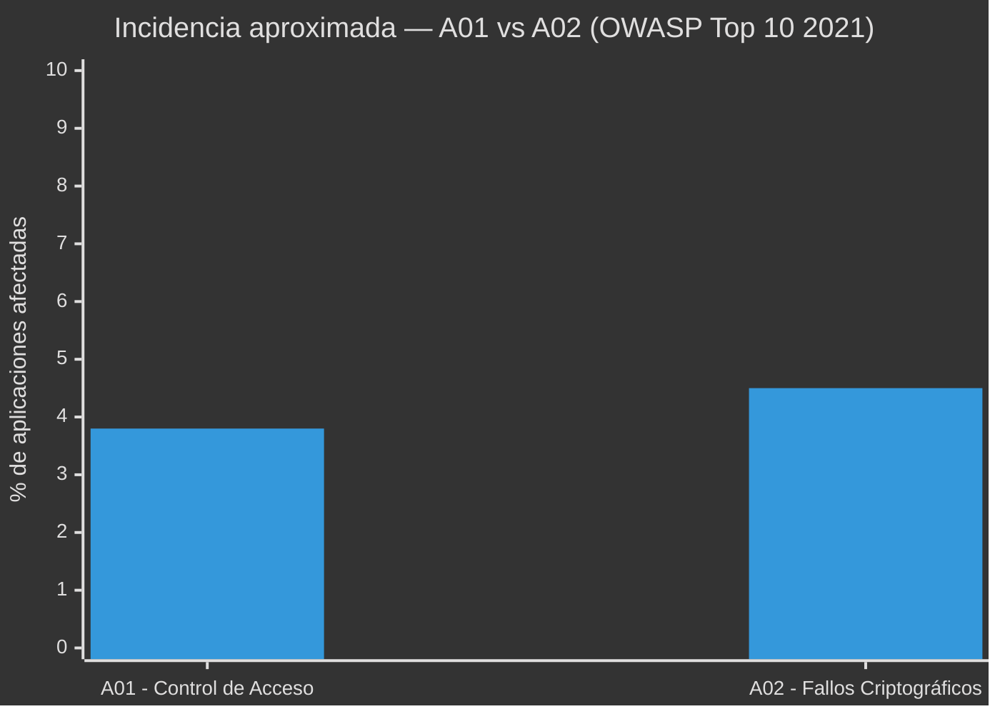

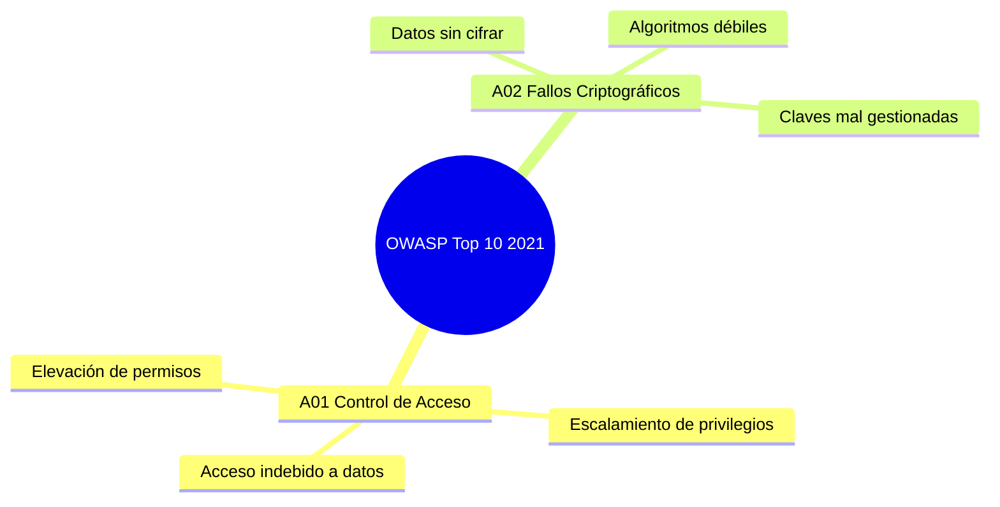

---

## 🧩 Detalle de las categorías

### 1️⃣ A01:2021 — Fallos de Control de Acceso

🔒 **¿Qué es?**
El control de acceso es el conjunto de mecanismos que determina qué puede hacer o ver un usuario dentro de una aplicación, según su rol o identidad (por ejemplo, un usuario normal no debería poder ver ni modificar datos de un administrador). Un fallo de control de acceso ocurre cuando estas restricciones no se aplican correctamente en el backend, permitiendo que un usuario actúe fuera de los permisos que le corresponden.

Esta categoría subió de la quinta posición (en la edición 2017) al **primer lugar** en 2021, lo que refleja lo extendido y crítico que es este problema: se detectaron ocurrencias en la gran mayoría de las aplicaciones analizadas por OWASP.

**🧠 Causas más comunes:**
- Verificar permisos solo en el frontend (interfaz visual) y no en el backend (servidor).
- Confiar en el identificador enviado por el propio usuario (IDOR — *Insecure Direct Object Reference*) sin validar si le pertenece.
- No aplicar el principio de "denegar por defecto": otorgar acceso amplio y luego restringir, en vez de al revés.
- Rutas o endpoints de administración accesibles sin autenticación adecuada.
- CORS mal configurado, permitiendo peticiones desde orígenes no autorizados.

**💥 Ejemplos:**
1. Un usuario cambia el valor `id=1023` por `id=1024` en la URL (`miapp.com/perfil?id=1024`) y accede a la información de otra persona.
2. Un empleado normal accede directamente a `/admin/panel` sin que el sistema verifique su rol.
3. Una API permite eliminar registros de otros usuarios simplemente conociendo su identificador (`DELETE /api/pedidos/58`).

**⚠️ Impacto:**
Exposición de datos privados, modificación o eliminación no autorizada de información, fraude, escalamiento de privilegios hasta llegar a comprometer cuentas administrativas.

**🛡️ Recomendaciones de prevención:**
- Aplicar el principio de mínimo privilegio: cada usuario solo accede a lo estrictamente necesario.
- Validar permisos en cada solicitud del lado del servidor, no confiar en el cliente.
- Registrar (loggear) los intentos de acceso denegados para detectar posibles ataques.
- Usar pruebas automatizadas que verifiquen los controles de acceso en cada rol.

---

### 2️⃣ A02:2021 — Fallos Criptográficos

🔑 **¿Qué es?**
Antes llamada "Exposición de Datos Sensibles" (2017), esta categoría fue renombrada para reflejar su causa raíz: fallos en el uso de la criptografía, más que el simple hecho de exponer datos. Ocurre cuando una aplicación no protege adecuadamente la información sensible —contraseñas, datos financieros, información médica, tokens de sesión— ya sea **en tránsito** (mientras viaja por la red) o **en reposo** (mientras está almacenada).

**🧠 Causas más comunes:**
- Transmitir datos sensibles sin cifrado (uso de HTTP en lugar de HTTPS).
- Almacenar contraseñas usando algoritmos débiles o sin "salt" (por ejemplo, MD5 o SHA-1 sin protección adicional) en vez de funciones diseñadas para contraseñas como bcrypt o Argon2.
- Uso de algoritmos de cifrado obsoletos o claves criptográficas demasiado cortas.
- Gestión deficiente de claves: claves cifradas guardadas junto con los datos que protegen, o "hardcodeadas" directamente en el código fuente.
- Certificados SSL/TLS vencidos, autofirmados o mal configurados.

**💥 Ejemplos:**
1. Un formulario de inicio de sesión que envía usuario y contraseña por HTTP en lugar de HTTPS, exponiendo las credenciales a cualquiera que intercepte el tráfico de red.
2. Una base de datos que almacena contraseñas en texto plano o con un algoritmo de hash débil y sin "salt".
3. Una aplicación móvil que guarda tokens de autenticación sin cifrar en el almacenamiento local del dispositivo.

**⚠️ Impacto:**
Robo de credenciales, exposición de datos financieros o médicos, suplantación de identidad, incumplimiento de normativas de protección de datos (como GDPR o leyes locales de habeas data), y pérdida de confianza de los usuarios.

**🛡️ Recomendaciones de prevención:**
- Forzar el uso de HTTPS/TLS en toda la aplicación (incluyendo redirecciones automáticas de HTTP a HTTPS).
- Cifrar los datos sensibles en reposo con algoritmos actualizados y robustos.
- Usar funciones de hash específicas para contraseñas (bcrypt, scrypt o Argon2) en lugar de algoritmos de propósito general.
- Clasificar los datos según su sensibilidad y aplicar controles proporcionales a cada nivel.
- No almacenar datos sensibles que no sean estrictamente necesarios.

---

## 🖼️ Recursos visuales

| Categoría | Icono | Enfoque principal | Ejemplo típico |
|---|---|---|---|
| A01 | 🔒 | Control de acceso | Modificar una URL para ver datos ajenos |
| A02 | 🔑 | Criptografía | Enviar contraseñas por HTTP sin cifrar |

---

## 🎯 Conclusión

Los **Fallos de Control de Acceso (A01)** y los **Fallos Criptográficos (A02)** representan, según OWASP, dos de los riesgos más críticos y frecuentes en las aplicaciones web actuales. El primero falla en decidir *quién puede hacer qué*, y el segundo falla en *proteger la información* una vez que se accede a ella; por eso suelen presentarse combinados en ataques reales. Aplicar controles adecuados —como validación estricta de permisos en el servidor y cifrado robusto de la información— es un primer paso fundamental para reducir la superficie de ataque de cualquier sistema.

---

## 📚 Referencias

- OWASP Foundation. *OWASP Top 10:2021*. Disponible en: https://owasp.org/Top10/2021/
- OWASP Foundation. *OWASP Top Ten Web Application Security Risks*. Disponible en: https://owasp.org/www-project-top-ten/

# 🔐 OWASP Top 10 (2021) — A03, A04 y A05: Vulnerabilidades en Aplicaciones Web


---

## 📖 Introducción

La seguridad en el desarrollo de software es fundamental para proteger la información, los usuarios y la infraestructura tecnológica de una organización. El **OWASP Top 10** es una referencia ampliamente utilizada para identificar los principales riesgos de seguridad presentes en aplicaciones web.

En este documento se presentan tres categorías de la edición **OWASP Top 10:2021**:

- **A03:2021 — Inyección**
- **A04:2021 — Diseño Inseguro**
- **A05:2021 — Configuración de Seguridad Incorrecta**

Para cada vulnerabilidad se analiza su naturaleza, principales causas, impacto potencial, métodos de explotación, herramientas utilizadas por los atacantes y las medidas recomendadas para su prevención y mitigación.

> 📌 **Fuente oficial:** [OWASP Top 10:2021](https://owasp.org/Top10/2021/)

---

## 📊 Panorama general

Las tres categorías analizadas representan diferentes etapas en las que puede aparecer un riesgo de seguridad:


### Comparación de las categorías

| Categoría | Problema principal | Ejemplo | Impacto |
| --- | --- | --- | --- |
| **A03 — Inyección** | Datos interpretados como código | SQL Injection | Robo o modificación de información |
| **A04 — Diseño Inseguro** | Fallas en la arquitectura o lógica | Bypass de reglas de negocio | Fraude o abuso de funcionalidades |
| **A05 — Configuración Incorrecta** | Sistemas configurados de forma insegura | Panel administrativo expuesto | Acceso no autorizado |

---

# 🧩 Detalle de las categorías

---

# 1️⃣ A03:2021 — Inyección

## 💉 ¿Qué es?

La **inyección** ocurre cuando una aplicación incorpora datos proporcionados por un usuario dentro de una instrucción, consulta o comando sin realizar una separación adecuada entre los datos y el código.

Esto puede provocar que una entrada controlada por un atacante sea interpretada como parte de una instrucción ejecutable.

Entre los tipos más conocidos se encuentran:

- SQL Injection (SQLi)
- NoSQL Injection
- OS Command Injection
- LDAP Injection
- XPath Injection
- Cross-Site Scripting (XSS), dependiendo del contexto de clasificación.

### 🧠 Causas más comunes

- Construcción de consultas mediante concatenación de cadenas.
- Falta de validación de las entradas.
- Ausencia de consultas parametrizadas.
- Uso inseguro de comandos del sistema operativo.
- Falta de controles sobre los datos enviados por los usuarios.
- Utilización de cuentas de base de datos con privilegios excesivos.
- Dependencia de mecanismos de seguridad únicamente del lado cliente.

---

## 💥 Impacto

Una vulnerabilidad de inyección puede permitir a un atacante:

- Obtener información almacenada en bases de datos.
- Modificar o eliminar información.
- Evadir mecanismos de autenticación.
- Ejecutar determinadas instrucciones.
- Acceder a información confidencial.
- Comprometer otros componentes de la infraestructura.

| Propiedad | Posible impacto |
| --- | --- |
| 🔒 Confidencialidad | Lectura de información privada |
| 📝 Integridad | Modificación de registros |
| ⚡ Disponibilidad | Eliminación o alteración de recursos |
| 👤 Autenticación | Bypass del inicio de sesión |
| 🖥️ Sistema | Ejecución de comandos en determinados escenarios |

---

## 🔍 Métodos de explotación

Los atacantes normalmente comienzan identificando entradas controladas por el usuario, como:

```text
Parámetros URL
      ↓
Campos de formularios
      ↓
Cookies
      ↓
Headers HTTP
      ↓
Datos enviados a APIs
```

Posteriormente analizan cómo responde la aplicación ante entradas inesperadas o manipuladas.

### SQL Injection

Una aplicación vulnerable puede construir una consulta de esta manera:

```sql
SELECT * FROM usuarios
WHERE usuario = 'entrada'
AND password = 'entrada';
```

El problema aparece cuando las entradas del usuario se incorporan directamente en la consulta.

Una implementación segura debe utilizar **consultas parametrizadas** para mantener separados los datos de la estructura SQL.

### Command Injection

Puede ocurrir cuando una aplicación utiliza información proporcionada por el usuario para construir comandos del sistema operativo.

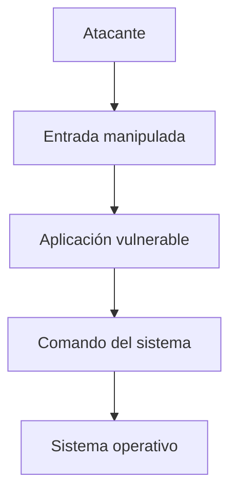

---

## 🛠️ Herramientas utilizadas

| Herramienta | Utilización |
| --- | --- |
| **Burp Suite** | Interceptar y modificar solicitudes HTTP |
| **OWASP ZAP** | Análisis de seguridad de aplicaciones web |
| **sqlmap** | Automatización de pruebas de SQL Injection |
| **Nmap** | Reconocimiento de servicios |
| **Wireshark** | Análisis del tráfico de red |

> ⚠️ Estas herramientas deben utilizarse únicamente en sistemas propios, laboratorios o infraestructuras donde exista autorización explícita para realizar pruebas.

---

## 🛡️ Prevención y mitigación

Las principales medidas de seguridad son:

- Utilizar consultas SQL parametrizadas.
- Implementar validación de entradas en el servidor.
- Aplicar listas de valores permitidos (*allowlist*) cuando sea posible.
- Evitar concatenar directamente datos del usuario en comandos.
- Utilizar ORM de forma segura.
- Aplicar el principio de mínimo privilegio.
- Mantener actualizadas las dependencias.
- Implementar pruebas de seguridad automatizadas.
- Utilizar mecanismos de protección adicionales como WAF cuando sean apropiados.

### Arquitectura recomendada

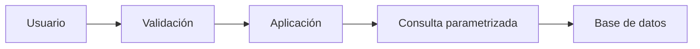


---

# 2️⃣ A04:2021 — Diseño Inseguro

## 🏗️ ¿Qué es?

**Diseño Inseguro** hace referencia a vulnerabilidades originadas principalmente por decisiones deficientes de arquitectura, diseño o lógica de negocio.

En este caso, el problema puede existir incluso antes de escribir el código. Una aplicación puede estar correctamente implementada desde el punto de vista sintáctico, pero continuar siendo vulnerable porque su diseño no contempla determinados escenarios de ataque.

### 🧠 Causas más comunes

- Ausencia de análisis de amenazas.
- Falta de requisitos de seguridad.
- No considerar escenarios de abuso.
- Confiar en controles implementados únicamente en el frontend.
- Falta de mecanismos contra automatización.
- Ausencia de límites sobre operaciones sensibles.
- Arquitecturas que no aplican defensa en profundidad.
- Falta de separación entre funcionalidades y privilegios.

---

## 💥 Ejemplos

### Ejemplo 1 — Validación únicamente en frontend

Una aplicación podría impedir visualmente que un usuario introduzca un valor determinado.

```text
Frontend
   │
   ├── "No puede realizar esta operación"
   │
   ▼
Backend
```

Si el backend no realiza nuevamente la validación, un atacante puede enviar directamente una solicitud modificada.

Por esta razón, las restricciones de seguridad **no deben depender exclusivamente de la interfaz del usuario**.

### Ejemplo 2 — Abuso de lógica de negocio

Una plataforma de compras podría tener:

```text
Producto
   ↓
Cupón de descuento
   ↓
Pago
```

Si el diseño no contempla la reutilización indebida de cupones, un atacante podría intentar utilizar repetidamente una promoción.

El problema no necesariamente corresponde a un error de sintaxis o programación, sino a una **falla en el diseño de las reglas de negocio**.

---

## ⚠️ Impacto

| Problema | Posible consecuencia |
| --- | --- |
| Falta de validación backend | Bypass de restricciones |
| Falta de límites | Abuso automatizado |
| Reglas de negocio deficientes | Fraude |
| Recuperación de cuentas insegura | Toma de cuentas |
| Autorización mal diseñada | Escalamiento de privilegios |
| Falta de controles | Manipulación de procesos |

---

## 🔍 Métodos de explotación

Los atacantes pueden estudiar el funcionamiento de una aplicación y manipular las solicitudes para comprobar si las reglas de negocio se cumplen realmente en el servidor.

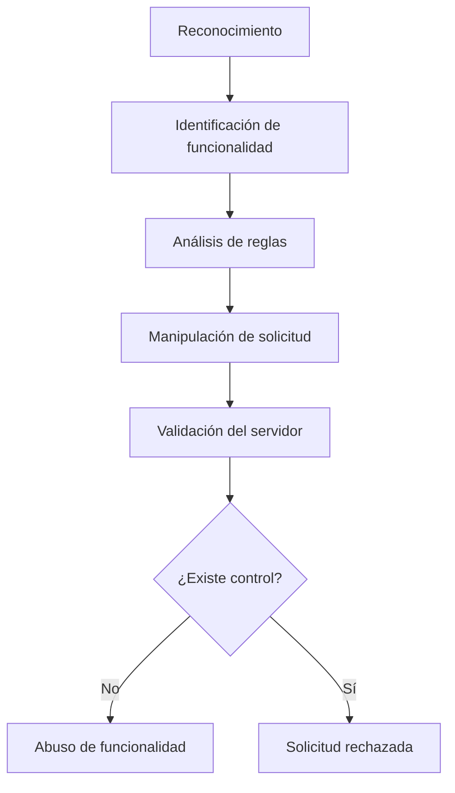

Algunas técnicas utilizadas incluyen:

- Manipulación de parámetros.
- Repetición de solicitudes.
- Alteración de valores enviados al servidor.
- Manipulación de procesos de negocio.
- Automatización de operaciones.
- Pruebas de límites y restricciones.

---

## 🛠️ Herramientas utilizadas

| Herramienta | Utilización |
| --- | --- |
| **Burp Suite** | Manipulación de solicitudes HTTP |
| **OWASP ZAP** | Análisis de aplicaciones web |
| **Postman** | Pruebas de APIs |
| **DevTools** | Inspección del comportamiento del cliente |
| **Nmap** | Reconocimiento de infraestructura |

---

## 🛡️ Prevención y mitigación

- Realizar **Threat Modeling** durante el diseño.
- Definir requisitos de seguridad antes de desarrollar.
- Validar todas las operaciones críticas en el backend.
- Aplicar autorización en cada operación sensible.
- Implementar límites y *rate limiting*.
- Diseñar mecanismos contra automatización.
- Aplicar el principio de mínimo privilegio.
- Implementar defensa en profundidad.
- Realizar pruebas de abuso de lógica de negocio.
- Revisar periódicamente la arquitectura.

### 🔐 Seguridad desde el diseño

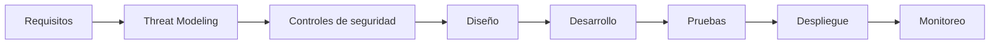

---

# 3️⃣ A05:2021 — Configuración de Seguridad Incorrecta

## ⚙️ ¿Qué es?

La **Configuración de Seguridad Incorrecta** ocurre cuando una aplicación, servidor, base de datos, servicio cloud o componente de infraestructura se encuentra configurado de manera insegura.

El problema puede aparecer tanto por una configuración incorrecta como por mantener configuraciones predeterminadas o funcionalidades que no son necesarias.

### 🧠 Causas más comunes

- Credenciales predeterminadas.
- Funciones innecesarias habilitadas.
- Paneles administrativos expuestos.
- Mensajes de error demasiado detallados.
- Debug habilitado en producción.
- Permisos excesivos.
- Servicios o puertos innecesarios expuestos.
- Falta de actualización de componentes.
- Configuración incorrecta de servicios cloud.
- Headers de seguridad ausentes o incorrectos.

---

## 💥 Ejemplos

### Ejemplo 1 — Modo Debug

Un servidor desplegado en producción podría mostrar información detallada cuando ocurre un error:

```text
Error 500

Database connection failed
Host: 192.168.x.x
Database: production_db
Stack trace:
...
```

Esta información puede ayudar a un atacante a conocer detalles internos de la infraestructura.

### Ejemplo 2 — Credenciales predeterminadas

Un dispositivo o aplicación puede mantener las credenciales originales proporcionadas por el fabricante.

```text
Usuario: admin
Contraseña: contraseña_predeterminada
```

Si estas credenciales no se modifican, un atacante que las conozca podría intentar acceder al sistema.

---

## ⚠️ Impacto

| Configuración | Riesgo |
| --- | --- |
| Credenciales predeterminadas | Acceso no autorizado |
| Debug habilitado | Divulgación de información |
| Directorios públicos | Exposición de archivos |
| Puertos innecesarios | Aumento de superficie de ataque |
| Panel administrativo público | Ataques contra autenticación |
| Permisos excesivos | Escalamiento o abuso |
| Componentes desactualizados | Explotación de vulnerabilidades conocidas |

---

## 🔍 Métodos de explotación

El atacante normalmente comienza realizando reconocimiento para identificar servicios, tecnologías y configuraciones expuestas.

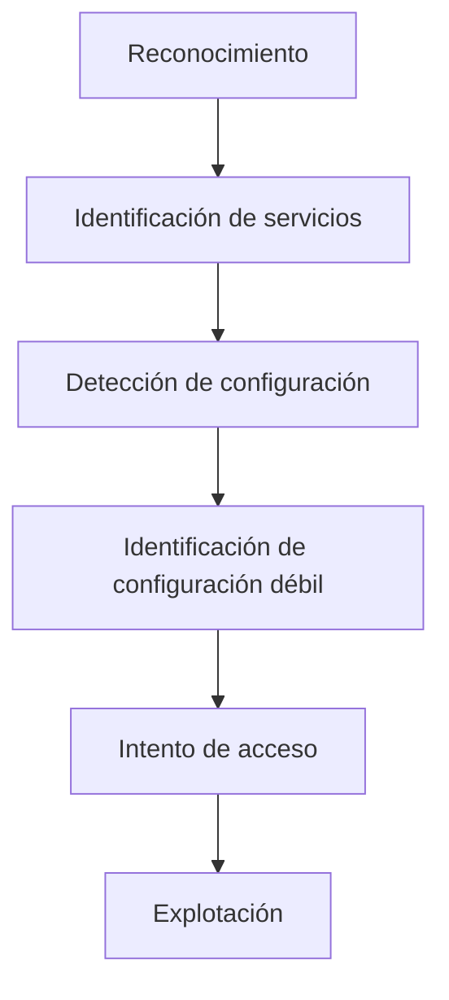

Entre las técnicas utilizadas se encuentran:

- Identificación de servicios expuestos.
- Detección de versiones.
- Búsqueda de configuraciones predeterminadas.
- Identificación de paneles administrativos.
- Análisis de respuestas HTTP.
- Revisión de certificados y configuraciones TLS.
- Enumeración de directorios.
- Identificación de mensajes de error.
- Detección de servicios innecesarios.

---

## 🛠️ Herramientas utilizadas

| Herramienta | Utilización |
| --- | --- |
| **Nmap** | Descubrimiento de puertos y servicios |
| **Burp Suite** | Análisis de solicitudes y respuestas HTTP |
| **OWASP ZAP** | Identificación de problemas de configuración web |
| **Nikto** | Evaluación de configuraciones de servidores web |
| **WhatWeb** | Identificación de tecnologías utilizadas |
| **Gobuster** | Enumeración de recursos y directorios |

---

## 🛡️ Prevención y mitigación

Las organizaciones deben implementar una configuración segura desde el despliegue inicial.

### Recomendaciones

- Eliminar credenciales predeterminadas.
- Deshabilitar funcionalidades innecesarias.
- Desactivar el modo debug en producción.
- Utilizar configuraciones seguras para servidores.
- Mantener actualizados los componentes.
- Aplicar el principio de mínimo privilegio.
- Reducir la cantidad de servicios expuestos.
- Configurar correctamente HTTPS/TLS.
- Implementar headers de seguridad.
- Evitar mostrar información sensible en errores.
- Realizar revisiones periódicas de configuración.
- Automatizar controles de seguridad dentro del pipeline CI/CD.

### 🔐 Proceso de configuración segura

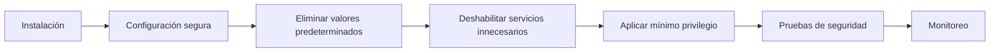


---

# 📊 Comparación general

| Característica | A03 — Inyección | A04 — Diseño Inseguro | A05 — Configuración Incorrecta |
| --- | --- | --- | --- |
| **Origen** | Entrada no controlada | Arquitectura o lógica deficiente | Configuración insegura |
| **Etapa principal** | Desarrollo | Diseño | Implementación/despliegue |
| **Objetivo frecuente** | Manipular instrucciones | Abusar de funcionalidades | Explotar exposición o configuración |
| **Ejemplo** | SQL Injection | Bypass de reglas | Debug habilitado |
| **Herramienta destacada** | sqlmap | Burp Suite | Nmap |
| **Principal defensa** | Parametrización | Secure by Design | Hardening |
| **Impacto** | Datos/sistema | Procesos/negocio | Infraestructura/aplicación |

---

## 📈 Relación entre las vulnerabilidades

Las tres categorías pueden aparecer simultáneamente dentro de una misma aplicación.


Por ejemplo, una aplicación podría tener una arquitectura que no contempla correctamente la validación de entradas (**A04**), implementar consultas SQL inseguras (**A03**) y además desplegarse con una configuración de producción incorrecta (**A05**).

La combinación de varias debilidades puede incrementar considerablemente la superficie de ataque.


---

# 🎯 Conclusión

Las categorías **A03:2021 — Inyección**, **A04:2021 — Diseño Inseguro** y **A05:2021 — Configuración de Seguridad Incorrecta** representan diferentes tipos de debilidades que pueden comprometer la seguridad de una aplicación.

La **Inyección** se produce principalmente cuando los datos externos son interpretados como instrucciones. El **Diseño Inseguro** surge cuando la arquitectura o las reglas de negocio no contemplan adecuadamente escenarios de abuso. Por su parte, la **Configuración de Seguridad Incorrecta** aparece cuando los componentes de una aplicación o infraestructura se despliegan con configuraciones inseguras.

La prevención requiere un enfoque integral que abarque todo el ciclo de vida del software: **diseño seguro, desarrollo seguro, configuración adecuada, pruebas de seguridad, monitoreo y mantenimiento continuo**.

La aplicación de principios como **mínimo privilegio, defensa en profundidad, validación del lado servidor, parametrización, hardening y Threat Modeling** permite reducir significativamente la superficie de ataque y mejorar la postura de seguridad de las aplicaciones.

# 📚 Referencias

- OWASP Foundation. **OWASP Top 10:2021 — A03:2021 Injection.**  
  <https://owasp.org/Top10/2021/A03_2021-Injection/>

- OWASP Foundation. **OWASP Top 10:2021 — A04:2021 Insecure Design.**  
  <https://owasp.org/Top10/2021/A04_2021-Insecure_Design/>

- OWASP Foundation. **OWASP Top 10:2021 — A05:2021 Security Misconfiguration.**  
  <https://owasp.org/Top10/2021/A05_2021-Security_Misconfiguration/>

- OWASP Foundation. **OWASP Top 10:2021.**  
  <https://owasp.org/Top10/2021/>

- OWASP Foundation. **OWASP Web Security Testing Guide.**  
  <https://owasp.org/www-project-web-security-testing-guide/>

- OWASP Foundation. **OWASP Cheat Sheet Series.**  
  <https://cheatsheetseries.owasp.org/>


---

# 4️⃣ A06:2021 – Componentes Vulnerables y Desactualizados

## 🧩 Introducción

Las aplicaciones web modernas rara vez están construidas completamente desde cero. Los desarrolladores utilizan frameworks, librerías, paquetes, servidores, sistemas operativos y otros componentes desarrollados por terceros.

Esto permite desarrollar aplicaciones de manera más rápida, pero también introduce riesgos de seguridad.

El riesgo **A06:2021 – Componentes Vulnerables y Desactualizados** del OWASP Top 10 ocurre cuando una aplicación utiliza componentes que contienen vulnerabilidades conocidas, se encuentran desactualizados, ya no reciben soporte o no son administrados adecuadamente.

> 💡 Una aplicación puede tener código propio aparentemente seguro y aun así ser vulnerable debido a una dependencia de terceros.

---

## 🧠 ¿Qué es un componente?

Un componente es una pieza de software que forma parte de una aplicación o de la infraestructura que la soporta.

Algunos ejemplos son:

- Frameworks.
- Librerías.
- Paquetes.
- APIs.
- Servidores web.
- Sistemas operativos.
- Servidores de aplicaciones.
- Sistemas gestores de bases de datos.
- Plugins.
- Runtimes.
- Dependencias de terceros.

Por ejemplo, una aplicación desarrollada en Python podría utilizar:

```text
Aplicación Web
│
├── Python
├── Flask
├── Requests
├── SQLAlchemy
├── PostgreSQL
└── Otras librerías
```

Cada uno de estos componentes puede introducir dependencias adicionales.

---

## 🔗 Dependencias directas y transitivas

Este concepto es fundamental para comprender A06.

### Dependencia directa

Es un componente que nuestro proyecto utiliza directamente.

Ejemplo:

```text
Mi aplicación
      │
      └── Flask
```

Nosotros decidimos instalar Flask.

### Dependencia transitiva

Es una dependencia utilizada por otro componente que nosotros instalamos.

Ejemplo:

```text
Mi aplicación
      │
      └── Framework
             │
             └── Librería A
                    │
                    └── Librería B
```

Aunque nosotros nunca instalamos directamente la Librería B, nuestra aplicación puede depender de ella.

> ⚠️ Una vulnerabilidad en una dependencia transitiva también puede afectar nuestra aplicación.

---

## 🔴 ¿Cuándo tenemos un problema A06?

Podemos encontrar A06 cuando:

- Utilizamos una librería con vulnerabilidades conocidas.
- Utilizamos componentes sin actualizar durante largos periodos.
- Utilizamos software que ya no recibe soporte.
- No conocemos las versiones exactas de nuestras dependencias.
- No analizamos las dependencias de manera periódica.
- Utilizamos componentes obtenidos de fuentes no confiables.
- Tenemos dependencias innecesarias.
- No conocemos las dependencias transitivas.
- No tenemos un inventario de los componentes utilizados.

---

## 📊 Ejemplo sencillo

Supongamos que tenemos una tienda virtual:

```text
                    🛒 TIENDA WEB
                         │
        ┌────────────────┼────────────────┐
        │                │                │
      Frontend        Backend          Base de datos
        │                │                │
     React/JS          Flask           PostgreSQL
                         │
                 ┌───────┴───────┐
                 │               │
              Requests       Librería X
                                 │
                          ⚠️ Vulnerabilidad
```

El desarrollador puede no haber escrito la Librería X.

Sin embargo, si la aplicación la utiliza directa o indirectamente, puede verse afectada.

---

# 🕵️ ¿Cómo puede aprovecharlo un atacante?

El atacante puede intentar descubrir qué tecnologías utiliza una aplicación.

Un escenario simplificado sería:

```text
        🔴 ATACANTE
             │
             ▼
     Identifica tecnología
             │
             ▼
     Identifica versión
             │
             ▼
     Busca vulnerabilidades
             │
             ▼
      ¿Existe una CVE?
          /       \
        Sí         No
        │           │
        ▼           ▼
  Investiga       Busca
  explotación     otra vía
```

Por esta razón, conocer y administrar las versiones de los componentes es una actividad importante dentro de la seguridad del software.

---

# 📚 Conceptos importantes: CVE, CWE y CVSS

Estos tres términos suelen aparecer juntos cuando estudiamos vulnerabilidades.

## 🆔 CVE

**CVE – Common Vulnerabilities and Exposures**

Es un sistema utilizado para identificar vulnerabilidades de seguridad conocidas mediante identificadores únicos.

Ejemplo:

```text
CVE-2021-XXXXX
```

El identificador permite referenciar una vulnerabilidad específica.

---

## 🧱 CWE

**CWE – Common Weakness Enumeration**

Describe categorías de debilidades de software.

Por ejemplo:

```text
CWE-1104
Use of Unmaintained Third Party Components
```

En términos sencillos:

```text
CVE = Identifica una vulnerabilidad específica

CWE = Describe el tipo de debilidad
```

---

## 📈 CVSS

**CVSS – Common Vulnerability Scoring System**

Permite expresar la severidad técnica de una vulnerabilidad mediante una puntuación.

De forma simplificada:

```text
Vulnerabilidad
      │
      ▼
Características técnicas
      │
      ▼
Explotabilidad + Impacto
      │
      ▼
Puntuación CVSS
```

### 📌 Diferencia

| Concepto | Significado |
|---|---|
| CVE | Identificador de una vulnerabilidad |
| CWE | Categoría de una debilidad |
| CVSS | Evaluación de severidad |

---

# 🔎 ¿Qué significa "desactualizado"?

Un componente desactualizado es aquel que utiliza una versión antigua cuando existen versiones posteriores.

Ejemplo:

```text
Versión instalada
       │
       ▼
Librería X 1.2
       │
       │
       ▼
Versiones disponibles
       │
       ├── 1.3
       ├── 1.4
       └── 2.0
```

El hecho de que exista una versión nueva **no significa automáticamente que la versión anterior sea vulnerable**.

Sin embargo, mantener componentes antiguos puede aumentar el riesgo, especialmente cuando:

- Ya no reciben soporte.
- Existen vulnerabilidades conocidas.
- No reciben parches de seguridad.
- El fabricante recomienda actualizar.

---

# ⚠️ Componentes sin mantenimiento

Otro escenario importante ocurre cuando un proyecto deja de recibir mantenimiento.

Ejemplo:

```text
Librería X
│
├── Última actualización: hace varios años
├── Sin nuevos parches
├── Issues sin resolver
├── Sin soporte activo
└── Vulnerabilidades conocidas
```

Esto representa un riesgo porque una organización puede depender de un componente que ya no recibe correcciones.

---

# 🧬 Dependencias transitivas

Veamos un ejemplo más completo:

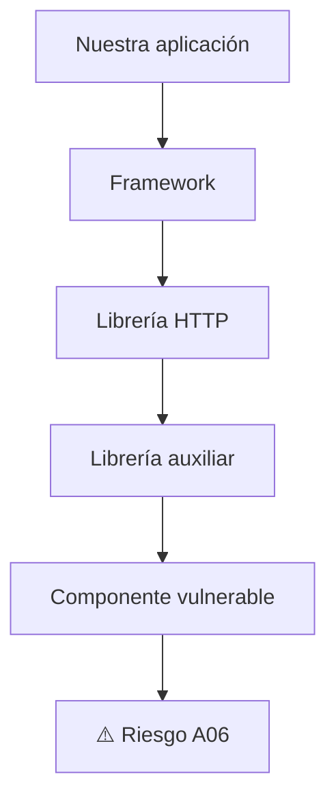

La aplicación puede terminar utilizando un componente vulnerable sin que el desarrollador lo haya agregado directamente.

Por esto es importante conocer el árbol completo de dependencias.

---

# 🧰 ¿Qué es SCA?

**SCA – Software Composition Analysis**

Es el análisis de los componentes y dependencias de una aplicación con el objetivo de identificar riesgos, versiones y vulnerabilidades conocidas.

Podemos imaginarlo así:

```text
              📦 PROYECTO
                   │
                   ▼
             Analizador SCA
                   │
          ┌────────┼────────┐
          ▼        ▼        ▼
      Librería A Librería B Librería C
          │        │        │
          ▼        ▼        ▼
        CVE?     CVE?      CVE?
          │        │        │
          └────────┼────────┘
                   ▼
              📊 Reporte
```

Una herramienta SCA puede ayudarnos a identificar:

- Dependencias.
- Versiones.
- Vulnerabilidades conocidas.
- Componentes obsoletos.
- Dependencias transitivas.
- Riesgos asociados.

---

# 🛠️ Herramientas relacionadas con A06

Algunas herramientas que podemos estudiar son:

### OWASP Dependency-Check

Analiza dependencias de proyectos y busca vulnerabilidades conocidas.

### npm audit

Permite analizar vulnerabilidades en proyectos que utilizan paquetes de Node.js.

```bash
npm audit
```

### pip-audit

Permite analizar dependencias de proyectos Python.

```bash
pip-audit
```

### Dependabot

Puede ayudar a detectar dependencias vulnerables y proponer actualizaciones en proyectos alojados en GitHub.

---

# 📦 ¿Qué es una SBOM?

**SBOM – Software Bill of Materials**

Una SBOM puede entenderse como la "lista de ingredientes" de un software.

Por ejemplo:

```text
Aplicación: TiendaWeb
│
├── Python
├── Flask
├── Requests
├── SQLAlchemy
├── PostgreSQL Driver
└── Otras dependencias
```

Una SBOM permite conocer qué componentes forman parte de un producto de software.

### 🍔 Analogía

Podemos compararlo con una hamburguesa:

```text
🍔 Software
│
├── Pan
├── Carne
├── Queso
├── Salsa
└── Vegetales
```

Si descubrimos que uno de los ingredientes tiene un problema, necesitamos saber qué productos contienen ese ingrediente.

Con el software sucede algo similar.

---

# 🔄 Ciclo de gestión de dependencias

Una buena estrategia no consiste solamente en actualizar todo inmediatamente.

Se recomienda establecer un proceso:

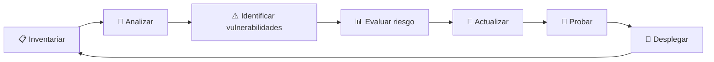

### 1. Inventariar

Conocer qué componentes tenemos.

### 2. Analizar

Revisar versiones y vulnerabilidades.

### 3. Evaluar

Determinar qué vulnerabilidades representan mayor riesgo.

### 4. Actualizar

Aplicar versiones corregidas cuando corresponda.

### 5. Probar

Verificar que la actualización no rompa la aplicación.

### 6. Desplegar

Llevar los cambios al entorno correspondiente.

### 7. Monitorear

Continuar revisando las dependencias.

---

# 💻 Ejemplo práctico con Python

Supongamos que tenemos:

```text
requirements.txt
```

Con:

```text
Flask
requests
```

Podemos instalar las dependencias:

```bash
pip install -r requirements.txt
```

Posteriormente podemos realizar una auditoría:

```bash
pip-audit
```

El objetivo del ejercicio es identificar si alguna dependencia tiene vulnerabilidades conocidas.

---

# 🧪 Laboratorio propuesto – A06

## Objetivo

Identificar, analizar y corregir vulnerabilidades relacionadas con dependencias de terceros.

### Paso 1 – Crear proyecto

```bash
mkdir laboratorio-a06
cd laboratorio-a06
```

### Paso 2 – Crear entorno virtual

```bash
python -m venv venv
```

Activación en Windows:

```bash
venv\Scripts\activate
```

### Paso 3 – Crear archivo de dependencias

```text
requirements.txt
```

Ejemplo:

```text
Flask
requests
```

### Paso 4 – Instalar dependencias

```bash
pip install -r requirements.txt
```

### Paso 5 – Ejecutar auditoría

```bash
pip-audit
```

### Paso 6 – Analizar resultados

Registrar:

```text
Dependencia
Versión instalada
Vulnerabilidad
Severidad
Versión corregida
Acción recomendada
```

### Paso 7 – Actualizar

Actualizar las dependencias afectadas.

```bash
pip install --upgrade nombre-paquete
```

### Paso 8 – Ejecutar nuevamente

```bash
pip-audit
```

### Paso 9 – Comparar

```text
ANTES
│
├── Dependencia vulnerable
└── ⚠️ Riesgo

        ↓ ACTUALIZACIÓN

DESPUÉS
│
├── Dependencia actualizada
└── ✅ Riesgo reducido
```

---

# 🛡️ ¿Cómo prevenir A06?

Las principales medidas son:

- Mantener un inventario de componentes.
- Conocer las versiones utilizadas.
- Analizar dependencias periódicamente.
- Utilizar herramientas SCA.
- Mantener las dependencias actualizadas.
- Eliminar dependencias innecesarias.
- Evitar componentes sin mantenimiento.
- Utilizar fuentes confiables.
- Revisar dependencias transitivas.
- Implementar análisis de dependencias dentro del CI/CD.
- Mantener una SBOM cuando sea apropiado.
- Establecer procesos para responder ante nuevas vulnerabilidades.

---

# 🔐 A06 dentro de DevSecOps

A06 puede integrarse directamente en el ciclo DevSecOps.

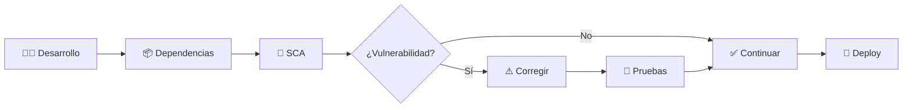

La idea es detectar problemas **antes de que lleguen a producción**.

---

# 📋 Checklist A06

```text
☐ ¿Conocemos todas nuestras dependencias?

☐ ¿Conocemos las versiones utilizadas?

☐ ¿Tenemos dependencias transitivas?

☐ ¿Analizamos las dependencias periódicamente?

☐ ¿Utilizamos una herramienta SCA?

☐ ¿Conocemos las vulnerabilidades asociadas?

☐ ¿Eliminamos dependencias innecesarias?

☐ ¿Tenemos componentes sin mantenimiento?

☐ ¿Tenemos un proceso de actualización?

☐ ¿Probamos las actualizaciones antes de producción?

☐ ¿Consideramos utilizar una SBOM?

☐ ¿Integramos el análisis en CI/CD?
```

---

# 🎯 Ejemplo de situación real

Supongamos que una empresa tiene 50 aplicaciones.

Una vulnerabilidad crítica aparece en una librería utilizada por varias aplicaciones.

Sin un inventario:

```text
Nueva vulnerabilidad
        │
        ▼
"¿Dónde utilizamos esa librería?"
        │
        ▼
Investigación manual
        │
        ▼
Horas o días de trabajo
```

Con inventario y herramientas:

```text
Nueva vulnerabilidad
        │
        ▼
SBOM / SCA
        │
        ▼
Aplicaciones afectadas
        │
        ▼
Priorización
        │
        ▼
Actualización
```

Esto demuestra por qué la gestión de dependencias es una parte importante de la seguridad.

---

# 🧠 ¿Qué aprendimos de A06?

A06 nos enseña que la seguridad de una aplicación no depende únicamente del código que escribimos.

También depende de los componentes que utilizamos.

```text
        Aplicación segura
              │
       ┌──────┴──────┐
       ▼             ▼
   Código propio   Dependencias
       │             │
       │             ▼
       │       ¿Son seguras?
       │             │
       └──────┬──────┘
              ▼
        Seguridad total
```

Una aplicación puede tener un código propio correctamente desarrollado y aun así estar expuesta debido a una dependencia vulnerable.

---

# ✅ Conclusión A06

Los componentes de terceros son fundamentales para el desarrollo moderno de aplicaciones, pero también representan una superficie de ataque importante.

El uso de dependencias vulnerables, desactualizadas o sin mantenimiento puede introducir riesgos que no siempre son evidentes para los desarrolladores.

Por esta razón, las organizaciones deben conocer qué componentes utilizan, controlar sus versiones, analizar periódicamente las dependencias, eliminar componentes innecesarios y establecer procesos de actualización y respuesta ante vulnerabilidades.

El uso de herramientas SCA y, cuando sea apropiado, de una SBOM facilita la identificación y gestión de estos riesgos.

> 🔑 **La primera medida de seguridad para nuestras dependencias es saber exactamente qué tenemos instalado.**

# 📚 Referencias A06

- OWASP Top 10 – A06:2021 Componentes Vulnerables y Desactualizados.
- OWASP Top 10 – 2021.
- OWASP Dependency-Check.
- OWASP Software Component Verification Standard.
- NIST – National Vulnerability Database (NVD).
- NIST – Software Bill of Materials (SBOM).
- MITRE – Common Vulnerabilities and Exposures (CVE).
- MITRE – Common Weakness Enumeration (CWE).
- FIRST – Common Vulnerability Scoring System (CVSS).

---

# 5️⃣ A07:2021 – Fallas de Identificación y Autenticación

## 🔐 Introducción

Una aplicación web necesita saber quién está intentando acceder a ella y comprobar que realmente es quien dice ser.

Por ejemplo, cuando un usuario inicia sesión en una plataforma bancaria, la aplicación debe responder preguntas como:

- ¿Quién es el usuario?
- ¿Cómo demuestra su identidad?
- ¿La contraseña es correcta?
- ¿Tiene habilitado un segundo factor?
- ¿Qué permisos tiene?
- ¿Cuánto tiempo puede permanecer abierta su sesión?
- ¿Qué ocurre si pierde su contraseña?
- ¿Qué sucede después de varios intentos fallidos?

Cuando estos mecanismos están mal diseñados o implementados pueden aparecer vulnerabilidades relacionadas con la identificación, autenticación y gestión de sesiones.

El **A07:2021 – Identification and Authentication Failures** del OWASP Top 10 agrupa diferentes problemas relacionados con la autenticación de usuarios, las credenciales y la gestión de sesiones.

> 💡 En términos sencillos: A07 ocurre cuando una aplicación no comprueba correctamente quién es el usuario o permite que un atacante pueda hacerse pasar por él.

---

# 🧠 1. Identificación, autenticación y autorización

Antes de estudiar A07 debemos diferenciar tres conceptos que suelen confundirse.

## 👤 Identificación

La identificación responde:

> **¿Quién eres?**

Por ejemplo:

```text
Usuario: william
Correo: william@example.com
```

El usuario está indicando a la aplicación quién dice ser.

---

## 🔑 Autenticación

La autenticación responde:

> **¿Puedes demostrar que realmente eres esa persona?**

Ejemplo:

```text
Usuario
   +
Contraseña
   +
Código MFA
```

Si las credenciales son correctas, la aplicación puede considerar que el usuario fue autenticado.

---

## 🛂 Autorización

La autorización responde:

> **¿Qué tienes permitido hacer?**

Ejemplo:

```text
Usuario: William
       │
       ▼
Autenticado ✅
       │
       ▼
¿Puede eliminar usuarios?
       │
       ▼
      NO ❌
```

Estar autenticado **no significa tener acceso a todo**.

---

## 📊 Diferencia entre los tres conceptos

| Concepto | Pregunta | Ejemplo |
|---|---|---|
| Identificación | ¿Quién eres? | Usuario: William |
| Autenticación | ¿Puedes demostrarlo? | Contraseña + MFA |
| Autorización | ¿Qué puedes hacer? | Consultar su cuenta |

### 🧠 Analogía

Podemos compararlo con entrar a una universidad:

```text
IDENTIFICACIÓN
      ↓
"Soy William"

      ↓

AUTENTICACIÓN
      ↓
"Esta es mi tarjeta de identificación"

      ↓

AUTORIZACIÓN
      ↓
"Mi tarjeta me permite entrar a esta área"
```

---

# 🔴 2. ¿Qué es A07?

A07 se presenta cuando existen fallas en mecanismos como:

- Inicio de sesión.
- Contraseñas.
- MFA.
- Recuperación de cuentas.
- Gestión de sesiones.
- Tokens.
- Protección contra ataques automatizados.
- Cierre de sesión.
- Validación de credenciales.

Algunos ejemplos son:

```text
❌ Contraseñas débiles
❌ Credenciales predeterminadas
❌ Falta de MFA
❌ Fuerza bruta
❌ Credential Stuffing
❌ Recuperación insegura de cuentas
❌ Contraseñas almacenadas incorrectamente
❌ Sesiones que no expiran
❌ Session Fixation
❌ Session Hijacking
```

---

# 🔓 3. Contraseñas débiles

Una contraseña débil puede ser fácilmente adivinada o encontrada mediante ataques automatizados.

Ejemplos:

```text
123456
password
admin
admin123
qwerty
```

El problema aumenta cuando los usuarios reutilizan la misma contraseña en diferentes servicios.

---

# ⚠️ 4. Credenciales predeterminadas

Algunos sistemas pueden instalarse inicialmente con credenciales conocidas.

Ejemplo:

```text
Usuario: admin
Contraseña: admin
```

Si estas credenciales permanecen activas en producción, un atacante podría intentar utilizarlas.

### ❌ Mala práctica

```text
Instalación
    ↓
Usuario predeterminado
    ↓
Contraseña predeterminada
    ↓
Producción
```

### ✅ Buena práctica

```text
Instalación
    ↓
Cambiar credenciales
    ↓
Configurar autenticación segura
    ↓
MFA cuando corresponda
    ↓
Producción
```

---

# 💥 5. Ataque de fuerza bruta

Un ataque de fuerza bruta consiste en realizar numerosos intentos de autenticación buscando encontrar las credenciales correctas.

Ejemplo conceptual:

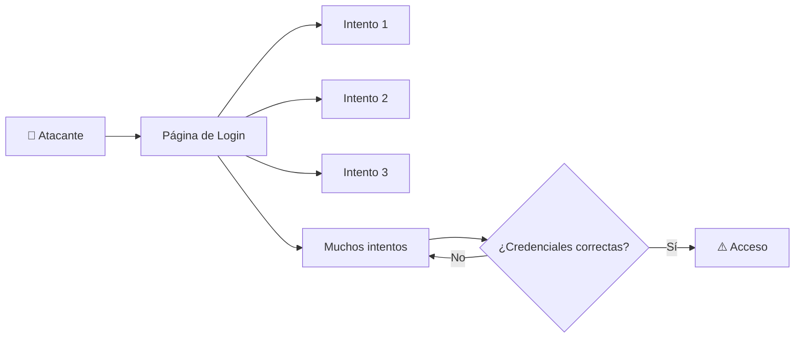

Una aplicación vulnerable podría permitir una cantidad ilimitada de intentos.

### ❌ Ejemplo

```text
Intento 1 → incorrecto
Intento 2 → incorrecto
Intento 3 → incorrecto
...
Intento 10.000 → incorrecto
```

Sin controles adecuados, el atacante puede continuar intentando.

---

# 🛡️ 6. Protección contra fuerza bruta

Algunas medidas de protección incluyen:

- Limitar intentos.
- Aplicar retrasos progresivos.
- Utilizar rate limiting.
- Implementar MFA.
- Detectar patrones anormales.
- Monitorear intentos fallidos.
- Utilizar mecanismos de bloqueo cuidadosamente diseñados.
- Alertar ante comportamientos sospechosos.

Ejemplo conceptual:

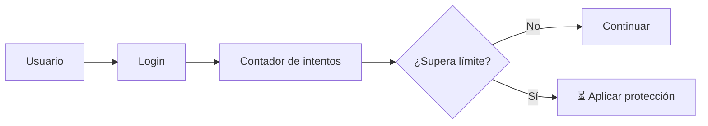

> ⚠️ Un bloqueo de cuenta mal diseñado también puede convertirse en un problema de disponibilidad si un atacante puede bloquear intencionalmente cuentas de otros usuarios.

---

# 🧪 7. Credential Stuffing

El **Credential Stuffing** es diferente de la fuerza bruta.

En este caso, el atacante utiliza pares de usuario y contraseña obtenidos previamente, normalmente de una filtración o compromiso de otro servicio.

Ejemplo:

```text
Servicio A
────────────────
usuario@example.com
contraseña123

        ↓
Credenciales obtenidas
        ↓
        ↓
        ↓

Servicio B
────────────────
usuario@example.com
contraseña123

        ↓
⚠️ Intento de acceso
```

El problema principal es la **reutilización de contraseñas**.

---

## 🔄 Fuerza bruta vs Credential Stuffing

| Característica | Fuerza bruta | Credential Stuffing |
|---|---|---|
| Objetivo | Encontrar credenciales | Reutilizar credenciales obtenidas |
| Contraseñas | Se prueban combinaciones | Ya fueron obtenidas |
| Principal defensa | Rate limiting + MFA | MFA + detección + contraseñas únicas |
| Riesgo | Alto | Alto |

---

# 🔐 8. MFA – Multi-Factor Authentication

MFA significa:

> **Multi-Factor Authentication**

Consiste en utilizar dos o más factores de autenticación independientes.

## Los principales factores

### 🧠 Algo que sabes

Por ejemplo:

```text
Contraseña
PIN
```

### 📱 Algo que tienes

Por ejemplo:

```text
Teléfono
Token de seguridad
Aplicación autenticadora
```

### 👤 Algo que eres

Por ejemplo:

```text
Huella digital
Reconocimiento facial
```

---

## MFA de forma visual

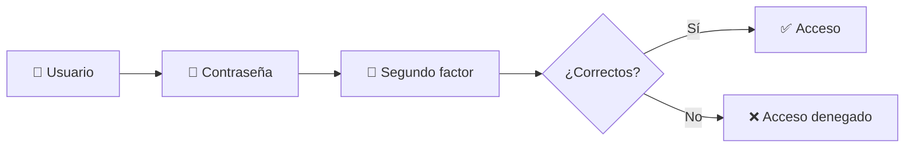

Si un atacante obtiene la contraseña, todavía tendría que superar el segundo factor.

> 💡 MFA no hace que una aplicación sea invulnerable, pero reduce significativamente el riesgo asociado al robo de credenciales.

---

# 🔑 9. Almacenamiento seguro de contraseñas

Una de las reglas más importantes:

> ❌ **Las contraseñas no deben almacenarse en texto plano.**

### ❌ Ejemplo incorrecto

```text
Usuario: william
Password: MiPassword123
```

Si un atacante obtiene la base de datos, puede conocer directamente las contraseñas.

---

## ✅ Hashing

En lugar de guardar directamente la contraseña, se almacena un resultado derivado mediante un algoritmo diseñado para contraseñas.

Conceptualmente:

```text
Contraseña
     │
     ▼
Función de hashing
     │
     ▼
Hash almacenado
```

Cuando el usuario vuelve a iniciar sesión:

```text
Contraseña ingresada
       │
       ▼
Verificación
       │
       ▼
Hash almacenado
       │
       ▼
¿Coinciden?
```

---

# 🧂 10. ¿Qué es un salt?

Un **salt** es un valor aleatorio que se utiliza junto con la contraseña durante el proceso de almacenamiento.

Conceptualmente:

```text
Contraseña + Salt
       │
       ▼
Hash
       │
       ▼
Base de datos
```

El objetivo es dificultar ataques basados en contraseñas previamente procesadas y evitar que usuarios con la misma contraseña terminen necesariamente con el mismo valor almacenado.

> ⚠️ No debemos implementar nuestro propio algoritmo de hashing de contraseñas. Es preferible utilizar mecanismos y librerías diseñados específicamente para este propósito.

---

# 🧰 11. Algoritmos para contraseñas

Para almacenar contraseñas se utilizan algoritmos diseñados para ser costosos computacionalmente, como:

- Argon2.
- bcrypt.
- scrypt.
- PBKDF2.

No debemos confundirlos con hashes rápidos utilizados para otros propósitos.

Ejemplos de algoritmos que **no deben utilizarse por sí solos para almacenar contraseñas**:

```text
MD5
SHA-1
SHA-256
```

El problema no es que SHA-256 sea "malo", sino que los hashes rápidos no están diseñados específicamente para proteger contraseñas frente a ataques de adivinación masiva.

---

# 📧 12. Recuperación de cuentas

La recuperación de una contraseña también forma parte de la seguridad de autenticación.

### ❌ Ejemplo inseguro

```text
¿Cuál es el nombre de tu mascota?
```

Si la respuesta puede ser conocida o adivinada, el mecanismo puede ser débil.

---

## ✅ Ejemplo más seguro

```text
Usuario solicita recuperación
          ↓
Servidor genera mecanismo temporal
          ↓
Usuario recibe enlace
          ↓
Enlace con token aleatorio
          ↓
Token expira
          ↓
Nueva contraseña
```

El mecanismo de recuperación debe tener controles de seguridad equivalentes a los del inicio de sesión.

---

# 🍪 13. ¿Qué es una sesión?

Después de autenticarse correctamente, una aplicación necesita recordar que el usuario ya fue autenticado.

Para esto se utilizan mecanismos de sesión.

Ejemplo:

```text
Usuario
   │
   ▼
Login
   │
   ▼
Autenticación correcta
   │
   ▼
Servidor crea sesión
   │
   ▼
Session ID / Token
   │
   ▼
Usuario continúa navegando
```

---

# 🎟️ 14. Session ID

Un Session ID es un identificador asociado a la sesión de un usuario.

Conceptualmente:

```text
Usuario
   │
   ▼
Login correcto
   │
   ▼
Session ID
   │
   ▼
Servidor reconoce la sesión
```

El identificador debe ser difícil de adivinar y debe protegerse adecuadamente.

---

# 🚨 15. Session Hijacking

El **Session Hijacking** ocurre cuando un atacante consigue utilizar una sesión legítima de otra persona.

Conceptualmente:

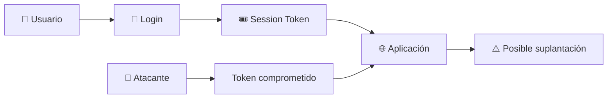

Por ejemplo, si un atacante consigue un token de sesión válido, podría intentar utilizarlo para actuar como el usuario.

---

# 🔒 16. Session Fixation

La **Session Fixation** es una vulnerabilidad en la que un atacante consigue que la víctima utilice un identificador de sesión conocido por el atacante y posteriormente la víctima se autentica utilizando esa sesión.

Conceptualmente:

```text
Atacante
   │
   ▼
Conoce Session ID
   │
   ▼
Víctima utiliza esa sesión
   │
   ▼
Víctima inicia sesión
   │
   ▼
Sesión autenticada
   │
   ▼
Atacante intenta reutilizarla
```

Una medida importante es **regenerar el identificador de sesión después de una autenticación exitosa**.

---

# 🔄 17. Expiración de sesiones

Una sesión no debería permanecer válida indefinidamente.

Podemos tener:

```text
Login
  ↓
Sesión activa
  ↓
Inactividad
  ↓
Tiempo de expiración
  ↓
Sesión invalidada
```

También es importante invalidar la sesión cuando el usuario realiza un cierre de sesión.

---

# 🚪 18. Cierre de sesión

Un error sería simplemente eliminar la información visual de la aplicación y mantener la sesión válida en el servidor.

### ❌ Conceptualmente

```text
Usuario pulsa "Cerrar sesión"
        ↓
Se oculta la página
        ↓
Session Token continúa válido
```

### ✅ Mejor práctica

```text
Usuario pulsa "Cerrar sesión"
        ↓
Servidor invalida sesión
        ↓
Token deja de ser válido
        ↓
Usuario debe autenticarse nuevamente
```

---

# 🔐 19. Cookies y seguridad de sesión

Cuando una aplicación utiliza cookies para mantener sesiones, existen atributos de seguridad importantes.

## HttpOnly

Ayuda a impedir que JavaScript del navegador acceda directamente a la cookie.

```text
HttpOnly
   ↓
Cookie no accesible mediante document.cookie
```

---

## Secure

Indica que la cookie debe transmitirse mediante una conexión HTTPS.

```text
Secure
   ↓
Enviar cookie únicamente mediante HTTPS
```

---

## SameSite

Ayuda a controlar cuándo el navegador envía cookies en solicitudes entre sitios.

Ejemplo:

```text
SameSite=Lax
```

o:

```text
SameSite=Strict
```

La configuración adecuada depende del diseño de la aplicación.

---

# 🌐 20. HTTPS y autenticación

Las credenciales y los tokens de sesión deben protegerse durante el transporte.

### ❌ Situación insegura

```text
Usuario
   │
   │ HTTP
   ▼
Servidor
```

### ✅ Situación recomendada

```text
Usuario
   │
   │ HTTPS 🔒
   ▼
Servidor
```

HTTPS ayuda a proteger la información mientras viaja entre el cliente y el servidor.

---

# 💻 21. Ejemplo de código vulnerable

El siguiente ejemplo es **educativo** y representa varias malas prácticas:

```python
users = {
    "admin": "123456"
}

@app.route("/login", methods=["POST"])
def login():

    username = request.form["username"]
    password = request.form["password"]

    if username in users:
        if users[username] == password:
            return "Login exitoso"

    return "Credenciales incorrectas"
```

## 🚨 Problemas

Podemos identificar:

```text
❌ Contraseña débil
❌ Contraseña almacenada en texto plano
❌ No existe MFA
❌ No existe rate limiting
❌ No existe control de intentos
❌ No existe una gestión segura de sesión
❌ No existe monitoreo
```

---

# 🛠️ 22. Ejemplo conceptual mejorado

Una implementación más segura debería seguir un flujo parecido a:

```python
@app.route("/login", methods=["POST"])
def login():

    username = request.form["username"]
    password = request.form["password"]

    user = get_user(username)

    if not user:
        register_failed_attempt(username)
        return "Credenciales incorrectas"

    if not verify_password(password, user.password_hash):
        register_failed_attempt(username)
        return "Credenciales incorrectas"

    if user.mfa_enabled:
        return "Solicitar segundo factor"

    create_secure_session(user)

    return "Login exitoso"
```

### Ahora tenemos:

```text
Usuario
   │
   ▼
Buscar cuenta
   │
   ▼
Verificar contraseña
   │
   ▼
Control de intentos
   │
   ▼
MFA
   │
   ▼
Crear sesión segura
   │
   ▼
✅ Acceso
```

---

# 🧪 23. Laboratorio A07

## 🎯 Objetivo

Construir una aplicación de autenticación sencilla, identificar vulnerabilidades y posteriormente aplicar medidas de seguridad.

El laboratorio debe realizarse únicamente en un entorno controlado y local.

---

## 🏗️ Arquitectura

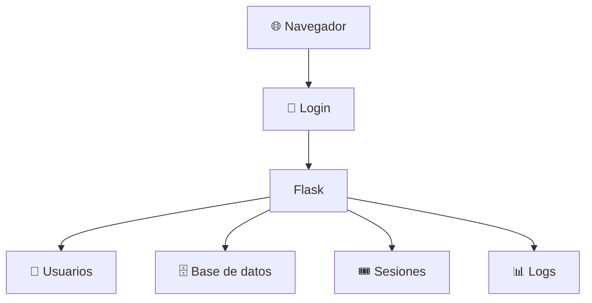

---

# 🧪 Fase 1 – Login vulnerable

Crear una aplicación sencilla con:

```text
Usuario
Contraseña
Botón Login
```

El primer objetivo es observar qué problemas existen.

### Ejemplo:

```python
users = {
    "admin": "123456"
}
```

El grupo debe identificar:

```text
1. ¿La contraseña es segura?
2. ¿Cómo está almacenada?
3. ¿Existe MFA?
4. ¿Cuántos intentos permite?
5. ¿Existe rate limiting?
6. ¿Cómo se crea la sesión?
7. ¿Cuándo expira?
```

---

# 🧪 Fase 2 – Mejorar las contraseñas

Cambiar el almacenamiento directo de contraseñas por un mecanismo de hashing adecuado.

Flujo:

```text
Contraseña
    ↓
Hash seguro para passwords
    ↓
Base de datos
```

No almacenar:

```text
password = "123456"
```

en texto plano.

---

# 🧪 Fase 3 – Protección contra intentos automatizados

Implementar un mecanismo para controlar múltiples intentos.

Ejemplo conceptual:

```text
Intento 1 → ❌
Intento 2 → ❌
Intento 3 → ❌
Intentos repetidos
       ↓
Protección
       ↓
⏳ Esperar / limitar solicitudes
```

---

# 🧪 Fase 4 – MFA

Agregar un segundo factor de demostración.

Por ejemplo:

```text
Usuario
   +
Contraseña
   +
Código temporal
   ↓
✅ Acceso
```

Para un laboratorio académico puede utilizarse un mecanismo de código temporal, siempre dentro del entorno de pruebas.

---

# 🧪 Fase 5 – Gestión de sesión

Comprobar:

```text
☐ ¿Se genera una sesión después del login?

☐ ¿El identificador es suficientemente aleatorio?

☐ ¿Se regenera después de autenticarse?

☐ ¿La sesión expira?

☐ ¿Se invalida al cerrar sesión?

☐ ¿Las cookies utilizan atributos de seguridad?
```

---

# 🔍 24. Pruebas que podemos realizar

Una vez creada la aplicación, podemos revisar:

### Prueba 1 – Contraseña débil

Intentar utilizar contraseñas evidentemente inseguras en el laboratorio.

```text
123456
password
admin
```

Objetivo:

> Comprobar si la aplicación permite credenciales débiles.

---

### Prueba 2 – Intentos repetidos

Realizar varios intentos fallidos controlados.

Objetivo:

> Comprobar si existe protección contra ataques automatizados.

---

### Prueba 3 – Cierre de sesión

Cerrar sesión y comprobar si el acceso anterior continúa funcionando.

Objetivo:

> Verificar la invalidación de la sesión.

---

### Prueba 4 – Expiración

Esperar el tiempo configurado y comprobar si la sesión continúa válida.

Objetivo:

> Verificar la expiración.

---

### Prueba 5 – MFA

Comprobar que conocer solamente la contraseña no sea suficiente cuando MFA está habilitado.

---

# 🛡️ 25. Herramientas para estudiar A07

## OWASP ZAP

Puede utilizarse para analizar aplicaciones web durante pruebas de seguridad.

## Burp Suite

Permite observar y analizar solicitudes HTTP/HTTPS durante pruebas autorizadas.

## DevTools

Las herramientas de desarrollador del navegador permiten estudiar:

- Cookies.
- Headers.
- Solicitudes.
- Respuestas.
- Almacenamiento.

Por ejemplo:

```text
Browser
   ↓
DevTools
   ↓
Network
   ↓
Request / Response
```

---

# 🧩 26. A07 y DevSecOps

La autenticación segura no debería revisarse solamente al final del proyecto.

Puede incorporarse al ciclo de desarrollo:

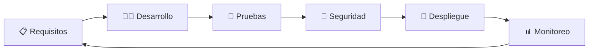

En cada etapa podemos preguntarnos:

```text
¿La autenticación es segura?

¿Las sesiones están protegidas?

¿Las contraseñas están correctamente gestionadas?

¿Existe MFA?

¿Hay protección contra automatización?

¿Se registran eventos de seguridad?
```

---

# 📊 27. Matriz de vulnerabilidades A07

| Vulnerabilidad | Ejemplo | Impacto |
|---|---|---|
| Contraseña débil | `123456` | 🔴 Alto |
| Credenciales predeterminadas | `admin/admin` | 🔴 Alto |
| Fuerza bruta | Muchos intentos | 🔴 Alto |
| Credential Stuffing | Reutilización de credenciales | 🔴 Alto |
| Sin MFA | Solo contraseña | 🟠 Medio/Alto |
| Hashing incorrecto | Contraseñas en texto plano | 🔴 Crítico |
| Sesión sin expiración | Token permanente | 🟠 Alto |
| Session Fixation | Sesión reutilizada | 🔴 Alto |
| Session Hijacking | Robo de sesión | 🔴 Alto |
| Recuperación insegura | Preguntas fáciles | 🟠 Alto |

---

# 🛡️ 28. Buenas prácticas para prevenir A07

Las aplicaciones deberían considerar:

### 🔑 Contraseñas

- Utilizar políticas de contraseñas adecuadas.
- No utilizar contraseñas predeterminadas.
- No almacenar contraseñas en texto plano.
- Utilizar algoritmos diseñados para almacenamiento de contraseñas.
- Evitar reutilización de contraseñas.

### 📱 MFA

- Utilizar MFA cuando sea apropiado.
- Proteger especialmente cuentas administrativas.
- Preferir mecanismos resistentes al phishing cuando sea posible.

### 🚦 Protección contra automatización

- Rate limiting.
- Protección contra intentos excesivos.
- Monitoreo.
- Detección de comportamientos anormales.

### 🎟️ Sesiones

- Utilizar identificadores de sesión impredecibles.
- Regenerar la sesión después de autenticarse.
- Establecer expiración.
- Invalidar la sesión al cerrar sesión.
- Proteger las cookies.
- Utilizar HTTPS.

### 🔄 Recuperación de cuentas

- Utilizar mecanismos temporales.
- Utilizar tokens aleatorios.
- Establecer expiración.
- No utilizar preguntas de seguridad débiles.
- No revelar información innecesaria sobre las cuentas.

---

# 🔗 29. Relación entre A07 y otros riesgos OWASP

A07 puede relacionarse con otras categorías del OWASP Top 10.

Por ejemplo:

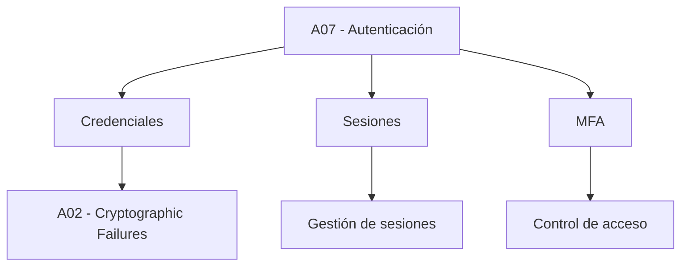

Esto demuestra que las categorías del OWASP Top 10 no necesariamente aparecen aisladas.

Una vulnerabilidad puede involucrar diferentes controles de seguridad.

---

# 🧠 30. Ejemplo completo

Imaginemos una aplicación bancaria.

El usuario realiza:

```text
1. Introduce usuario
       ↓
2. Introduce contraseña
       ↓
3. Sistema verifica contraseña
       ↓
4. Solicita MFA
       ↓
5. Usuario proporciona segundo factor
       ↓
6. Sistema crea sesión
       ↓
7. Usuario accede a su cuenta
```

Una implementación insegura podría tener:

```text
❌ Contraseña débil
❌ Contraseña almacenada en texto plano
❌ Sin MFA
❌ Sin límite de intentos
❌ Sesión permanente
❌ Cookie sin protección
❌ Sesión no invalidada al cerrar sesión
```

Mientras una implementación más segura podría tener:

```text
✅ Contraseña protegida
✅ MFA
✅ Rate limiting
✅ Sesión segura
✅ Expiración
✅ Cookies protegidas
✅ HTTPS
✅ Invalidación al cerrar sesión
✅ Monitoreo
```

---

# 📋 31. Checklist A07

```text
☐ ¿La aplicación identifica correctamente al usuario?

☐ ¿La autenticación está correctamente implementada?

☐ ¿Se utilizan contraseñas seguras?

☐ ¿Se evitan credenciales predeterminadas?

☐ ¿Las contraseñas se almacenan mediante mecanismos seguros?

☐ ¿Existe MFA?

☐ ¿Existe protección contra fuerza bruta?

☐ ¿Existe protección contra Credential Stuffing?

☐ ¿Existe rate limiting?

☐ ¿La recuperación de cuentas es segura?

☐ ¿Las sesiones tienen expiración?

☐ ¿Las sesiones se invalidan al cerrar sesión?

☐ ¿El Session ID se regenera después del login?

☐ ¿Las cookies utilizan atributos de seguridad?

☐ ¿La aplicación utiliza HTTPS?

☐ ¿Se monitorean eventos de autenticación?

☐ ¿Se registran intentos fallidos?

☐ ¿Las cuentas administrativas tienen controles adicionales?
```

---

# 🎓 32. ¿Qué aprendimos de A07?

A07 nos permite comprender que la autenticación es mucho más que colocar un formulario de usuario y contraseña.

Una autenticación segura involucra diferentes elementos:

```text
              🔐 AUTENTICACIÓN SEGURA
                       │
        ┌──────────────┼──────────────┐
        ▼              ▼              ▼
   Contraseñas       MFA          Sesiones
        │              │              │
        ▼              ▼              ▼
     Hashing       Segundo       Expiración
                    factor       Invalidación
        │              │              │
        └──────────────┼──────────────┘
                       ▼
                  🛡️ Seguridad
```

Por lo tanto, proteger una cuenta requiere analizar todo el ciclo:

```text
Registro
   ↓
Login
   ↓
Autenticación
   ↓
MFA
   ↓
Sesión
   ↓
Uso de aplicación
   ↓
Logout
   ↓
Invalidación de sesión
```

---

# 🎯 33. Conclusión A07

Las fallas de identificación y autenticación representan un riesgo importante porque pueden permitir que un atacante acceda a una aplicación utilizando credenciales obtenidas, adivinadas o reutilizadas, o aprovechando errores en la gestión de sesiones.

Una autenticación segura debe considerar mucho más que una contraseña. Es necesario proteger el almacenamiento de credenciales, controlar los intentos de autenticación, implementar MFA cuando corresponda, proteger los mecanismos de recuperación de cuentas y gestionar correctamente las sesiones.

También es fundamental recordar que **autenticación y autorización son conceptos diferentes**: primero debemos comprobar quién es el usuario y posteriormente determinar qué acciones tiene permitidas.

> 🔑 **Una contraseña correcta no es suficiente para considerar segura una autenticación. La seguridad debe proteger todo el ciclo de vida de la identidad y la sesión.**

---

# 🔗 34. Relación entre A06 y A07

Los dos riesgos estudiados pueden aparecer simultáneamente.

Por ejemplo:

```mermaid
flowchart TD
    A["Aplicación Web"] --> B["Dependencias"]
    A --> C["Autenticación"]

    B --> D["A06"]
    D --> E["Componente vulnerable"]

    C --> F["A07"]
    F --> G["Contraseña débil"]
    F --> H["Sin MFA"]
    F --> I["Sesión insegura"]

    E --> J["⚠️ Superficie de ataque"]
    G --> J
    H --> J
    I --> J
```

### A06 responde principalmente:

> **¿Son seguros los componentes que utilizamos?**

### A07 responde principalmente:

> **¿Estamos protegiendo correctamente las identidades y sesiones de nuestros usuarios?**

---

# 🏁 Conclusión general A06 + A07

El estudio de A06 y A07 permite comprender dos aspectos fundamentales de la seguridad de aplicaciones.

Por un lado, **A06 demuestra que debemos conocer y gestionar los componentes que forman parte de nuestro software**. Una dependencia vulnerable puede convertirse en una puerta de entrada para un atacante.

Por otro lado, **A07 demuestra que debemos proteger adecuadamente las identidades, credenciales y sesiones de los usuarios**.

Ambos riesgos pueden reducirse mediante una combinación de:

```text
📋 Inventario
     +
🔎 Análisis
     +
🧪 Pruebas
     +
🔐 Controles de seguridad
     +
📊 Monitoreo
     +
🔄 Actualización continua
```

Desde una perspectiva DevSecOps, la seguridad debe incorporarse durante todo el ciclo de vida del software y no únicamente cuando la aplicación ya está en producción.

> 🛡️ **La seguridad no consiste solamente en evitar que entren a nuestra aplicación; también consiste en saber qué tenemos dentro, quién puede acceder y cómo controlamos ese acceso.**

---

# 📚 Referencias específicas – A07

- OWASP Top 10 – A07:2021 Identification and Authentication Failures.
- OWASP Authentication Cheat Sheet.
- OWASP Session Management Cheat Sheet.
- OWASP Multifactor Authentication Cheat Sheet.
- OWASP Password Storage Cheat Sheet.
- OWASP Forgot Password Cheat Sheet.
- OWASP Credential Stuffing Prevention Cheat Sheet.
- OWASP Top 10 – 2021.
- NIST Digital Identity Guidelines.
- MITRE CWE – Authentication related weaknesses.

---

