# 🔐 OWASP Top 10 (2021) — Guía Completa de Riesgos de Seguridad en Aplicaciones Web


---

## 👥 Integrantes

| Nombre |
|---|
| William Andres Mosquera Vela |
| Juan Nicolas Pineda Alvarado |
| Johnny Albeiro Mallama Mejia |
| Juan Esteban Contreras Gonzalez |

---

## 📖 Introducción general

La seguridad en el desarrollo de software es hoy uno de los pilares fundamentales para proteger la información de los usuarios y la integridad de los sistemas. El **OWASP Top 10** es un documento de referencia elaborado por la *Open Web Application Security Project (OWASP)*, una fundación sin ánimo de lucro dedicada a mejorar la seguridad del software a nivel mundial.

Este documento resume, mediante un consenso amplio de expertos en seguridad, los **diez riesgos más críticos** que afectan a las aplicaciones web. Su propósito es concientizar a desarrolladores, arquitectos de software y equipos de seguridad sobre las vulnerabilidades más comunes y graves, para que puedan prevenirlas desde las primeras etapas del ciclo de vida del desarrollo (diseño, codificación, pruebas y despliegue).

Este repositorio reúne, de forma unificada, el análisis de las **diez categorías** de la edición **2021** del OWASP Top 10:

| # | Categoría |
|---|---|
| A01 | Fallos de Control de Acceso |
| A02 | Fallos Criptográficos |
| A03 | Inyección |
| A04 | Diseño Inseguro |
| A05 | Configuración de Seguridad Incorrecta |
| A06 | Componentes Vulnerables y Desactualizados |
| A07 | Fallas de Identificación y Autenticación |
| A08 | Fallas de Integridad de Software y Datos |
| A09 | Fallas de Registro y Monitoreo de Seguridad |
| A10 | Server-Side Request Forgery (SSRF) |

> 📌 Fuente oficial: [owasp.org/Top10/2021](https://owasp.org/Top10/2021/)

---

## 📑 Tabla de contenidos

1. [Panorama general](#-panorama-general)
2. [A01 — Fallos de Control de Acceso](#1️⃣-a012021--fallos-de-control-de-acceso)
3. [A02 — Fallos Criptográficos](#2️⃣-a022021--fallos-criptográficos)
4. [A03 — Inyección](#3️⃣-a032021--inyección)
5. [A04 — Diseño Inseguro](#4️⃣-a042021--diseño-inseguro)
6. [A05 — Configuración de Seguridad Incorrecta](#5️⃣-a052021--configuración-de-seguridad-incorrecta)
7. [Comparación A03–A05](#-comparación-a03-a05)
8. [A06 — Componentes Vulnerables y Desactualizados](#6️⃣-a062021--componentes-vulnerables-y-desactualizados)
9. [A07 — Fallas de Identificación y Autenticación](#7️⃣-a072021--fallas-de-identificación-y-autenticación)
10. [A08 — Fallas de Integridad de Software y Datos](#8️⃣-a082021--fallas-de-integridad-de-software-y-datos)
11. [A09 — Fallas de Registro y Monitoreo de Seguridad](#9️⃣-a092021--fallas-de-registro-y-monitoreo-de-seguridad)
12. [A10 — Server-Side Request Forgery (SSRF)](#🔟-a102021--server-side-request-forgery-ssrf)
13. [Conclusión general](#-conclusión-general)
14. [Referencias](#-referencias-generales)

---

## 📊 Panorama general

El siguiente gráfico ilustra, de forma aproximada, el porcentaje de aplicaciones analizadas que presentaron cada una de las dos primeras categorías de vulnerabilidad según los datos recopilados por OWASP para la edición 2021:

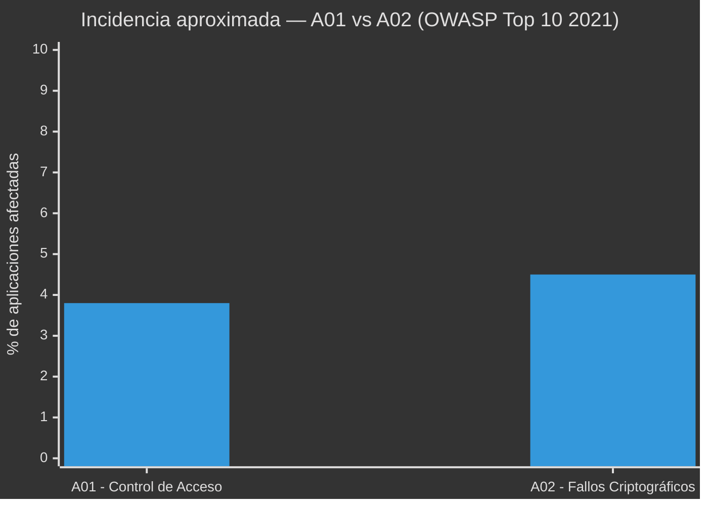

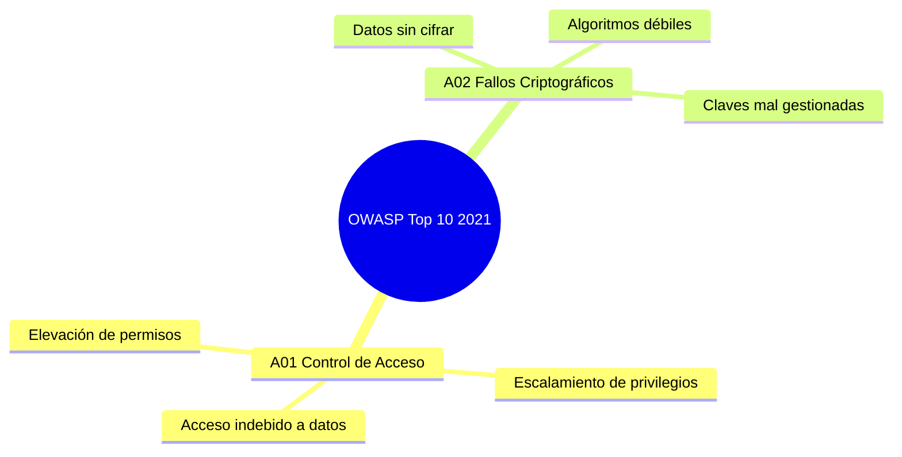

Las categorías A03, A04 y A05 representan además diferentes etapas en las que puede aparecer un riesgo de seguridad:


---

# 🧩 Detalle de las categorías

## 1️⃣ A01:2021 — Fallos de Control de Acceso

### 🔒 ¿Qué es?

El control de acceso es el conjunto de mecanismos que determina qué puede hacer o ver un usuario dentro de una aplicación, según su rol o identidad (por ejemplo, un usuario normal no debería poder ver ni modificar datos de un administrador). Un fallo de control de acceso ocurre cuando estas restricciones no se aplican correctamente en el backend, permitiendo que un usuario actúe fuera de los permisos que le corresponden.

Esta categoría subió de la quinta posición (en la edición 2017) al **primer lugar** en 2021, lo que refleja lo extendido y crítico que es este problema: se detectaron ocurrencias en la gran mayoría de las aplicaciones analizadas por OWASP.

### 🧠 Causas más comunes

- Verificar permisos solo en el frontend (interfaz visual) y no en el backend (servidor).
- Confiar en el identificador enviado por el propio usuario (IDOR — *Insecure Direct Object Reference*) sin validar si le pertenece.
- No aplicar el principio de "denegar por defecto": otorgar acceso amplio y luego restringir, en vez de al revés.
- Rutas o endpoints de administración accesibles sin autenticación adecuada.
- CORS mal configurado, permitiendo peticiones desde orígenes no autorizados.

### 💥 Ejemplos

1. Un usuario cambia el valor `id=1023` por `id=1024` en la URL (`miapp.com/perfil?id=1024`) y accede a la información de otra persona.
2. Un empleado normal accede directamente a `/admin/panel` sin que el sistema verifique su rol.
3. Una API permite eliminar registros de otros usuarios simplemente conociendo su identificador (`DELETE /api/pedidos/58`).

### ⚠️ Impacto

Exposición de datos privados, modificación o eliminación no autorizada de información, fraude, escalamiento de privilegios hasta llegar a comprometer cuentas administrativas.

### 🛡️ Recomendaciones de prevención

- Aplicar el principio de mínimo privilegio: cada usuario solo accede a lo estrictamente necesario.
- Validar permisos en cada solicitud del lado del servidor, no confiar en el cliente.
- Registrar (loggear) los intentos de acceso denegados para detectar posibles ataques.
- Usar pruebas automatizadas que verifiquen los controles de acceso en cada rol.

---

## 2️⃣ A02:2021 — Fallos Criptográficos

### 🔑 ¿Qué es?

Antes llamada "Exposición de Datos Sensibles" (2017), esta categoría fue renombrada para reflejar su causa raíz: fallos en el uso de la criptografía, más que el simple hecho de exponer datos. Ocurre cuando una aplicación no protege adecuadamente la información sensible —contraseñas, datos financieros, información médica, tokens de sesión— ya sea **en tránsito** (mientras viaja por la red) o **en reposo** (mientras está almacenada).

### 🧠 Causas más comunes

- Transmitir datos sensibles sin cifrado (uso de HTTP en lugar de HTTPS).
- Almacenar contraseñas usando algoritmos débiles o sin "salt" (por ejemplo, MD5 o SHA-1 sin protección adicional) en vez de funciones diseñadas para contraseñas como bcrypt o Argon2.
- Uso de algoritmos de cifrado obsoletos o claves criptográficas demasiado cortas.
- Gestión deficiente de claves: claves cifradas guardadas junto con los datos que protegen, o "hardcodeadas" directamente en el código fuente.
- Certificados SSL/TLS vencidos, autofirmados o mal configurados.

### 💥 Ejemplos

1. Un formulario de inicio de sesión que envía usuario y contraseña por HTTP en lugar de HTTPS, exponiendo las credenciales a cualquiera que intercepte el tráfico de red.
2. Una base de datos que almacena contraseñas en texto plano o con un algoritmo de hash débil y sin "salt".
3. Una aplicación móvil que guarda tokens de autenticación sin cifrar en el almacenamiento local del dispositivo.

### ⚠️ Impacto

Robo de credenciales, exposición de datos financieros o médicos, suplantación de identidad, incumplimiento de normativas de protección de datos (como GDPR o leyes locales de habeas data), y pérdida de confianza de los usuarios.

### 🛡️ Recomendaciones de prevención

- Forzar el uso de HTTPS/TLS en toda la aplicación (incluyendo redirecciones automáticas de HTTP a HTTPS).
- Cifrar los datos sensibles en reposo con algoritmos actualizados y robustos.
- Usar funciones de hash específicas para contraseñas (bcrypt, scrypt o Argon2) en lugar de algoritmos de propósito general.
- Clasificar los datos según su sensibilidad y aplicar controles proporcionales a cada nivel.
- No almacenar datos sensibles que no sean estrictamente necesarios.

### 🖼️ Resumen visual A01 vs A02

| Categoría | Icono | Enfoque principal | Ejemplo típico |
|---|---|---|---|
| A01 | 🔒 | Control de acceso | Modificar una URL para ver datos ajenos |
| A02 | 🔑 | Criptografía | Enviar contraseñas por HTTP sin cifrar |

> **Conclusión A01–A02:** el primero falla en decidir *quién puede hacer qué*, y el segundo falla en *proteger la información* una vez que se accede a ella; por eso suelen presentarse combinados en ataques reales. Aplicar controles adecuados —como validación estricta de permisos en el servidor y cifrado robusto de la información— es un primer paso fundamental para reducir la superficie de ataque de cualquier sistema.

---

## 3️⃣ A03:2021 — Inyección

### 💉 ¿Qué es?

La **inyección** ocurre cuando una aplicación incorpora datos proporcionados por un usuario dentro de una instrucción, consulta o comando sin realizar una separación adecuada entre los datos y el código. Esto puede provocar que una entrada controlada por un atacante sea interpretada como parte de una instrucción ejecutable.

Entre los tipos más conocidos se encuentran:

- SQL Injection (SQLi)
- NoSQL Injection
- OS Command Injection
- LDAP Injection
- XPath Injection
- Cross-Site Scripting (XSS), dependiendo del contexto de clasificación

### 🧠 Causas más comunes

- Construcción de consultas mediante concatenación de cadenas.
- Falta de validación de las entradas.
- Ausencia de consultas parametrizadas.
- Uso inseguro de comandos del sistema operativo.
- Falta de controles sobre los datos enviados por los usuarios.
- Utilización de cuentas de base de datos con privilegios excesivos.
- Dependencia de mecanismos de seguridad únicamente del lado cliente.

### 💥 Impacto

Una vulnerabilidad de inyección puede permitir a un atacante obtener información almacenada en bases de datos, modificar o eliminar información, evadir mecanismos de autenticación, ejecutar determinadas instrucciones, acceder a información confidencial o comprometer otros componentes de la infraestructura.

| Propiedad | Posible impacto |
| --- | --- |
| 🔒 Confidencialidad | Lectura de información privada |
| 📝 Integridad | Modificación de registros |
| ⚡ Disponibilidad | Eliminación o alteración de recursos |
| 👤 Autenticación | Bypass del inicio de sesión |
| 🖥️ Sistema | Ejecución de comandos en determinados escenarios |

### 🔍 Métodos de explotación

Los atacantes normalmente comienzan identificando entradas controladas por el usuario:

```text
Parámetros URL
      ↓
Campos de formularios
      ↓
Cookies
      ↓
Headers HTTP
      ↓
Datos enviados a APIs
```

**SQL Injection.** Una aplicación vulnerable puede construir una consulta de esta manera:

```sql
SELECT * FROM usuarios
WHERE usuario = 'entrada'
AND password = 'entrada';
```

El problema aparece cuando las entradas del usuario se incorporan directamente en la consulta. Una implementación segura debe utilizar **consultas parametrizadas** para mantener separados los datos de la estructura SQL.

**Command Injection.** Puede ocurrir cuando una aplicación utiliza información proporcionada por el usuario para construir comandos del sistema operativo.

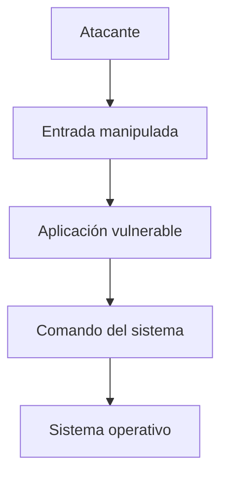

### 🛠️ Herramientas utilizadas

| Herramienta | Utilización |
| --- | --- |
| **Burp Suite** | Interceptar y modificar solicitudes HTTP |
| **OWASP ZAP** | Análisis de seguridad de aplicaciones web |
| **sqlmap** | Automatización de pruebas de SQL Injection |
| **Nmap** | Reconocimiento de servicios |
| **Wireshark** | Análisis del tráfico de red |

> ⚠️ Estas herramientas deben utilizarse únicamente en sistemas propios, laboratorios o infraestructuras donde exista autorización explícita para realizar pruebas.

### 🛡️ Prevención y mitigación

- Utilizar consultas SQL parametrizadas.
- Implementar validación de entradas en el servidor.
- Aplicar listas de valores permitidos (*allowlist*) cuando sea posible.
- Evitar concatenar directamente datos del usuario en comandos.
- Utilizar ORM de forma segura.
- Aplicar el principio de mínimo privilegio.
- Mantener actualizadas las dependencias.
- Implementar pruebas de seguridad automatizadas.
- Utilizar mecanismos de protección adicionales como WAF cuando sean apropiados.

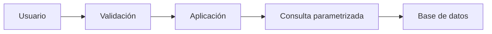

---

## 4️⃣ A04:2021 — Diseño Inseguro

### 🏗️ ¿Qué es?

**Diseño Inseguro** hace referencia a vulnerabilidades originadas principalmente por decisiones deficientes de arquitectura, diseño o lógica de negocio. En este caso, el problema puede existir incluso antes de escribir el código. Una aplicación puede estar correctamente implementada desde el punto de vista sintáctico, pero continuar siendo vulnerable porque su diseño no contempla determinados escenarios de ataque.

### 🧠 Causas más comunes

- Ausencia de análisis de amenazas.
- Falta de requisitos de seguridad.
- No considerar escenarios de abuso.
- Confiar en controles implementados únicamente en el frontend.
- Falta de mecanismos contra automatización.
- Ausencia de límites sobre operaciones sensibles.
- Arquitecturas que no aplican defensa en profundidad.
- Falta de separación entre funcionalidades y privilegios.

### 💥 Ejemplos

**Ejemplo 1 — Validación únicamente en frontend.** Una aplicación podría impedir visualmente que un usuario introduzca un valor determinado.

```text
Frontend
   │
   ├── "No puede realizar esta operación"
   │
   ▼
Backend
```

Si el backend no realiza nuevamente la validación, un atacante puede enviar directamente una solicitud modificada. Por esta razón, las restricciones de seguridad **no deben depender exclusivamente de la interfaz del usuario**.

**Ejemplo 2 — Abuso de lógica de negocio.** Una plataforma de compras podría tener:

```text
Producto
   ↓
Cupón de descuento
   ↓
Pago
```

Si el diseño no contempla la reutilización indebida de cupones, un atacante podría intentar utilizar repetidamente una promoción. El problema no necesariamente corresponde a un error de sintaxis o programación, sino a una **falla en el diseño de las reglas de negocio**.

### ⚠️ Impacto

| Problema | Posible consecuencia |
| --- | --- |
| Falta de validación backend | Bypass de restricciones |
| Falta de límites | Abuso automatizado |
| Reglas de negocio deficientes | Fraude |
| Recuperación de cuentas insegura | Toma de cuentas |
| Autorización mal diseñada | Escalamiento de privilegios |
| Falta de controles | Manipulación de procesos |

### 🔍 Métodos de explotación

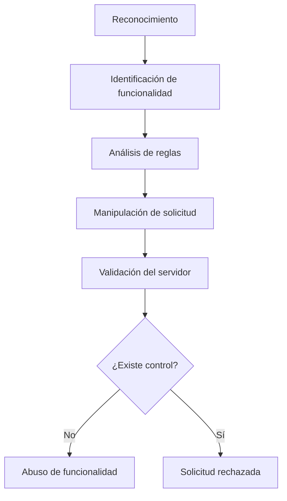

Algunas técnicas utilizadas incluyen manipulación de parámetros, repetición de solicitudes, alteración de valores enviados al servidor, manipulación de procesos de negocio, automatización de operaciones y pruebas de límites y restricciones.

### 🛠️ Herramientas utilizadas

| Herramienta | Utilización |
| --- | --- |
| **Burp Suite** | Manipulación de solicitudes HTTP |
| **OWASP ZAP** | Análisis de aplicaciones web |
| **Postman** | Pruebas de APIs |
| **DevTools** | Inspección del comportamiento del cliente |
| **Nmap** | Reconocimiento de infraestructura |

### 🛡️ Prevención y mitigación

- Realizar **Threat Modeling** durante el diseño.
- Definir requisitos de seguridad antes de desarrollar.
- Validar todas las operaciones críticas en el backend.
- Aplicar autorización en cada operación sensible.
- Implementar límites y *rate limiting*.
- Diseñar mecanismos contra automatización.
- Aplicar el principio de mínimo privilegio.
- Implementar defensa en profundidad.
- Realizar pruebas de abuso de lógica de negocio.
- Revisar periódicamente la arquitectura.

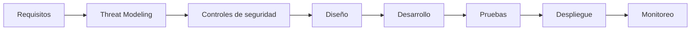

---

## 5️⃣ A05:2021 — Configuración de Seguridad Incorrecta

### ⚙️ ¿Qué es?

La **Configuración de Seguridad Incorrecta** ocurre cuando una aplicación, servidor, base de datos, servicio cloud o componente de infraestructura se encuentra configurado de manera insegura. El problema puede aparecer tanto por una configuración incorrecta como por mantener configuraciones predeterminadas o funcionalidades que no son necesarias.

### 🧠 Causas más comunes

- Credenciales predeterminadas.
- Funciones innecesarias habilitadas.
- Paneles administrativos expuestos.
- Mensajes de error demasiado detallados.
- Debug habilitado en producción.
- Permisos excesivos.
- Servicios o puertos innecesarios expuestos.
- Falta de actualización de componentes.
- Configuración incorrecta de servicios cloud.
- Headers de seguridad ausentes o incorrectos.

### 💥 Ejemplos

**Ejemplo 1 — Modo Debug.** Un servidor desplegado en producción podría mostrar información detallada cuando ocurre un error:

```text
Error 500

Database connection failed
Host: 192.168.x.x
Database: production_db
Stack trace:
...
```

Esta información puede ayudar a un atacante a conocer detalles internos de la infraestructura.

**Ejemplo 2 — Credenciales predeterminadas.** Un dispositivo o aplicación puede mantener las credenciales originales proporcionadas por el fabricante.

```text
Usuario: admin
Contraseña: contraseña_predeterminada
```

Si estas credenciales no se modifican, un atacante que las conozca podría intentar acceder al sistema.

### ⚠️ Impacto

| Configuración | Riesgo |
| --- | --- |
| Credenciales predeterminadas | Acceso no autorizado |
| Debug habilitado | Divulgación de información |
| Directorios públicos | Exposición de archivos |
| Puertos innecesarios | Aumento de superficie de ataque |
| Panel administrativo público | Ataques contra autenticación |
| Permisos excesivos | Escalamiento o abuso |
| Componentes desactualizados | Explotación de vulnerabilidades conocidas |

### 🔍 Métodos de explotación

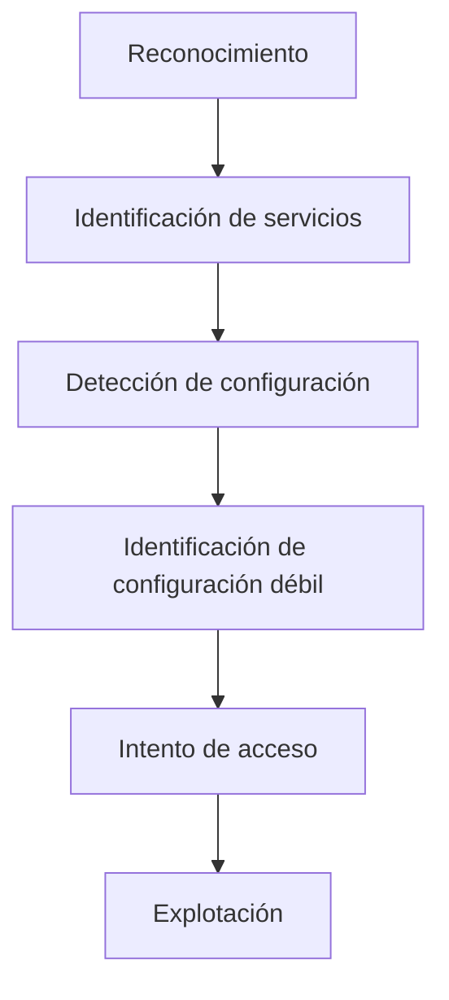

Entre las técnicas utilizadas se encuentran: identificación de servicios expuestos, detección de versiones, búsqueda de configuraciones predeterminadas, identificación de paneles administrativos, análisis de respuestas HTTP, revisión de certificados y configuraciones TLS, enumeración de directorios, identificación de mensajes de error y detección de servicios innecesarios.

### 🛠️ Herramientas utilizadas

| Herramienta | Utilización |
| --- | --- |
| **Nmap** | Descubrimiento de puertos y servicios |
| **Burp Suite** | Análisis de solicitudes y respuestas HTTP |
| **OWASP ZAP** | Identificación de problemas de configuración web |
| **Nikto** | Evaluación de configuraciones de servidores web |
| **WhatWeb** | Identificación de tecnologías utilizadas |
| **Gobuster** | Enumeración de recursos y directorios |

### 🛡️ Prevención y mitigación

- Eliminar credenciales predeterminadas.
- Deshabilitar funcionalidades innecesarias.
- Desactivar el modo debug en producción.
- Utilizar configuraciones seguras para servidores.
- Mantener actualizados los componentes.
- Aplicar el principio de mínimo privilegio.
- Reducir la cantidad de servicios expuestos.
- Configurar correctamente HTTPS/TLS.
- Implementar headers de seguridad.
- Evitar mostrar información sensible en errores.
- Realizar revisiones periódicas de configuración.
- Automatizar controles de seguridad dentro del pipeline CI/CD.

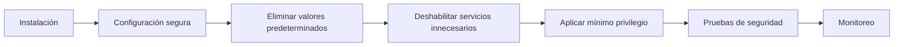

---

## 📊 Comparación A03–A05

| Característica | A03 — Inyección | A04 — Diseño Inseguro | A05 — Configuración Incorrecta |
| --- | --- | --- | --- |
| **Origen** | Entrada no controlada | Arquitectura o lógica deficiente | Configuración insegura |
| **Etapa principal** | Desarrollo | Diseño | Implementación/despliegue |
| **Objetivo frecuente** | Manipular instrucciones | Abusar de funcionalidades | Explotar exposición o configuración |
| **Ejemplo** | SQL Injection | Bypass de reglas | Debug habilitado |
| **Herramienta destacada** | sqlmap | Burp Suite | Nmap |
| **Principal defensa** | Parametrización | Secure by Design | Hardening |
| **Impacto** | Datos/sistema | Procesos/negocio | Infraestructura/aplicación |

Las tres categorías pueden aparecer simultáneamente dentro de una misma aplicación:


Por ejemplo, una aplicación podría tener una arquitectura que no contempla correctamente la validación de entradas (**A04**), implementar consultas SQL inseguras (**A03**) y además desplegarse con una configuración de producción incorrecta (**A05**). La combinación de varias debilidades puede incrementar considerablemente la superficie de ataque.

> **Conclusión A03–A05:** la **Inyección** se produce principalmente cuando los datos externos son interpretados como instrucciones. El **Diseño Inseguro** surge cuando la arquitectura o las reglas de negocio no contemplan adecuadamente escenarios de abuso. La **Configuración de Seguridad Incorrecta** aparece cuando los componentes de una aplicación o infraestructura se despliegan con configuraciones inseguras. La prevención requiere un enfoque integral: **diseño seguro, desarrollo seguro, configuración adecuada, pruebas de seguridad, monitoreo y mantenimiento continuo**.

---

## 6️⃣ A06:2021 — Componentes Vulnerables y Desactualizados

### 🧩 Introducción

Las aplicaciones web modernas rara vez están construidas completamente desde cero. Los desarrolladores utilizan frameworks, librerías, paquetes, servidores, sistemas operativos y otros componentes desarrollados por terceros. Esto permite desarrollar aplicaciones de manera más rápida, pero también introduce riesgos de seguridad.

El riesgo **A06:2021 – Componentes Vulnerables y Desactualizados** ocurre cuando una aplicación utiliza componentes que contienen vulnerabilidades conocidas, se encuentran desactualizados, ya no reciben soporte o no son administrados adecuadamente.

> 💡 Una aplicación puede tener código propio aparentemente seguro y aun así ser vulnerable debido a una dependencia de terceros.

### 🧠 ¿Qué es un componente?

Un componente es una pieza de software que forma parte de una aplicación o de la infraestructura que la soporta: frameworks, librerías, paquetes, APIs, servidores web, sistemas operativos, servidores de aplicaciones, sistemas gestores de bases de datos, plugins, runtimes y otras dependencias de terceros.

```text
Aplicación Web
│
├── Python
├── Flask
├── Requests
├── SQLAlchemy
├── PostgreSQL
└── Otras librerías
```

### 🔗 Dependencias directas y transitivas

**Dependencia directa** — un componente que nuestro proyecto utiliza directamente:

```text
Mi aplicación
      │
      └── Flask
```

**Dependencia transitiva** — una dependencia utilizada por otro componente que nosotros instalamos:

```text
Mi aplicación
      │
      └── Framework
             │
             └── Librería A
                    │
                    └── Librería B
```

> ⚠️ Una vulnerabilidad en una dependencia transitiva también puede afectar nuestra aplicación.

### 🔴 ¿Cuándo tenemos un problema A06?

- Utilizamos una librería con vulnerabilidades conocidas.
- Utilizamos componentes sin actualizar durante largos periodos.
- Utilizamos software que ya no recibe soporte.
- No conocemos las versiones exactas de nuestras dependencias.
- No analizamos las dependencias de manera periódica.
- Utilizamos componentes obtenidos de fuentes no confiables.
- Tenemos dependencias innecesarias o desconocidas (transitivas).
- No tenemos un inventario de los componentes utilizados.

### 📊 Ejemplo sencillo

```text
                    🛒 TIENDA WEB
                         │
        ┌────────────────┼────────────────┐
        │                │                │
      Frontend        Backend          Base de datos
        │                │                │
     React/JS          Flask           PostgreSQL
                         │
                 ┌───────┴───────┐
                 │               │
              Requests       Librería X
                                 │
                          ⚠️ Vulnerabilidad
```

El desarrollador puede no haber escrito la Librería X. Sin embargo, si la aplicación la utiliza directa o indirectamente, puede verse afectada.

### 🕵️ ¿Cómo puede aprovecharlo un atacante?

```text
        🔴 ATACANTE
             │
             ▼
     Identifica tecnología
             │
             ▼
     Identifica versión
             │
             ▼
     Busca vulnerabilidades
             │
             ▼
      ¿Existe una CVE?
          /       \
        Sí         No
        │           │
        ▼           ▼
  Investiga       Busca
  explotación     otra vía
```

### 📚 Conceptos importantes: CVE, CWE y CVSS

| Concepto | Significado |
|---|---|
| **CVE** (Common Vulnerabilities and Exposures) | Identificador único de una vulnerabilidad específica (p. ej. `CVE-2021-XXXXX`) |
| **CWE** (Common Weakness Enumeration) | Describe categorías de debilidades de software (p. ej. `CWE-1104 – Use of Unmaintained Third Party Components`) |
| **CVSS** (Common Vulnerability Scoring System) | Puntuación que expresa la severidad técnica de una vulnerabilidad, combinando explotabilidad e impacto |

### 🔎 Componentes desactualizados y sin mantenimiento

Un componente desactualizado es aquel que utiliza una versión antigua cuando existen versiones posteriores. El hecho de que exista una versión nueva **no significa automáticamente que la versión anterior sea vulnerable**, pero mantener componentes antiguos aumenta el riesgo, especialmente cuando ya no reciben soporte, existen vulnerabilidades conocidas o el fabricante recomienda actualizar.

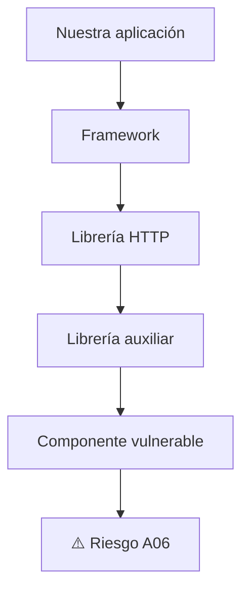

### 🧰 SCA — Software Composition Analysis

Es el análisis de los componentes y dependencias de una aplicación con el objetivo de identificar riesgos, versiones y vulnerabilidades conocidas.

```text
              📦 PROYECTO
                   │
                   ▼
             Analizador SCA
                   │
          ┌────────┼────────┐
          ▼        ▼        ▼
      Librería A Librería B Librería C
          │        │        │
          ▼        ▼        ▼
        CVE?     CVE?      CVE?
          │        │        │
          └────────┼────────┘
                   ▼
              📊 Reporte
```

### 🛠️ Herramientas relacionadas

| Herramienta | Utilización |
|---|---|
| **OWASP Dependency-Check** | Analiza dependencias y busca vulnerabilidades conocidas |
| **npm audit** | Analiza vulnerabilidades en proyectos Node.js (`npm audit`) |
| **pip-audit** | Analiza dependencias de proyectos Python (`pip-audit`) |
| **Dependabot** | Detecta dependencias vulnerables y propone actualizaciones en GitHub |

### 📦 SBOM — Software Bill of Materials

Una SBOM es la "lista de ingredientes" de un software: qué componentes forman parte de un producto.

```text
Aplicación: TiendaWeb
│
├── Python
├── Flask
├── Requests
├── SQLAlchemy
├── PostgreSQL Driver
└── Otras dependencias
```

### 🔄 Ciclo de gestión de dependencias

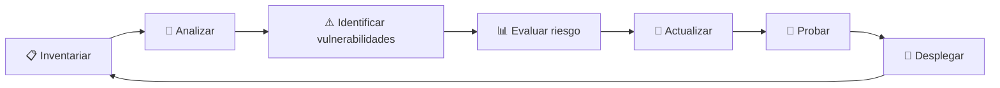

### 🧪 Laboratorio propuesto — A06

**Objetivo:** identificar, analizar y corregir vulnerabilidades relacionadas con dependencias de terceros.

1. Crear el proyecto: `mkdir laboratorio-a06 && cd laboratorio-a06`
2. Crear entorno virtual: `python -m venv venv` (activar con `venv\Scripts\activate` en Windows)
3. Crear `requirements.txt` con, por ejemplo, `Flask` y `requests`
4. Instalar dependencias: `pip install -r requirements.txt`
5. Ejecutar auditoría: `pip-audit`
6. Registrar dependencia, versión instalada, vulnerabilidad, severidad, versión corregida y acción recomendada
7. Actualizar las dependencias afectadas: `pip install --upgrade nombre-paquete`
8. Ejecutar `pip-audit` nuevamente y comparar resultados antes/después

### 🔐 A06 dentro de DevSecOps

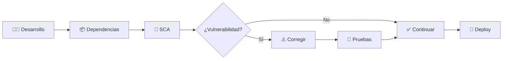

### 🛡️ ¿Cómo prevenir A06?

- Mantener un inventario de componentes y conocer las versiones utilizadas.
- Analizar dependencias periódicamente con herramientas SCA.
- Mantener las dependencias actualizadas y eliminar las innecesarias.
- Evitar componentes sin mantenimiento y utilizar fuentes confiables.
- Revisar dependencias transitivas.
- Implementar análisis de dependencias dentro del CI/CD.
- Mantener una SBOM cuando sea apropiado.
- Establecer procesos para responder ante nuevas vulnerabilidades.

> 🔑 **La primera medida de seguridad para nuestras dependencias es saber exactamente qué tenemos instalado.**

---

## 7️⃣ A07:2021 — Fallas de Identificación y Autenticación

### 🔐 Introducción

Una aplicación web necesita saber quién está intentando acceder a ella y comprobar que realmente es quien dice ser. Cuando estos mecanismos están mal diseñados o implementados pueden aparecer vulnerabilidades relacionadas con la identificación, autenticación y gestión de sesiones.

> 💡 En términos sencillos: A07 ocurre cuando una aplicación no comprueba correctamente quién es el usuario o permite que un atacante pueda hacerse pasar por él.

### 🧠 Identificación, autenticación y autorización

| Concepto | Pregunta | Ejemplo |
|---|---|---|
| **Identificación** | ¿Quién eres? | Usuario: William |
| **Autenticación** | ¿Puedes demostrarlo? | Contraseña + MFA |
| **Autorización** | ¿Qué puedes hacer? | Consultar su cuenta |

**Analogía:** entrar a una universidad.

```text
IDENTIFICACIÓN → "Soy William"
AUTENTICACIÓN  → "Esta es mi tarjeta de identificación"
AUTORIZACIÓN   → "Mi tarjeta me permite entrar a esta área"
```

Estar autenticado **no significa tener acceso a todo**.

### 🔴 ¿Qué es A07?

Se presenta cuando existen fallas en mecanismos como inicio de sesión, contraseñas, MFA, recuperación de cuentas, gestión de sesiones, tokens, protección contra ataques automatizados, cierre de sesión y validación de credenciales:

```text
❌ Contraseñas débiles          ❌ Recuperación insegura de cuentas
❌ Credenciales predeterminadas ❌ Contraseñas almacenadas incorrectamente
❌ Falta de MFA                 ❌ Sesiones que no expiran
❌ Fuerza bruta                 ❌ Session Fixation
❌ Credential Stuffing          ❌ Session Hijacking
```

### 🔓 Contraseñas débiles y credenciales predeterminadas

Ejemplos de contraseñas fácilmente adivinables: `123456`, `password`, `admin`, `admin123`, `qwerty`. El problema aumenta cuando los usuarios reutilizan la misma contraseña en diferentes servicios, o cuando un sistema mantiene credenciales predeterminadas de fábrica (`admin`/`admin`) en producción.

```text
❌ Mala práctica                    ✅ Buena práctica
Instalación                         Instalación
   ↓                                   ↓
Usuario/contraseña predeterminados  Cambiar credenciales
   ↓                                   ↓
Producción                          Configurar autenticación segura + MFA
                                        ↓
                                     Producción
```

### 💥 Fuerza bruta

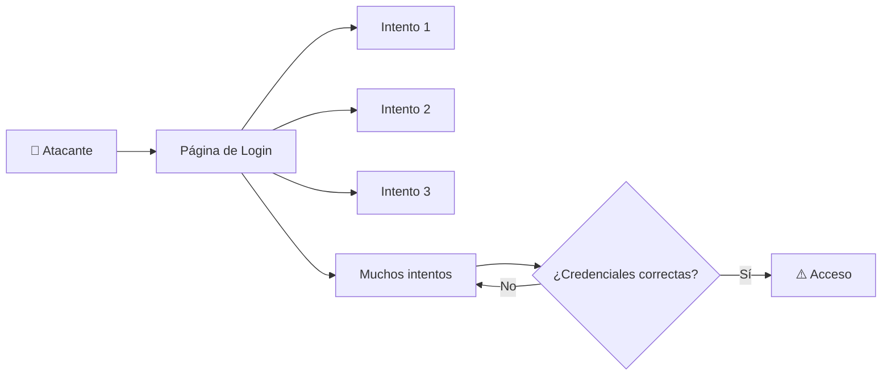

**Protección:** limitar intentos, retrasos progresivos, rate limiting, MFA, detección de patrones anormales, monitoreo, bloqueos cuidadosamente diseñados y alertas.

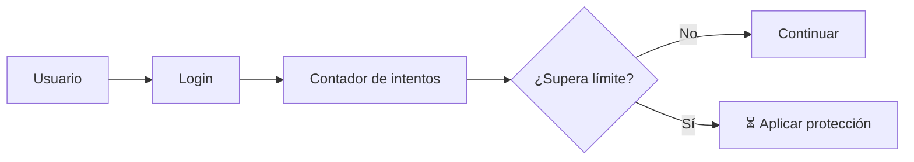

> ⚠️ Un bloqueo de cuenta mal diseñado también puede convertirse en un problema de disponibilidad si un atacante puede bloquear intencionalmente cuentas de otros usuarios.

### 🧪 Credential Stuffing

El atacante utiliza pares de usuario/contraseña obtenidos previamente de una filtración de otro servicio y los reutiliza contra la aplicación objetivo. El problema principal es la **reutilización de contraseñas**.

| Característica | Fuerza bruta | Credential Stuffing |
|---|---|---|
| Objetivo | Encontrar credenciales | Reutilizar credenciales obtenidas |
| Contraseñas | Se prueban combinaciones | Ya fueron obtenidas |
| Principal defensa | Rate limiting + MFA | MFA + detección + contraseñas únicas |
| Riesgo | Alto | Alto |

### 🔐 MFA — Multi-Factor Authentication

Combina dos o más factores independientes:

- **Algo que sabes:** contraseña, PIN.
- **Algo que tienes:** teléfono, token de seguridad, app autenticadora.
- **Algo que eres:** huella digital, reconocimiento facial.

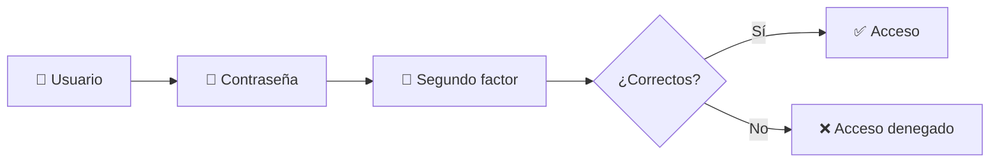

> 💡 MFA no hace que una aplicación sea invulnerable, pero reduce significativamente el riesgo asociado al robo de credenciales.

### 🔑 Almacenamiento seguro de contraseñas

> ❌ **Las contraseñas no deben almacenarse en texto plano.**

```text
Contraseña → Función de hashing → Hash almacenado
```

En el login: `Contraseña ingresada → Verificación → Hash almacenado → ¿Coinciden?`

**Salt:** valor aleatorio combinado con la contraseña antes del hashing (`Contraseña + Salt → Hash → Base de datos`), que dificulta ataques con tablas precomputadas.

> ⚠️ No debemos implementar nuestro propio algoritmo de hashing de contraseñas; es preferible usar librerías diseñadas específicamente para esto.

**Algoritmos recomendados:** Argon2, bcrypt, scrypt, PBKDF2.
**No deben usarse solos para contraseñas:** MD5, SHA-1, SHA-256 (no están diseñados para resistir ataques de adivinación masiva).

### 📧 Recuperación de cuentas

❌ Inseguro: preguntas fácilmente adivinables (`¿Cuál es el nombre de tu mascota?`).

✅ Más seguro:

```text
Usuario solicita recuperación → Servidor genera mecanismo temporal
→ Usuario recibe enlace con token aleatorio → Token expira → Nueva contraseña
```

### 🍪 Sesiones, Session ID y sus riesgos

```text
Usuario → Login → Autenticación correcta → Servidor crea sesión
→ Session ID / Token → Usuario continúa navegando
```

**Session Hijacking** — un atacante consigue utilizar la sesión legítima de otra persona:

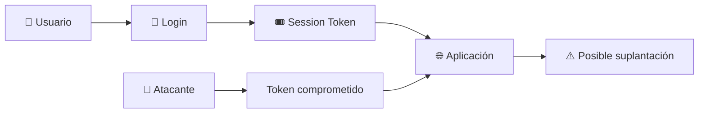

**Session Fixation** — un atacante logra que la víctima utilice un identificador de sesión conocido por él, y luego la víctima se autentica usando esa sesión:

```text
Atacante conoce Session ID → Víctima utiliza esa sesión → Víctima inicia sesión
→ Sesión autenticada → Atacante intenta reutilizarla
```

> Una medida importante es **regenerar el identificador de sesión después de una autenticación exitosa**.

**Expiración y cierre de sesión:**

```text
❌ Cierre de sesión inseguro         ✅ Cierre de sesión correcto
Usuario pulsa "Cerrar sesión"        Usuario pulsa "Cerrar sesión"
   ↓                                    ↓
Se oculta la página                  Servidor invalida sesión
   ↓                                    ↓
Session Token continúa válido        Token deja de ser válido
```

**Atributos de seguridad de cookies:**

- **HttpOnly** — impide que JavaScript acceda a la cookie mediante `document.cookie`.
- **Secure** — la cookie solo se transmite por HTTPS.
- **SameSite=Lax / Strict** — controla el envío de cookies en solicitudes entre sitios.

### 🌐 HTTPS y autenticación

Las credenciales y tokens de sesión deben protegerse durante el transporte (HTTPS en lugar de HTTP).

### 💻 Ejemplo de código vulnerable vs. mejorado

**Vulnerable (educativo):**

```python
users = {
    "admin": "123456"
}

@app.route("/login", methods=["POST"])
def login():
    username = request.form["username"]
    password = request.form["password"]
    if username in users:
        if users[username] == password:
            return "Login exitoso"
    return "Credenciales incorrectas"
```

Problemas: contraseña débil, texto plano, sin MFA, sin rate limiting, sin control de intentos, sin gestión segura de sesión, sin monitoreo.

**Conceptual mejorado:**

```python
@app.route("/login", methods=["POST"])
def login():
    username = request.form["username"]
    password = request.form["password"]

    user = get_user(username)
    if not user:
        register_failed_attempt(username)
        return "Credenciales incorrectas"

    if not verify_password(password, user.password_hash):
        register_failed_attempt(username)
        return "Credenciales incorrectas"

    if user.mfa_enabled:
        return "Solicitar segundo factor"

    create_secure_session(user)
    return "Login exitoso"
```

### 🧪 Laboratorio propuesto — A07

**Objetivo:** construir una aplicación de autenticación sencilla, identificar vulnerabilidades y aplicar medidas de seguridad, únicamente en un entorno controlado y local.

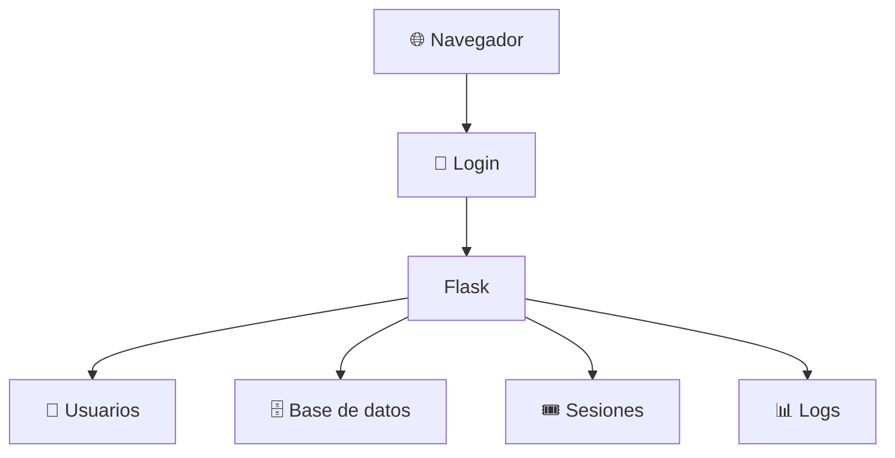

1. **Fase 1 — Login vulnerable:** crear un login simple y observar qué problemas existen (contraseña segura, almacenamiento, MFA, intentos permitidos, rate limiting, creación/expiración de sesión).
2. **Fase 2 — Mejorar contraseñas:** reemplazar el almacenamiento directo por hashing seguro (`Contraseña → Hash seguro para passwords → Base de datos`).
3. **Fase 3 — Protección contra automatización:** implementar un mecanismo de control de múltiples intentos.
4. **Fase 4 — MFA:** agregar un segundo factor de demostración (código temporal) dentro del entorno de pruebas.
5. **Fase 5 — Gestión de sesión:** verificar generación, aleatoriedad, regeneración post-login, expiración, invalidación al cerrar sesión y atributos seguros de cookies.

**Pruebas sugeridas:** contraseñas débiles, intentos repetidos, cierre de sesión, expiración, y verificación de MFA.

### 🛡️ Herramientas para estudiar A07

- **OWASP ZAP** — análisis de aplicaciones web en pruebas de seguridad.
- **Burp Suite** — observación y análisis de solicitudes HTTP/HTTPS autorizadas.
- **DevTools** — inspección de cookies, headers, solicitudes, respuestas y almacenamiento.

### 🧩 A07 y DevSecOps

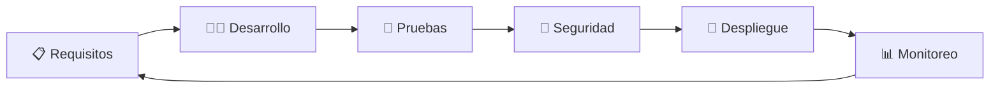

### 📊 Matriz de vulnerabilidades A07

| Vulnerabilidad | Ejemplo | Impacto |
|---|---|---|
| Contraseña débil | `123456` | 🔴 Alto |
| Credenciales predeterminadas | `admin/admin` | 🔴 Alto |
| Fuerza bruta | Muchos intentos | 🔴 Alto |
| Credential Stuffing | Reutilización de credenciales | 🔴 Alto |
| Sin MFA | Solo contraseña | 🟠 Medio/Alto |
| Hashing incorrecto | Contraseñas en texto plano | 🔴 Crítico |
| Sesión sin expiración | Token permanente | 🟠 Alto |
| Session Fixation | Sesión reutilizada | 🔴 Alto |
| Session Hijacking | Robo de sesión | 🔴 Alto |
| Recuperación insegura | Preguntas fáciles | 🟠 Alto |

### 🛡️ Buenas prácticas para prevenir A07

- **Contraseñas:** políticas adecuadas, sin predeterminadas, hashing seguro, evitar reutilización.
- **MFA:** usar cuando sea apropiado, priorizar cuentas administrativas y mecanismos resistentes al phishing.
- **Protección contra automatización:** rate limiting, control de intentos, monitoreo, detección de anomalías.
- **Sesiones:** identificadores impredecibles, regeneración post-login, expiración, invalidación al cerrar sesión, cookies protegidas, HTTPS.
- **Recuperación de cuentas:** mecanismos temporales, tokens aleatorios con expiración, sin preguntas de seguridad débiles.

### 🔗 Relación entre A07 y otros riesgos OWASP

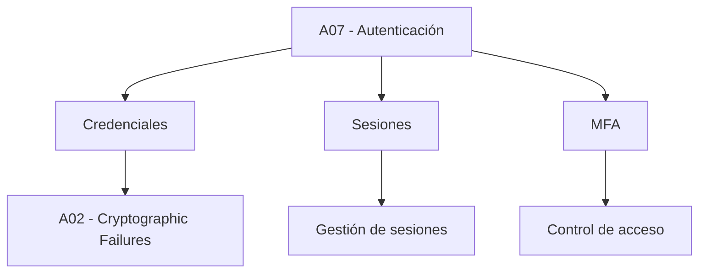

### 🧠 Ejemplo completo (aplicación bancaria)

```text
1. Introduce usuario → 2. Introduce contraseña → 3. Verifica contraseña
→ 4. Solicita MFA → 5. Proporciona segundo factor → 6. Crea sesión → 7. Accede a su cuenta
```

**Implementación insegura:** contraseña débil, texto plano, sin MFA, sin límite de intentos, sesión permanente, cookie sin protección, sin invalidación al cerrar sesión.

**Implementación segura:** contraseña protegida, MFA, rate limiting, sesión segura con expiración, cookies protegidas, HTTPS, invalidación al cerrar sesión, monitoreo.

> 🔑 **Una contraseña correcta no es suficiente para considerar segura una autenticación. La seguridad debe proteger todo el ciclo de vida de la identidad y la sesión.**

---

## 8️⃣ A08:2021 — Fallas de Integridad de Software y Datos

### 🧩 Introducción

Cuando hablamos de A06 vimos que una aplicación puede depender de componentes de terceros vulnerables. A08 va un paso más allá: no se trata solo de si un componente tiene una vulnerabilidad conocida, sino de si tenemos alguna forma de verificar que el código, las actualizaciones o los datos que estamos usando realmente vienen de donde creemos que vienen y no fueron alterados en el camino.

El riesgo **A08:2021 – Software and Data Integrity Failures** se relaciona con código e infraestructura que no protege contra violaciones de integridad, es decir, situaciones donde se asume que algo es confiable sin haberlo comprobado realmente.

> 💡 En términos sencillos: A08 ocurre cuando una aplicación confía "a ciegas" en un archivo, una actualización o un objeto de datos, sin verificar su procedencia ni su integridad.

### 🧠 ¿Qué significa "integridad" aquí?

```text
        🔺 TRIADA CIA
              │
   ┌──────────┼──────────┐
   ▼          ▼          ▼
Confidencialidad   Integridad   Disponibilidad
```

- **Confidencialidad:** que solo quien debe ver la información pueda verla.
- **Integridad:** que la información no haya sido alterada sin autorización.
- **Disponibilidad:** que la información esté accesible cuando se necesita.

A08 se enfoca en el segundo pilar, tanto de software (código, paquetes, actualizaciones, pipelines) como de datos (objetos serializados, cookies, tokens).

### 🔴 ¿Cuándo aparece A08?

- Utilizamos plugins, librerías o contenido servido desde un CDN sin verificar su integridad.
- Un pipeline CI/CD no valida que el código que despliega proviene realmente del repositorio autorizado.
- Una aplicación implementa actualizaciones automáticas sin verificar la firma del paquete.
- Se deserializan objetos que provienen del cliente sin comprobar que no fueron manipulados.
- Se confía en cookies o parámetros para tomar decisiones de seguridad sin validarlos en el servidor.

### 📊 Ejemplo — cadena de confianza rota

```text
   Repositorio oficial
          │
          ▼
   Pipeline CI/CD
          │
   ┌──────┴──────┐
   ▼             ▼
Verificación   Sin verificación
   │             │
   ▼             ▼
 ✅ Seguro     ⚠️ Riesgo de A08
```

Si el pipeline no verifica de dónde viene el código o el artefacto que va a desplegar, un atacante que logre insertarse en cualquier punto de esa cadena puede hacer que su código termine ejecutándose en producción, sin que nadie lo note hasta que sea demasiado tarde.

### 🕵️ Deserialización insegura

```text
Cliente → Objeto serializado → Servidor → Deserialización
→ ¿El objeto fue validado?
     /        \
   Sí          No
   │            │
   ▼            ▼
 Seguro     ⚠️ Ejecución de código
```

Si el servidor no valida el contenido antes de reconstruir el objeto, un atacante puede manipular esos datos para alterar el comportamiento de la aplicación, e incluso, en algunos lenguajes y frameworks, lograr ejecución remota de código.

### 💥 Ejemplos de escenarios reales

- **Actualización sin firma:** un dispositivo (router, decodificador, IoT) descarga actualizaciones de firmware sin verificar una firma digital; un atacante que intercepta o suplanta el servidor de actualizaciones puede distribuir una versión maliciosa.
- **Dependencia fuera del gestor oficial:** un desarrollador descarga un paquete desde un sitio externo no firmado ni verificado, que puede contener código malicioso.
- **CI/CD comprometido:** casos como el ataque a la cadena de suministro de SolarWinds muestran cómo comprometer una sola herramienta del pipeline permite distribuir código malicioso a miles de organizaciones.

### 🛠️ Herramientas relacionadas

| Herramienta | Utilización |
|---|---|
| **Cosign / Sigstore** | Firma y verificación de artefactos e imágenes de contenedores |
| **OWASP Dependency-Check** | Verificación de integridad de dependencias |
| **GPG** | Firma y verificación de paquetes y commits |
| **Escáneres de deserialización (Java)** | Identificación de puntos vulnerables a deserialización insegura |

### 🛡️ ¿Cómo prevenir A08?

- Utilizar firmas digitales para verificar que el software o los datos provienen de la fuente esperada.
- Asegurarse de que las dependencias solo se consuman desde repositorios de confianza.
- Establecer revisión de código y de configuración antes de fusionar cambios.
- Proteger el pipeline CI/CD con control de acceso y segregación adecuados.
- No deserializar datos no confiables sin verificación de integridad o firma digital.

### 🧪 Laboratorio propuesto — A08

**Objetivo:** comprender de forma práctica el concepto de verificación de integridad de un archivo descargado.

1. Descargar un archivo de ejemplo.
2. Calcular su hash (`sha256sum archivo`).
3. Comparar contra el hash publicado por la fuente oficial.
4. Modificar intencionalmente el archivo (laboratorio propio).
5. Calcular el hash nuevamente y comparar la diferencia.

> Este ejercicio evidencia por qué verificar la integridad (hashes o firmas) permite detectar si un archivo fue alterado antes de confiar en él.

### 🎯 Conclusión A08

A08 nos recuerda que no basta con que un componente exista o funcione correctamente: también debemos poder confiar en que nadie lo alteró en el camino, desde el repositorio hasta la ejecución en producción. La integridad es un pilar de seguridad tan importante como la confidencialidad, y suele pasar desapercibido hasta que ya es demasiado tarde.

---

## 9️⃣ A09:2021 — Fallas de Registro y Monitoreo de Seguridad

### 🧩 Introducción

Hasta ahora hemos analizado vulnerabilidades que un atacante puede explotar directamente. A09 es distinto: no es una falla que se "ataque" en sí misma, sino una falla que permite que todo lo demás pase desapercibido.

El riesgo **A09:2021 – Security Logging and Monitoring Failures** se refiere a la incapacidad de una aplicación u organización para detectar, registrar y responder ante actividad sospechosa o incidentes de seguridad.

> 💡 En términos sencillos: A09 ocurre cuando "las luces están apagadas" — un atacante puede estar operando dentro del sistema y nadie se entera.

### 🧠 ¿Por qué es tan importante el registro?

```text
Ataque en curso
      │
      ▼
 ¿Existe registro?
    /         \
  Sí            No
  │              │
  ▼              ▼
Detección      ⚠️ Persistencia
  │              │
  ▼              ▼
Respuesta      Sin respuesta
```

Sin registro (logging) y monitoreo, los ataques no pueden detectarse. Y sin alertas, aunque exista registro, nadie reacciona a tiempo. Por eso esta categoría abarca tres capas relacionadas: registrar, monitorear y alertar.

### 🔴 ¿Cuándo tenemos un problema A09?

- No se registran eventos auditables como inicios de sesión fallidos o transacciones sensibles.
- Las advertencias y errores no generan mensajes de registro claros.
- Los registros se almacenan solo localmente, sin respaldo ni protección contra manipulación.
- No existen umbrales de alerta ni procesos de escalamiento.
- Hay tantos falsos positivos que las alertas reales se pierden entre el ruido.
- Se registra información sensible (contraseñas, datos personales) dentro de los propios logs.

### 📊 Ejemplo sencillo

```text
   🏢 EMPRESA
        │
   ┌────┴────┐
   ▼         ▼
Con logging   Sin logging
   │             │
   ▼             ▼
Detecta el      Brecha pasa
ataque en       desapercibida
minutos/horas   durante meses/años
```

### 💥 Ejemplos de escenarios reales

- **Ausencia total de monitoreo:** una plataforma de salud sufrió el acceso y modificación no autorizada de millones de registros médicos sensibles; sin registro ni monitoreo, la brecha pudo haber estado activa durante años sin que nadie lo notara.
- **Brecha en un proveedor externo:** una aerolínea sufrió la exposición de más de una década de datos personales de pasajeros, originada en un proveedor externo de hosting en la nube que tardó en notificar el incidente.
- **Ataques a sistemas de pago sin alerta oportuna:** una aerolínea europea sufrió el robo de cientos de miles de registros de pago, derivando en una sanción millonaria por no detectar ni reportar la brecha a tiempo.

### 🔍 ¿Qué debería registrarse?

```text
Evento
   │
   ├── Inicios de sesión (éxito y fallo)
   ├── Cambios de permisos
   ├── Transacciones de alto valor
   ├── Errores de validación del lado del servidor
   ├── Accesos a datos sensibles
   └── Actividad administrativa
```

### 🛠️ Herramientas relacionadas

| Herramienta | Utilización |
|---|---|
| **ELK Stack** (Elasticsearch, Logstash, Kibana) | Correlación y visualización de logs |
| **Splunk** | Gestión centralizada de logs y alertas |
| **OWASP ModSecurity Core Rule Set** | Protección y registro a nivel de WAF |
| **SIEM** (genérico) | Correlación de eventos de seguridad y generación de alertas |

### 🛡️ ¿Cómo prevenir A09?

- Registrar todos los eventos relevantes con suficiente contexto (usuario, IP, acción, resultado).
- Proteger la integridad de los registros contra manipulación (p. ej. almacenamiento append-only).
- Definir umbrales de alerta y manuales de procedimiento (*playbooks*) para el equipo de respuesta.
- Usar **honeytokens**: datos señuelo que nunca deberían usarse en operación normal, de modo que cualquier acceso a ellos dispare una alerta confiable.
- Adoptar un plan formal de respuesta a incidentes (p. ej. basado en NIST SP 800-61).

### 🧪 Laboratorio propuesto — A09

**Objetivo:** configurar un registro básico de eventos de autenticación y observar cómo permite detectar un patrón de ataque.

1. Retomar la aplicación de login del laboratorio A07.
2. Agregar registro de cada intento (éxito/fallo, usuario, IP, hora).
3. Simular varios intentos fallidos consecutivos.
4. Revisar el archivo/registro generado.
5. Identificar visualmente el patrón de ataque.
6. Proponer un umbral de alerta (p. ej. 5 fallos en 1 minuto).

### 🎯 Conclusión A09

A09 nos enseña que la seguridad no termina en prevenir un ataque: también debemos poder verlo cuando ocurre. Una aplicación puede tener excelentes controles preventivos y, aun así, quedar expuesta durante años si nadie está observando lo que sucede dentro de ella.

---

## 🔟 A10:2021 — Server-Side Request Forgery (SSRF)

### 🧩 Introducción

Muchas aplicaciones modernas necesitan pedirle a otro servidor que "vaya a buscar algo" en su nombre: descargar una imagen desde una URL, consultar un webhook, generar una vista previa de un enlace, etc. El riesgo **A10:2021 – Server-Side Request Forgery (SSRF)** aparece cuando esta funcionalidad no valida correctamente la URL proporcionada por el usuario, permitiendo que el servidor haga solicitudes hacia destinos que no debería alcanzar.

> 💡 En términos sencillos: SSRF ocurre cuando conseguimos que el propio servidor haga una petición por nosotros, hacia donde nosotros queramos.

### 🧠 Solicitud legítima vs. explotada

**Solicitud normal (legítima):**

```text
Usuario → Aplicación → (URL proporcionada por el usuario)
Servidor realiza la solicitud → Recurso externo legítimo
```

**Explotación:** el problema aparece cuando el atacante puede controlar total o parcialmente esa URL y el servidor no valida hacia dónde puede o no puede apuntar.

```text
Atacante → URL manipulada → Aplicación → Servidor realiza la solicitud
   │
   ┌───────────────┬───────────────┐
   ▼               ▼               ▼
Recurso externo  Red interna   Metadata cloud
 (esperado)      (no debería)  (no debería)
```

El servidor, al estar dentro de la red interna de la organización, puede alcanzar recursos que el atacante nunca podría contactar directamente desde internet.

### 💥 Ejemplos de explotación

- **Acceso a servicios internos:** una funcionalidad de "importar imagen desde internet" permite ingresar `http://localhost:8080/admin` o una IP interna, logrando que el servidor consulte paneles administrativos u otros servicios internos no expuestos públicamente.
- **Robo de credenciales de metadatos cloud:** en entornos como AWS, cada instancia tiene un servicio interno de metadatos en `http://169.254.169.254/`. Si una aplicación vulnerable a SSRF permite apuntar hacia esa dirección, un atacante puede obtener credenciales temporales de la instancia.
- **Escaneo de puertos internos:** un atacante puede usar la funcionalidad vulnerable para probar sistemáticamente distintas IPs y puertos internos, observando diferencias en tiempos de respuesta o mensajes de error, mapeando así la red interna.

```text
Atacante
   │
   ▼
Prueba 10.0.0.1:22
Prueba 10.0.0.1:80
Prueba 10.0.0.1:3306
   │
   ▼
Diferencias en respuesta
   │
   ▼
📊 Mapa de la red interna
```

### 🔍 Puntos frecuentes donde aparece SSRF

- Funciones de "vista previa de URL" o "importar desde una URL".
- Webhooks configurables por el usuario.
- Procesamiento de documentos (PDF, XML) que pueden referenciar recursos externos.
- Integraciones que descargan archivos remotos (avatares, adjuntos).
- Funcionalidades de renderizado de páginas (capturas de pantalla, generación de PDF).

### 🛠️ Herramientas utilizadas

| Herramienta | Utilización |
|---|---|
| **Burp Suite** | Interceptar y modificar solicitudes que contienen URLs |
| **SSRFmap** | Automatización de pruebas de SSRF |
| **Servicios de "callback"** (Burp Collaborator y similares) | Confirmar si el servidor realizó realmente la solicitud |
| **Nmap** (indirectamente, desde el servidor vulnerable) | Escaneo de red interna aprovechando el SSRF |

> ⚠️ Estas herramientas deben utilizarse únicamente en sistemas propios, laboratorios o infraestructuras con autorización explícita.

### 🛡️ ¿Cómo prevenir SSRF?

- Validar y sanear todos los datos proporcionados por el cliente, incluyendo URLs.
- Aplicar una lista blanca (*allowlist*) de dominios o direcciones permitidas, en lugar de intentar bloquear los peligrosos (*blocklist*).
- Bloquear rangos de IP privadas (`10.x`, `172.16.x`, `169.254.x`, `127.x`) y direcciones de loopback en las solicitudes salientes del servidor.
- Deshabilitar esquemas de URL innecesarios (`file://`, `gopher://`, `dict://`).
- Usar mecanismos como IMDSv2 en AWS para dificultar el abuso del servicio de metadatos.
- Segmentar de red los servicios que realizan solicitudes hacia internet, separándolos de los sistemas internos críticos.
- No devolver directamente al usuario la respuesta cruda de la solicitud realizada por el servidor.

### 🧪 Laboratorio propuesto — A10 (SSRF)

**Objetivo:** comprender el concepto de SSRF mediante un entorno local y controlado.

1. Crear un servicio interno de prueba (p. ej. servidor Flask en `localhost:9000`) que muestre un mensaje "Acceso interno".
2. Crear una aplicación que reciba una URL y descargue su contenido.
3. Probar con una URL externa legítima (comportamiento esperado).
4. Probar apuntando a `http://localhost:9000` (comportamiento vulnerable).
5. Documentar la diferencia de comportamiento.
6. Implementar una validación con lista blanca de dominios.
7. Repetir la prueba y confirmar que el acceso interno ya no es posible.

### 🎯 Conclusión A10

SSRF es un buen recordatorio de que el servidor también es un usuario de la red, y como tal, puede ser engañado para actuar en nombre de un atacante. Cualquier funcionalidad que reciba una URL o dirección proporcionada externamente y la use para realizar una solicitud debe tratarse con el mismo cuidado que cualquier otra entrada no confiable.

---

## 🏁 Conclusión general

El estudio conjunto de las diez categorías del OWASP Top 10:2021 permite comprender que la seguridad de una aplicación web no depende de un único control, sino de la combinación de múltiples capas de defensa a lo largo de todo el ciclo de vida del software.

```text
🔒 A01 — Control de acceso        ¿Quién puede hacer qué?
🔑 A02 — Criptografía              ¿Protegemos la información?
💉 A03 — Inyección                 ¿Separamos datos de código?
🏗️ A04 — Diseño inseguro            ¿La arquitectura contempla el abuso?
⚙️ A05 — Configuración incorrecta  ¿Está bien configurado el sistema?
📦 A06 — Componentes vulnerables   ¿Confiamos en terceros sin verificar?
🔐 A07 — Autenticación             ¿Protegemos identidades y sesiones?
📦 A08 — Integridad                ¿Podemos confiar en lo que ejecutamos?
📊 A09 — Registro y monitoreo      ¿Nos damos cuenta si algo sale mal?
🌐 A10 — SSRF                      ¿Puede el atacante usar a nuestro servidor
                                      como intermediario?
```

Las categorías **A01** y **A02** muestran que fallar en decidir *quién puede hacer qué* y fallar en *proteger la información* suelen presentarse combinados en ataques reales. **A03**, **A04** y **A05** demuestran que un mismo sistema puede fallar en distintas etapas: desarrollo (inyección), diseño (arquitectura y lógica de negocio) e implementación/despliegue (configuración). **A06** y **A07** recuerdan que también debemos gestionar los componentes de terceros que usamos y proteger adecuadamente las identidades y sesiones de los usuarios. Finalmente, **A08**, **A09** y **A10** cierran el ciclo abordando aspectos que suelen quedar en segundo plano frente a vulnerabilidades más "vistosas", pero igual de críticos: verificar el origen y la integridad de lo que ejecutamos, poder detectar y responder ante un ataque, y evitar que el propio servidor sea utilizado como intermediario hacia la red interna.

> 🔑 **La seguridad de una aplicación no depende de un único control, sino de la combinación de principios como mínimo privilegio, defensa en profundidad, validación del lado del servidor, parametrización, hardening, integridad, visibilidad y validación estricta de cada dato que proviene del exterior — incluyendo aquellos que parecen tan simples como una URL.**

---

## 📚 Referencias generales

**OWASP Foundation**

- OWASP Top 10:2021 — <https://owasp.org/Top10/2021/>
- OWASP Top Ten Web Application Security Risks — <https://owasp.org/www-project-top-ten/>
- A03:2021 – Injection — <https://owasp.org/Top10/2021/A03_2021-Injection/>
- A04:2021 – Insecure Design — <https://owasp.org/Top10/2021/A04_2021-Insecure_Design/>
- A05:2021 – Security Misconfiguration — <https://owasp.org/Top10/2021/A05_2021-Security_Misconfiguration/>
- A06:2021 – Componentes Vulnerables y Desactualizados
- A07:2021 – Identification and Authentication Failures
- A08:2021 – Software and Data Integrity Failures
- A09:2021 – Security Logging and Monitoring Failures
- A10:2021 – Server-Side Request Forgery (SSRF)
- OWASP Dependency-Check
- OWASP Software Component Verification Standard
- OWASP Web Security Testing Guide — <https://owasp.org/www-project-web-security-testing-guide/>
- OWASP Cheat Sheet Series — <https://cheatsheetseries.owasp.org/>
- OWASP Authentication Cheat Sheet
- OWASP Session Management Cheat Sheet
- OWASP Multifactor Authentication Cheat Sheet
- OWASP Password Storage Cheat Sheet
- OWASP Forgot Password Cheat Sheet
- OWASP Credential Stuffing Prevention Cheat Sheet
- OWASP Cheat Sheet: Software Supply Chain Security
- OWASP Cheat Sheet: Deserialization
- OWASP Cheat Sheet: Logging
- OWASP Cheat Sheet: Server-Side Request Forgery Prevention

**Otras entidades de referencia**

- NIST — National Vulnerability Database (NVD)
- NIST — Software Bill of Materials (SBOM)
- NIST — Digital Identity Guidelines
- NIST SP 800-61 — Computer Security Incident Handling Guide
- MITRE — Common Vulnerabilities and Exposures (CVE)
- MITRE — Common Weakness Enumeration (CWE)
- MITRE CWE — Authentication related weaknesses
- FIRST — Common Vulnerability Scoring System (CVSS)