# 🔐 OWASP Top 10 (2025) — Guía Completa de Riesgos de Seguridad en Aplicaciones Web


---

## 👥 Integrantes

| Nombre |
|---|
| William Andres Mosquera Vela |
| Juan Nicolas Pineda Alvarado |
| Johnny Albeiro Mallama Mejia |
| Juan Esteban Contreras Gonzalez |

---

## 📖 Introducción general

La seguridad en el desarrollo de software es hoy uno de los pilares fundamentales para proteger la información de los usuarios y la integridad de los sistemas. El **OWASP Top 10** es un documento de referencia elaborado por la *Open Web Application Security Project (OWASP)*, una fundación sin ánimo de lucro dedicada a mejorar la seguridad del software a nivel mundial.

Este documento resume, mediante un consenso amplio de expertos en seguridad, los **diez riesgos más críticos** que afectan a las aplicaciones web. Su propósito es concientizar a desarrolladores, arquitectos de software y equipos de seguridad sobre las vulnerabilidades más comunes y graves, para que puedan prevenirlas desde las primeras etapas del ciclo de vida del desarrollo (diseño, codificación, pruebas y despliegue).

En noviembre de 2025 OWASP presentó, en la conferencia Global AppSec de Washington D.C., la **octava edición** del Top 10, la primera actualización desde 2021. La versión final se publicó en enero de 2026. Este análisis se construyó sobre más de 175.000 registros CVE y 589 CWE (Common Weakness Enumerations) diferentes —casi el 50% más que en la edición anterior—, además de encuestas a miles de profesionales de la industria.

> 📌 **¿Por qué cambió la lista?** OWASP explica que este ciclo profundizó el giro hacia las **causas raíz** en vez de los **síntomas**. Por ejemplo, "Exposición de Datos Sensibles" (síntoma) se reemplazó por "Fallos Criptográficos" (causa raíz) desde 2017/2021, y ese mismo criterio se aplicó ahora para fusionar SSRF dentro de Control de Acceso y para separar "Fallas de Integridad" del concepto más amplio de "Cadena de Suministro de Software".

Este repositorio reúne, de forma unificada, el análisis de las **diez categorías** de la edición **2025** del OWASP Top 10:

| # 2025 | Categoría | Cambio respecto a 2021 |
|---|---|---|
| A01 | Control de Acceso Roto (*Broken Access Control*) | Se mantiene en el puesto #1. Absorbe **SSRF** (antes A10:2021) |
| A02 | Configuración de Seguridad Incorrecta | Sube del puesto #5 al #2 |
| A03 | **Fallas de la Cadena de Suministro de Software** (NUEVA) | Expande a A06:2021 – Componentes Vulnerables y Desactualizados |
| A04 | Fallos Criptográficos | Baja del puesto #2 al #4 |
| A05 | Inyección | Baja del puesto #3 al #5 |
| A06 | Diseño Inseguro | Baja del puesto #4 al #6 |
| A07 | Fallas de Autenticación | Se mantiene en el puesto #7 (renombrada, antes "Identificación y Autenticación") |
| A08 | Fallas de Integridad de Software o Datos | Se mantiene en el puesto #8 |
| A09 | Fallas de Registro y **Alertamiento** de Seguridad | Se mantiene en el puesto #9 (renombrada, antes "Registro y Monitoreo") |
| A10 | **Manejo Inadecuado de Condiciones Excepcionales** (NUEVA) | Categoría completamente nueva |

> 📌 Fuente oficial: [owasp.org/Top10/2025](https://owasp.org/Top10/2025/)

### 🆚 ¿Qué cambió respecto a 2021?

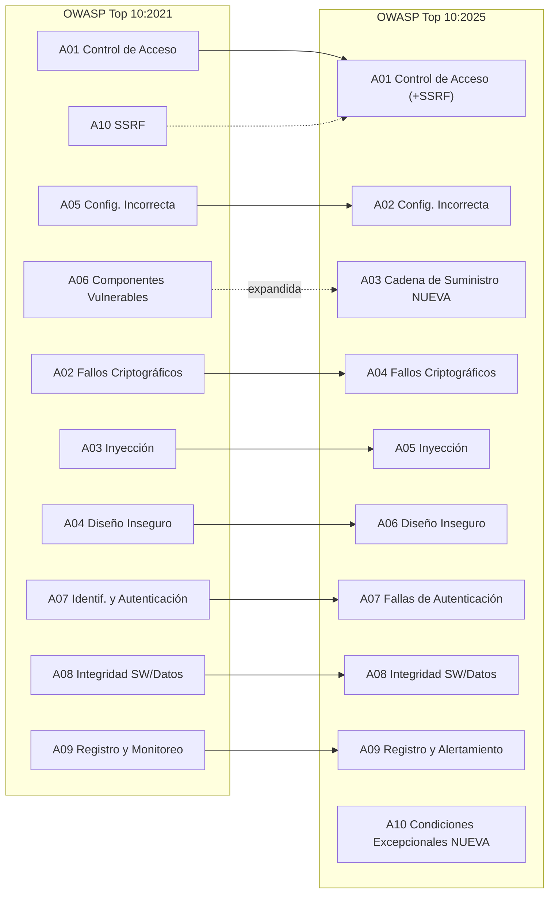

**Resumen de los tres movimientos clave:**

1. **Consolidación:** *Server-Side Request Forgery* (A10:2021) desaparece como categoría independiente y se integra dentro de **A01:2025 – Control de Acceso Roto**, ya que conceptualmente SSRF también es un fallo en las restricciones que determinan qué puede alcanzar o solicitar una aplicación.
2. **Categoría nueva — A03:2025:** *Fallas de la Cadena de Suministro de Software* amplía lo que antes era "Componentes Vulnerables y Desactualizados" (A06:2021) para cubrir todo el ecosistema: dependencias, sistemas de build (compilación), pipelines CI/CD e infraestructura de distribución, no solo la versión de una librería.
3. **Categoría nueva — A10:2025:** *Manejo Inadecuado de Condiciones Excepcionales* cubre 24 CWE relacionados con manejo de errores deficiente, errores lógicos, mecanismos de "fail open" (fallar de forma insegura) y otros escenarios derivados de condiciones anómalas que el sistema no supo manejar correctamente.

---

## 📑 Tabla de contenidos

1. [Panorama general](#-panorama-general)
2. [A01 — Control de Acceso Roto (incluye SSRF)](#1️⃣-a012025--control-de-acceso-roto-incluye-ssrf)
3. [A02 — Configuración de Seguridad Incorrecta](#2️⃣-a022025--configuración-de-seguridad-incorrecta)
4. [A03 — Fallas de la Cadena de Suministro de Software (NUEVA)](#3️⃣-a032025--fallas-de-la-cadena-de-suministro-de-software-nueva)
5. [A04 — Fallos Criptográficos](#4️⃣-a042025--fallos-criptográficos)
6. [A05 — Inyección](#5️⃣-a052025--inyección)
7. [A06 — Diseño Inseguro](#6️⃣-a062025--diseño-inseguro)
8. [Comparación A02, A05 y A06](#-comparación-a02-a05-y-a06)
9. [A07 — Fallas de Autenticación](#7️⃣-a072025--fallas-de-autenticación)
10. [A08 — Fallas de Integridad de Software o Datos](#8️⃣-a082025--fallas-de-integridad-de-software-o-datos)
11. [A09 — Fallas de Registro y Alertamiento de Seguridad](#9️⃣-a092025--fallas-de-registro-y-alertamiento-de-seguridad)
12. [A10 — Manejo Inadecuado de Condiciones Excepcionales (NUEVA)](#🔟-a102025--manejo-inadecuado-de-condiciones-excepcionales-nueva)
13. [Conclusión general](#-conclusión-general)
14. [Referencias](#-referencias-generales)

---

## 📊 Panorama general

El siguiente gráfico ilustra, de forma aproximada, el porcentaje de aplicaciones analizadas que presentaron cada una de las dos primeras categorías de vulnerabilidad según los datos recopilados por OWASP para la edición 2025:

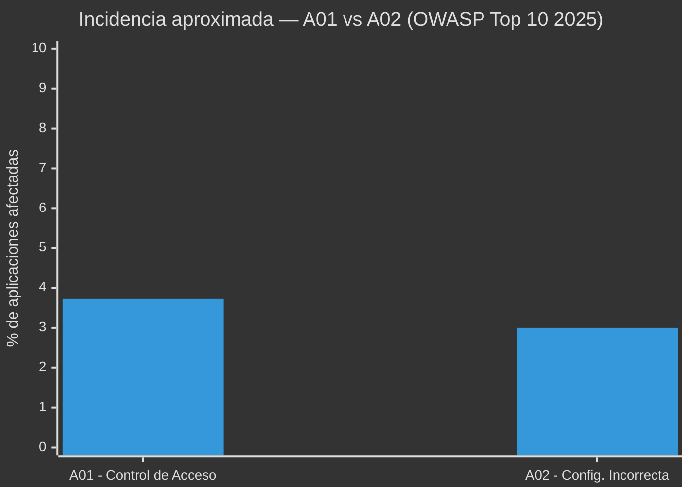

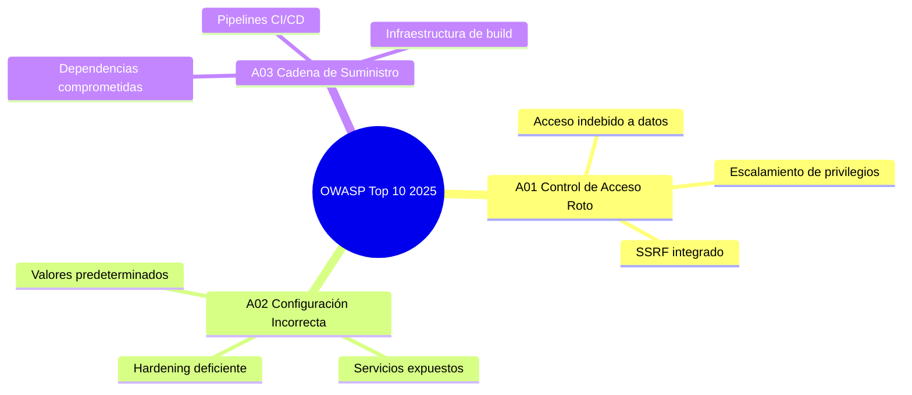

Las categorías A02, A05 y A06 representan además diferentes etapas en las que puede aparecer un riesgo de seguridad:

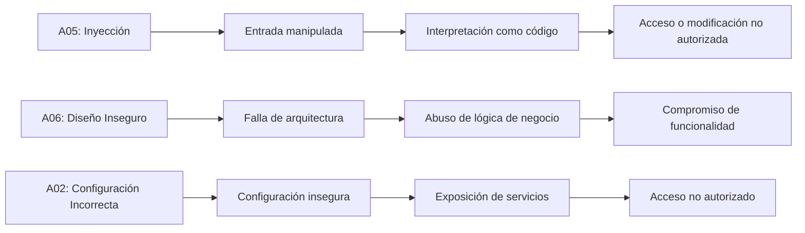

---

# 🧩 Detalle de las categorías

## 1️⃣ A01:2025 — Control de Acceso Roto (incluye SSRF)

### 🔒 ¿Qué es?

El control de acceso es el conjunto de mecanismos que determina qué puede hacer o ver un usuario dentro de una aplicación, según su rol o identidad (por ejemplo, un usuario normal no debería poder ver ni modificar datos de un administrador). Un fallo de control de acceso ocurre cuando estas restricciones no se aplican correctamente en el backend, permitiendo que un usuario actúe fuera de los permisos que le corresponden.

Esta categoría mantiene el **primer lugar** en la edición 2025: en promedio, el **3.73%** de las aplicaciones analizadas presentó al menos una de las **40 CWE** agrupadas en esta categoría (la mayor cantidad de CWE de todo el Top 10), lo que confirma que sigue siendo el riesgo más extendido.

> 🆕 **Novedad 2025:** lo que en la edición anterior era la categoría independiente **A10:2021 – Server-Side Request Forgery (SSRF)** ahora se integra dentro de A01, ya que también es, en esencia, un fallo en las restricciones sobre qué puede alcanzar o solicitar la aplicación en nombre de un usuario. Esta categoría ahora cubre explícitamente patrones de API como **BOLA** (*Broken Object Level Authorization*) y **BFLA** (*Broken Function Level Authorization*), token manipulation y CORS mal configurado.

### 🧠 Causas más comunes

- Verificar permisos solo en el frontend (interfaz visual) y no en el backend (servidor).
- Confiar en el identificador enviado por el propio usuario (IDOR — *Insecure Direct Object Reference*) sin validar si le pertenece.
- No aplicar el principio de "denegar por defecto": otorgar acceso amplio y luego restringir, en vez de al revés.
- Rutas o endpoints de administración accesibles sin autenticación adecuada.
- CORS mal configurado, permitiendo peticiones desde orígenes no autorizados.
- **(SSRF)** Funcionalidades que reciben una URL o dirección proporcionada por el usuario y no validan hacia dónde puede apuntar la solicitud que hace el propio servidor.

### 💥 Ejemplos

1. Un usuario cambia el valor `id=1023` por `id=1024` en la URL (`miapp.com/perfil?id=1024`) y accede a la información de otra persona.
2. Un empleado normal accede directamente a `/admin/panel` sin que el sistema verifique su rol.
3. Una API permite eliminar registros de otros usuarios simplemente conociendo su identificador (`DELETE /api/pedidos/58`) — patrón BOLA.
4. Una función de "importar imagen desde internet" permite ingresar `http://localhost:8080/admin` o una IP interna, logrando que el servidor consulte paneles administrativos u otros servicios internos no expuestos públicamente (SSRF).
5. En entornos cloud como AWS, una aplicación vulnerable a SSRF permite apuntar hacia el servicio interno de metadatos (`http://169.254.169.254/`), obteniendo credenciales temporales de la instancia.

```text
Atacante → URL o parámetro manipulado → Aplicación → Servidor realiza la solicitud
   │
   ┌───────────────┬───────────────┐
   ▼               ▼               ▼
Recurso externo  Red interna   Metadata cloud
 (esperado)      (no debería)  (no debería)
```

### ⚠️ Impacto

Exposición de datos privados, modificación o eliminación no autorizada de información, fraude, escalamiento de privilegios hasta llegar a comprometer cuentas administrativas, escaneo y explotación de la red interna, y robo de credenciales temporales de servicios cloud a través de SSRF.

### 🛠️ Herramientas utilizadas

| Herramienta | Utilización |
| --- | --- |
| **Burp Suite** | Interceptar y modificar solicitudes, incluyendo aquellas que contienen URLs |
| **OWASP ZAP** | Análisis de control de acceso y de solicitudes salientes del servidor |
| **SSRFmap** | Automatización de pruebas de SSRF |
| **Servicios de "callback"** (Burp Collaborator y similares) | Confirmar si el servidor realizó realmente una solicitud saliente |

### 🛡️ Recomendaciones de prevención

- Aplicar el principio de mínimo privilegio: cada usuario solo accede a lo estrictamente necesario.
- Validar permisos en cada solicitud del lado del servidor, no confiar en el cliente.
- Registrar (loggear) los intentos de acceso denegados para detectar posibles ataques.
- Usar pruebas automatizadas que verifiquen los controles de acceso en cada rol, incluyendo pruebas específicas de BOLA/BFLA en APIs.
- **(SSRF)** Validar y sanear todas las URLs proporcionadas por el cliente; aplicar listas blancas (*allowlist*) de dominios o direcciones permitidas.
- **(SSRF)** Bloquear rangos de IP privadas (`10.x`, `172.16.x`, `169.254.x`, `127.x`) en las solicitudes salientes del servidor y deshabilitar esquemas innecesarios (`file://`, `gopher://`, `dict://`).
- **(SSRF)** Usar mecanismos como IMDSv2 en AWS para dificultar el abuso del servicio de metadatos, y no devolver directamente al usuario la respuesta cruda de la solicitud realizada por el servidor.

---

## 2️⃣ A02:2025 — Configuración de Seguridad Incorrecta

### ⚙️ ¿Qué es?

La **Configuración de Seguridad Incorrecta** ocurre cuando una aplicación, servidor, base de datos, servicio cloud o componente de infraestructura se encuentra configurado de manera insegura. El problema puede aparecer tanto por una configuración incorrecta como por mantener configuraciones predeterminadas o funcionalidades que no son necesarias.

> 🆕 **Novedad 2025:** esta categoría **sube del puesto #5 (2021) al puesto #2**. En promedio, el **3.00%** de las aplicaciones analizadas presentó al menos una de las **16 CWE** agrupadas aquí. OWASP señala que este ascenso no es sorprendente: cada vez más comportamiento de las aplicaciones depende de configuraciones (infraestructura como código, contenedores, servicios administrados en la nube), y el despliegue continuo sin escaneo continuo abre ventanas de exposición activas.

### 🧠 Causas más comunes

- Credenciales predeterminadas.
- Funciones innecesarias habilitadas.
- Paneles administrativos expuestos.
- Mensajes de error demasiado detallados.
- Debug habilitado en producción.
- Permisos excesivos.
- Servicios o puertos innecesarios expuestos.
- Falta de actualización de componentes.
- Configuración incorrecta de servicios cloud.
- Headers de seguridad ausentes o incorrectos.
- Despliegues continuos (CI/CD) sin escaneo continuo de configuración.

### 💥 Ejemplos

**Ejemplo 1 — Modo Debug.** Un servidor desplegado en producción podría mostrar información detallada cuando ocurre un error:

```text
Error 500

Database connection failed
Host: 192.168.x.x
Database: production_db
Stack trace:
...
```

Esta información puede ayudar a un atacante a conocer detalles internos de la infraestructura.

**Ejemplo 2 — Credenciales predeterminadas.** Un dispositivo o aplicación puede mantener las credenciales originales proporcionadas por el fabricante.

```text
Usuario: admin
Contraseña: contraseña_predeterminada
```

Si estas credenciales no se modifican, un atacante que las conozca podría intentar acceder al sistema.

**Ejemplo 3 — Bucket cloud mal configurado.** Un contenedor de almacenamiento (S3, Blob Storage, etc.) queda accesible públicamente por un permiso mal asignado durante el despliegue automatizado, sin que ningún control lo detecte antes de llegar a producción.

### ⚠️ Impacto

| Configuración | Riesgo |
| --- | --- |
| Credenciales predeterminadas | Acceso no autorizado |
| Debug habilitado | Divulgación de información |
| Directorios públicos | Exposición de archivos |
| Puertos innecesarios | Aumento de superficie de ataque |
| Panel administrativo público | Ataques contra autenticación |
| Permisos excesivos | Escalamiento o abuso |
| Componentes desactualizados | Explotación de vulnerabilidades conocidas |
| Recursos cloud mal configurados | Exposición masiva de datos |

### 🔍 Métodos de explotación

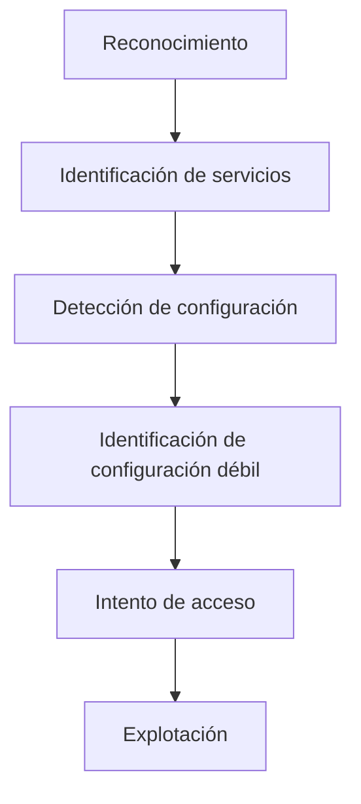

### 🛠️ Herramientas utilizadas

| Herramienta | Utilización |
| --- | --- |
| **Nmap** | Descubrimiento de puertos y servicios |
| **Burp Suite** | Análisis de solicitudes y respuestas HTTP |
| **OWASP ZAP** | Identificación de problemas de configuración web |
| **Nikto** | Evaluación de configuraciones de servidores web |
| **WhatWeb** | Identificación de tecnologías utilizadas |
| **Gobuster** | Enumeración de recursos y directorios |

### 🛡️ Prevención y mitigación

- Eliminar credenciales predeterminadas.
- Deshabilitar funcionalidades innecesarias.
- Desactivar el modo debug en producción.
- Utilizar configuraciones seguras para servidores.
- Mantener actualizados los componentes.
- Aplicar el principio de mínimo privilegio.
- Reducir la cantidad de servicios expuestos.
- Configurar correctamente HTTPS/TLS.
- Implementar headers de seguridad.
- Evitar mostrar información sensible en errores.
- Realizar revisiones periódicas de configuración.
- Automatizar controles de configuración (IaC scanning) dentro del pipeline CI/CD.

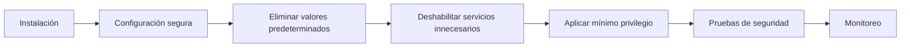

---

## 3️⃣ A03:2025 — Fallas de la Cadena de Suministro de Software (NUEVA)

### 🆕 ¿Por qué es una categoría nueva?

En 2021 existía la categoría **A06:2021 – Componentes Vulnerables y Desactualizados**, enfocada principalmente en si una librería o dependencia tenía una CVE conocida. En 2025 esta idea se **expande** hacia un concepto mucho más amplio: la **Cadena de Suministro de Software** (*Software Supply Chain*), que incluye no solo las dependencias en sí, sino todo el ecosistema que las construye, empaqueta y distribuye — sistemas de build, pipelines CI/CD, registries de paquetes e infraestructura de distribución.

Esta categoría fue votada de forma abrumadora por la comunidad como una de las principales preocupaciones actuales. Tiene solo **5 CWE** asociadas —la menor cantidad de todo el Top 10— y una presencia limitada en los datos recopilados, pero paradójicamente presenta los **puntajes promedio más altos de explotabilidad e impacto** de todas las categorías, lo que sugiere que las herramientas de escaneo automatizado todavía no logran detectar bien este tipo de ataques mientras ya están ocurriendo en producción.

> 💡 En términos sencillos: A03 ocurre cuando comprometemos no el código que escribimos, sino algún eslabón de la cadena que lo construye, empaqueta o entrega — una dependencia, un paquete, un pipeline o un registry.

### 🧠 ¿Qué cubre esta categoría?

```text
        🏭 CADENA DE SUMINISTRO DE SOFTWARE
                     │
     ┌───────────────┼───────────────┬────────────────┐
     ▼                ▼               ▼                ▼
Dependencias    Sistemas de Build   Pipelines      Registries /
(directas y      (compiladores,      CI/CD          repositorios de
 transitivas)     empaquetadores)   (GitHub Actions,  distribución
                                     Jenkins, etc.)   (npm, PyPI, etc.)
```

- **Dependencias directas y transitivas** con vulnerabilidades conocidas o mantenidas de forma deficiente (lo que antes cubría íntegramente A06:2021).
- **Compromiso del sistema de build**: inyección de código malicioso durante la compilación o empaquetado.
- **Pipelines CI/CD inseguros**: falta de control de acceso, secretos expuestos, ejecución de pasos no verificados.
- **Registries y repositorios de paquetes comprometidos**: *typosquatting* (paquetes con nombres similares a los legítimos), *dependency confusion* (confundir un paquete interno con uno público), o paquetes maliciosos publicados con nombres legítimos.
- **Componentes sin mantenimiento o sin soporte**, heredado de A06:2021.

### 🔴 ¿Cuándo tenemos un problema A03?

- Utilizamos una librería con vulnerabilidades conocidas o sin actualizar durante largos periodos.
- Instalamos paquetes desde fuentes no verificadas o sin firma.
- No tenemos un inventario (SBOM) de los componentes utilizados.
- El pipeline CI/CD no restringe qué puede ejecutarse ni quién puede modificarlo.
- No verificamos la integridad (hash o firma) de los artefactos que se despliegan.
- No monitoreamos si aparecen nuevas vulnerabilidades en dependencias ya instaladas.

### 💥 Ejemplos de escenarios reales

- **Ataque a la cadena de suministro (tipo SolarWinds):** comprometer una sola herramienta del pipeline de compilación permite distribuir código malicioso a miles de organizaciones que confían en ese proveedor.
- **Dependency confusion:** un atacante publica en un registry público un paquete con el mismo nombre que una dependencia interna privada de una empresa, y el sistema de build termina descargando la versión maliciosa por error de resolución de paquetes.
- **Typosquatting:** un paquete malicioso se publica con un nombre casi idéntico a uno legítimo y muy popular (`reqeusts` en lugar de `requests`), esperando errores de tipeo de los desarrolladores.
- **Compromiso de un registry:** credenciales de mantenedor de un paquete popular son robadas y se publica una nueva versión con código malicioso que se descarga automáticamente en miles de proyectos.

### 🛠️ Herramientas relacionadas

| Herramienta | Utilización |
|---|---|
| **OWASP Dependency-Check** | Analiza dependencias y busca vulnerabilidades conocidas |
| **npm audit / pip-audit** | Analiza vulnerabilidades en proyectos Node.js / Python |
| **Dependabot / Renovate** | Detecta dependencias vulnerables y propone actualizaciones |
| **Cosign / Sigstore** | Firma y verificación de artefactos e imágenes de contenedores |
| **Herramientas de generación de SBOM** (Syft, CycloneDX) | Inventario completo de componentes de software |

### 🛡️ ¿Cómo prevenir A03?

- Mantener un inventario de componentes (SBOM) y conocer las versiones utilizadas.
- Analizar dependencias periódicamente con herramientas SCA (*Software Composition Analysis*).
- Consumir dependencias solo desde repositorios de confianza y fijar versiones (*pinning*) cuando sea posible.
- Proteger el pipeline CI/CD con control de acceso, segregación de funciones y revisión de cambios.
- Firmar y verificar artefactos antes de desplegarlos.
- Configurar los registries privados con prioridad sobre los públicos para evitar *dependency confusion*.
- Establecer un proceso formal de respuesta ante nuevas vulnerabilidades en la cadena de suministro.

### 🧪 Laboratorio propuesto — A03

**Objetivo:** identificar, analizar y corregir vulnerabilidades relacionadas con dependencias y con la integridad de la cadena de suministro.

1. Crear el proyecto: `mkdir laboratorio-a03 && cd laboratorio-a03`
2. Crear entorno virtual: `python -m venv venv` (activar con `venv\Scripts\activate` en Windows)
3. Crear `requirements.txt` con, por ejemplo, `Flask` y `requests`
4. Instalar dependencias: `pip install -r requirements.txt`
5. Ejecutar auditoría: `pip-audit`
6. Registrar dependencia, versión instalada, vulnerabilidad, severidad, versión corregida y acción recomendada
7. Generar un SBOM básico del proyecto con una herramienta como Syft o CycloneDX
8. Actualizar las dependencias afectadas y volver a ejecutar `pip-audit` para comparar resultados antes/después

> 🔑 **La primera medida de seguridad para nuestra cadena de suministro es saber exactamente qué componentes tenemos, de dónde vienen y si podemos confiar en su integridad.**

---

## 4️⃣ A04:2025 — Fallos Criptográficos

### 🔑 ¿Qué es?

Renombrada desde "Exposición de Datos Sensibles" (2017) hacia "Fallos Criptográficos" (2021), esta categoría **baja del puesto #2 al puesto #4** en 2025, aunque en promedio el **3.80%** de las aplicaciones analizadas presentó al menos una de las **32 CWE** agrupadas aquí — una de las incidencias más altas de todo el Top 10. Ocurre cuando una aplicación no protege adecuadamente la información sensible —contraseñas, datos financieros, información médica, tokens de sesión— ya sea **en tránsito** (mientras viaja por la red) o **en reposo** (mientras está almacenada).

### 🧠 Causas más comunes

- Transmitir datos sensibles sin cifrado (uso de HTTP en lugar de HTTPS).
- Almacenar contraseñas usando algoritmos débiles o sin "salt" (por ejemplo, MD5 o SHA-1 sin protección adicional) en vez de funciones diseñadas para contraseñas como bcrypt o Argon2.
- Uso de algoritmos de cifrado obsoletos o claves criptográficas demasiado cortas.
- Gestión deficiente de claves: claves cifradas guardadas junto con los datos que protegen, o "hardcodeadas" directamente en el código fuente.
- Certificados SSL/TLS vencidos, autofirmados o mal configurados.

### 💥 Ejemplos

1. Un formulario de inicio de sesión que envía usuario y contraseña por HTTP en lugar de HTTPS, exponiendo las credenciales a cualquiera que intercepte el tráfico de red.
2. Una base de datos que almacena contraseñas en texto plano o con un algoritmo de hash débil y sin "salt".
3. Una aplicación móvil que guarda tokens de autenticación sin cifrar en el almacenamiento local del dispositivo.

### ⚠️ Impacto

Robo de credenciales, exposición de datos financieros o médicos, suplantación de identidad, incumplimiento de normativas de protección de datos (como GDPR o leyes locales de habeas data), y pérdida de confianza de los usuarios.

### 🛡️ Recomendaciones de prevención

- Forzar el uso de HTTPS/TLS en toda la aplicación (incluyendo redirecciones automáticas de HTTP a HTTPS).
- Cifrar los datos sensibles en reposo con algoritmos actualizados y robustos.
- Usar funciones de hash específicas para contraseñas (bcrypt, scrypt o Argon2) en lugar de algoritmos de propósito general.
- Clasificar los datos según su sensibilidad y aplicar controles proporcionales a cada nivel.
- No almacenar datos sensibles que no sean estrictamente necesarios.

### 🖼️ Resumen visual A01, A02 y A04

| Categoría | Icono | Enfoque principal | Ejemplo típico |
|---|---|---|---|
| A01 | 🔒 | Control de acceso (+SSRF) | Modificar una URL para ver datos ajenos |
| A02 | ⚙️ | Configuración | Servicio en producción con debug habilitado |
| A04 | 🔑 | Criptografía | Enviar contraseñas por HTTP sin cifrar |

> **Conclusión:** A01 falla en decidir *quién puede hacer qué (y hacia dónde)*, A02 falla en cómo está *dispuesto y protegido* el sistema, y A04 falla en *proteger la información* una vez que se accede a ella; por eso suelen presentarse combinadas en ataques reales.

---

## 5️⃣ A05:2025 — Inyección

### 💉 ¿Qué es?

La **inyección** se presenta cuando una aplicación utiliza información proporcionada externamente dentro de una consulta, instrucción o comando sin separar correctamente los datos de las instrucciones que serán procesadas. Como consecuencia, un atacante puede conseguir que una entrada manipulada sea interpretada como código o como parte de una instrucción ejecutable.

En 2025, esta categoría **desciende del puesto #3 al #5**. Aun así, continúa siendo una de las vulnerabilidades más analizadas y reúne el mayor número de CVE entre las **38 CWE** incluidas en esta categoría. Su alcance comprende diferentes problemas, desde Cross-Site Scripting, que suele presentar una alta frecuencia pero un impacto individual menor, hasta SQL Injection, que puede ser menos frecuente pero generar consecuencias mucho más graves.

Algunos de los principales tipos de inyección son:

* SQL Injection (SQLi)
* NoSQL Injection
* OS Command Injection
* LDAP Injection
* XPath Injection
* Cross-Site Scripting (XSS)

### 🧠 Causas más comunes

* Construcción de consultas utilizando concatenación de cadenas.
* Validación insuficiente de los datos de entrada.
* No utilizar consultas parametrizadas.
* Manejo inseguro de comandos del sistema operativo.
* Falta de controles sobre la información proporcionada por los usuarios.
* Utilización de cuentas de base de datos con permisos superiores a los necesarios.
* Confiar únicamente en mecanismos de seguridad implementados en el cliente.

### 💥 Impacto

| Propiedad           | Posible impacto                                          |
| ------------------- | -------------------------------------------------------- |
| 🔒 Confidencialidad | Acceso o lectura de información privada                  |
| 📝 Integridad       | Alteración o modificación de registros                   |
| ⚡ Disponibilidad    | Eliminación o modificación de recursos                   |
| 👤 Autenticación    | Evasión de mecanismos de inicio de sesión                |
| 🖥️ Sistema         | Posible ejecución de comandos en determinados escenarios |

### 🔍 Métodos de explotación

Las entradas manipuladas pueden llegar a la aplicación mediante diferentes mecanismos:

```text
Parámetros URL
      ↓
Campos de formularios
      ↓
Cookies
      ↓
Headers HTTP
      ↓
Datos enviados a APIs
```

**SQL Injection.** Una aplicación vulnerable puede generar una consulta utilizando directamente los valores recibidos:

```sql
SELECT * FROM usuarios
WHERE usuario = 'entrada'
AND password = 'entrada';
```

El riesgo aparece cuando los valores proporcionados por el usuario se incorporan directamente a la estructura de la consulta. Para evitar esta situación se deben utilizar **consultas parametrizadas**, de manera que los datos permanezcan separados de la estructura SQL.

**Command Injection.** Este tipo de vulnerabilidad puede producirse cuando una aplicación utiliza datos controlados por el usuario para formar comandos que posteriormente serán ejecutados por el sistema operativo.

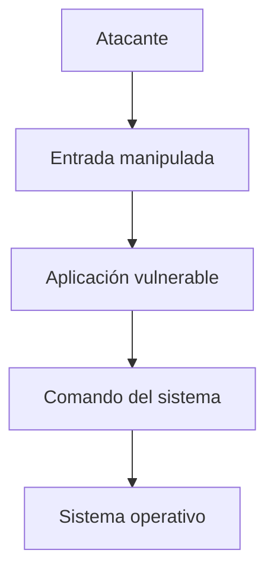

### 🛠️ Herramientas utilizadas

| Herramienta    | Utilización                                        |
| -------------- | -------------------------------------------------- |
| **Burp Suite** | Interceptar y modificar solicitudes HTTP           |
| **OWASP ZAP**  | Evaluar la seguridad de aplicaciones web           |
| **sqlmap**     | Automatizar pruebas relacionadas con SQL Injection |
| **Nmap**       | Realizar reconocimiento de servicios               |
| **Wireshark**  | Examinar y analizar tráfico de red                 |

> ⚠️ Estas herramientas deben emplearse únicamente sobre sistemas propios, entornos de laboratorio o infraestructuras en las que exista autorización explícita para efectuar pruebas de seguridad.

### 🛡️ Prevención y mitigación

* Implementar consultas SQL parametrizadas.
* Validar las entradas directamente en el servidor.
* Utilizar listas de valores permitidos (*allowlist*) cuando sea viable.
* Evitar introducir directamente datos del usuario dentro de comandos.
* Utilizar ORM aplicando configuraciones y prácticas seguras.
* Aplicar el principio de mínimo privilegio.
* Mantener actualizadas las dependencias utilizadas por la aplicación.
* Incorporar pruebas de seguridad automatizadas.
* Implementar mecanismos complementarios, como WAF, cuando resulten adecuados.

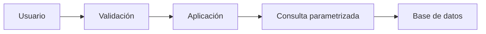

---

## 6️⃣ A06:2025 — Diseño Inseguro

### 🏗️ ¿Qué es?

El **Diseño Inseguro** comprende vulnerabilidades que tienen su origen en decisiones inadecuadas relacionadas con la arquitectura, el diseño o las reglas de negocio de una aplicación. Por lo tanto, el problema puede aparecer incluso antes de comenzar la implementación del software.

Una aplicación puede no presentar errores evidentes en su código y, aun así, ser vulnerable si durante su diseño no se contemplaron determinados escenarios de ataque, abuso o uso indebido.

En 2025, esta categoría **pasa del puesto #4 al #6**, debido a que Configuración de Seguridad Incorrecta y Fallas de la Cadena de Suministro de Software ocupan posiciones superiores. OWASP introdujo esta categoría en 2021 y señala que durante los últimos años se han producido avances en la industria, especialmente en la utilización de **Threat Modeling** y en la incorporación de seguridad desde las primeras etapas del desarrollo.

### 🧠 Causas más comunes

* No realizar un análisis de amenazas.
* No establecer requisitos de seguridad.
* Ignorar posibles escenarios de abuso.
* Confiar en controles de seguridad ubicados únicamente en el frontend.
* No implementar mecanismos para limitar la automatización.
* Ausencia de límites para operaciones críticas o sensibles.
* Arquitecturas que no incorporan defensa en profundidad.
* Falta de separación adecuada entre funcionalidades y privilegios.

### 💥 Ejemplos

**Ejemplo 1 — Validación exclusiva en frontend.**

Una aplicación puede bloquear visualmente una determinada operación desde su interfaz:

```text
Frontend

   │

   ├── "No puede realizar esta operación"

   │

   ▼

Backend
```

Sin embargo, si el servidor no comprueba nuevamente la operación, un atacante puede enviar directamente una solicitud modificada al backend.

Por esta razón, **los controles de seguridad no deben depender únicamente de la interfaz del usuario**.

**Ejemplo 2 — Abuso de la lógica de negocio.**

Una plataforma de comercio podría implementar un proceso similar a:

```text
Producto

   ↓

Cupón de descuento

   ↓

Pago
```

Si el diseño no contempla que un cupón pueda utilizarse varias veces de forma indebida, un atacante podría intentar reutilizar la promoción repetidamente.

En este escenario, el problema no necesariamente se encuentra en un error de sintaxis o en una instrucción incorrecta del código, sino en una **deficiencia en el diseño de las reglas de negocio**.

### ⚠️ Impacto

| Problema                         | Posible consecuencia                      |
| -------------------------------- | ----------------------------------------- |
| Falta de validación backend      | Evasión de restricciones                  |
| Falta de límites                 | Automatización y abuso de funcionalidades |
| Reglas de negocio deficientes    | Posibles fraudes                          |
| Recuperación de cuentas insegura | Compromiso o toma de cuentas              |
| Autorización mal diseñada        | Escalamiento de privilegios               |
| Ausencia de controles            | Manipulación de procesos                  |

### 🔍 Métodos de explotación

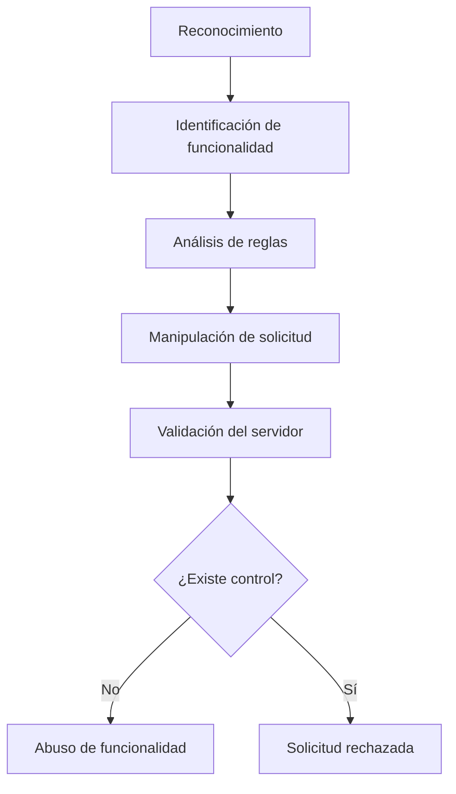

### 🛠️ Herramientas utilizadas

| Herramienta    | Utilización                                 |
| -------------- | ------------------------------------------- |
| **Burp Suite** | Modificación y análisis de solicitudes HTTP |
| **OWASP ZAP**  | Evaluación de aplicaciones web              |
| **Postman**    | Pruebas y análisis de APIs                  |
| **DevTools**   | Inspección del comportamiento del cliente   |
| **Nmap**       | Reconocimiento de infraestructura           |

### 🛡️ Prevención y mitigación

* Realizar **Threat Modeling** durante la etapa de diseño.
* Establecer requisitos de seguridad antes de comenzar el desarrollo.
* Comprobar todas las operaciones críticas desde el backend.
* Aplicar mecanismos de autorización en operaciones sensibles.
* Establecer límites y utilizar *rate limiting*.
* Implementar mecanismos para prevenir la automatización abusiva.
* Aplicar el principio de mínimo privilegio.
* Incorporar defensa en profundidad.
* Ejecutar pruebas orientadas a detectar abuso de la lógica de negocio.
* Revisar periódicamente la arquitectura de la aplicación.

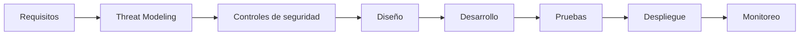

---

## 📊 Comparación A02, A05 y A06

| Característica            | A05 — Inyección                   | A06 — Diseño Inseguro                 | A02 — Configuración Incorrecta          |
| ------------------------- | --------------------------------- | ------------------------------------- | --------------------------------------- |
| **Origen**                | Datos de entrada no controlados   | Deficiencias de arquitectura o lógica | Configuración insegura                  |
| **Etapa principal**       | Desarrollo                        | Diseño                                | Implementación/despliegue               |
| **Objetivo frecuente**    | Alterar o manipular instrucciones | Aprovechar funcionalidades            | Explotar configuraciones o exposiciones |
| **Ejemplo**               | SQL Injection                     | Bypass de reglas                      | Debug habilitado                        |
| **Herramienta destacada** | sqlmap                            | Burp Suite                            | Nmap                                    |
| **Principal defensa**     | Parametrización                   | Secure by Design                      | Hardening                               |
| **Impacto**               | Datos y sistema                   | Procesos y negocio                    | Infraestructura y aplicación            |

Las tres categorías pueden coexistir dentro de una misma aplicación:

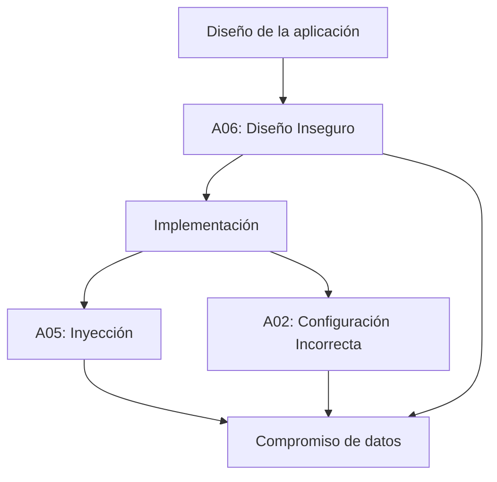

> **Conclusión:** la **Inyección** aparece principalmente cuando información externa termina siendo interpretada como parte de una instrucción o comando. El **Diseño Inseguro** se presenta cuando la arquitectura o las reglas de negocio no consideran correctamente posibles situaciones de abuso. Por otro lado, la **Configuración de Seguridad Incorrecta** ocurre cuando los componentes de la aplicación o de la infraestructura se despliegan utilizando configuraciones que generan riesgos de seguridad. La protección frente a estas amenazas requiere combinar **diseño seguro, desarrollo seguro, configuración adecuada, pruebas de seguridad, monitoreo y mantenimiento continuo**.

---

## 7️⃣ A07:2025 — Fallas de Autenticación

### 🔐 Introducción

Una aplicación web necesita saber quién está intentando acceder a ella y comprobar que realmente es quien dice ser. Cuando estos mecanismos están mal diseñados o implementados pueden aparecer vulnerabilidades relacionadas con la identificación, autenticación y gestión de sesiones.

Esta categoría **se mantiene en el puesto #7**, aunque cambia ligeramente de nombre: antes era *"Identification and Authentication Failures"* y ahora se llama simplemente **"Authentication Failures"**, para reflejar con más precisión las **36 CWE** agrupadas en ella. OWASP observa que el uso creciente de frameworks estandarizados de autenticación (OAuth, OIDC, librerías maduras de manejo de sesiones) parece estar reduciendo, de forma general, la ocurrencia de este tipo de fallas.

> 💡 En términos sencillos: A07 ocurre cuando una aplicación no comprueba correctamente quién es el usuario o permite que un atacante pueda hacerse pasar por él.

### 🧠 Identificación, autenticación y autorización

| Concepto | Pregunta | Ejemplo |
|---|---|---|
| **Identificación** | ¿Quién eres? | Usuario: William |
| **Autenticación** | ¿Puedes demostrarlo? | Contraseña + MFA |
| **Autorización** | ¿Qué puedes hacer? | Consultar su cuenta |

**Analogía:** entrar a una universidad.

```text
IDENTIFICACIÓN → "Soy William"
AUTENTICACIÓN  → "Esta es mi tarjeta de identificación"
AUTORIZACIÓN   → "Mi tarjeta me permite entrar a esta área"
```

Estar autenticado **no significa tener acceso a todo** (eso corresponde a A01 — Control de Acceso).

### 🔴 ¿Qué es A07?

Se presenta cuando existen fallas en mecanismos como inicio de sesión, contraseñas, MFA, recuperación de cuentas, gestión de sesiones, tokens, protección contra ataques automatizados, cierre de sesión y validación de credenciales:

```text
❌ Contraseñas débiles          ❌ Recuperación insegura de cuentas
❌ Credenciales predeterminadas ❌ Contraseñas almacenadas incorrectamente
❌ Falta de MFA                 ❌ Sesiones que no expiran
❌ Fuerza bruta                 ❌ Session Fixation
❌ Credential Stuffing          ❌ Session Hijacking
```

### 🔓 Contraseñas débiles y credenciales predeterminadas

Ejemplos de contraseñas fácilmente adivinables: `123456`, `password`, `admin`, `admin123`, `qwerty`. El problema aumenta cuando los usuarios reutilizan la misma contraseña en diferentes servicios, o cuando un sistema mantiene credenciales predeterminadas de fábrica (`admin`/`admin`) en producción.

```text
❌ Mala práctica                    ✅ Buena práctica
Instalación                         Instalación
   ↓                                   ↓
Usuario/contraseña predeterminados  Cambiar credenciales
   ↓                                   ↓
Producción                          Configurar autenticación segura + MFA
                                        ↓
                                     Producción
```

### 💥 Fuerza bruta

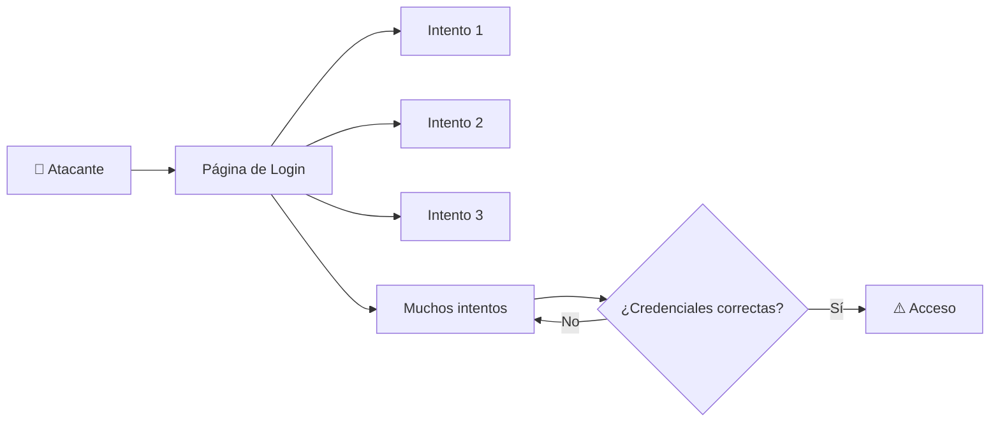

**Protección:** limitar intentos, retrasos progresivos, rate limiting, MFA, detección de patrones anormales, monitoreo, bloqueos cuidadosamente diseñados y alertas.

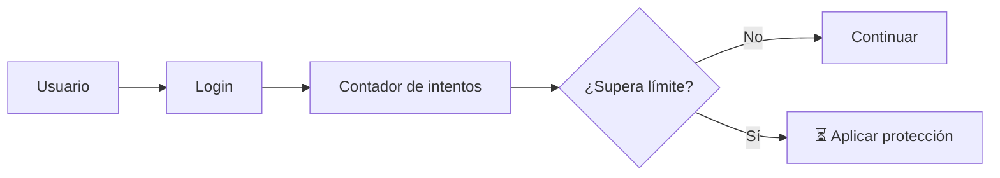

> ⚠️ Un bloqueo de cuenta mal diseñado también puede convertirse en un problema de disponibilidad si un atacante puede bloquear intencionalmente cuentas de otros usuarios.

### 🧪 Credential Stuffing

El atacante utiliza pares de usuario/contraseña obtenidos previamente de una filtración de otro servicio y los reutiliza contra la aplicación objetivo. El problema principal es la **reutilización de contraseñas**.

| Característica | Fuerza bruta | Credential Stuffing |
|---|---|---|
| Objetivo | Encontrar credenciales | Reutilizar credenciales obtenidas |
| Contraseñas | Se prueban combinaciones | Ya fueron obtenidas |
| Principal defensa | Rate limiting + MFA | MFA + detección + contraseñas únicas |
| Riesgo | Alto | Alto |

### 🔐 MFA — Multi-Factor Authentication

Combina dos o más factores independientes:

- **Algo que sabes:** contraseña, PIN.
- **Algo que tienes:** teléfono, token de seguridad, app autenticadora.
- **Algo que eres:** huella digital, reconocimiento facial.

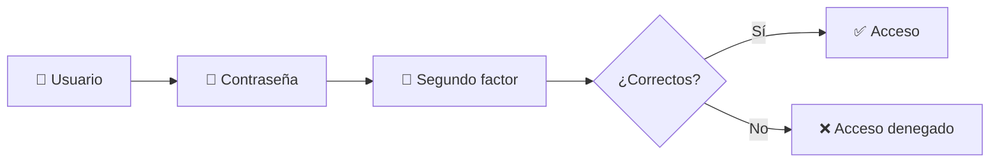

> 💡 MFA no hace que una aplicación sea invulnerable, pero reduce significativamente el riesgo asociado al robo de credenciales.

### 🔑 Almacenamiento seguro de contraseñas

> ❌ **Las contraseñas no deben almacenarse en texto plano.**

```text
Contraseña → Función de hashing → Hash almacenado
```

En el login: `Contraseña ingresada → Verificación → Hash almacenado → ¿Coinciden?`

**Salt:** valor aleatorio combinado con la contraseña antes del hashing (`Contraseña + Salt → Hash → Base de datos`), que dificulta ataques con tablas precomputadas.

> ⚠️ No debemos implementar nuestro propio algoritmo de hashing de contraseñas; es preferible usar librerías diseñadas específicamente para esto.

**Algoritmos recomendados:** Argon2, bcrypt, scrypt, PBKDF2.
**No deben usarse solos para contraseñas:** MD5, SHA-1, SHA-256 (no están diseñados para resistir ataques de adivinación masiva).

### 📧 Recuperación de cuentas

❌ Inseguro: preguntas fácilmente adivinables (`¿Cuál es el nombre de tu mascota?`).

✅ Más seguro:

```text
Usuario solicita recuperación → Servidor genera mecanismo temporal
→ Usuario recibe enlace con token aleatorio → Token expira → Nueva contraseña
```

### 🍪 Sesiones, Session ID y sus riesgos

```text
Usuario → Login → Autenticación correcta → Servidor crea sesión
→ Session ID / Token → Usuario continúa navegando
```

**Session Hijacking** — un atacante consigue utilizar la sesión legítima de otra persona:

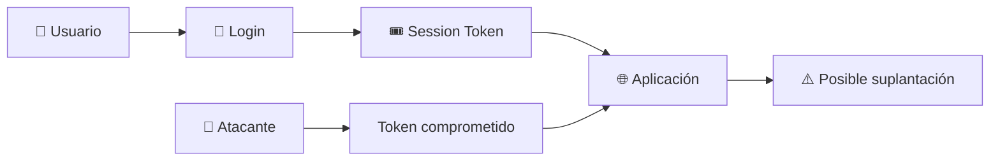

**Session Fixation** — un atacante logra que la víctima utilice un identificador de sesión conocido por él, y luego la víctima se autentica usando esa sesión:

```text
Atacante conoce Session ID → Víctima utiliza esa sesión → Víctima inicia sesión
→ Sesión autenticada → Atacante intenta reutilizarla
```

> Una medida importante es **regenerar el identificador de sesión después de una autenticación exitosa**.

**Expiración y cierre de sesión:**

```text
❌ Cierre de sesión inseguro         ✅ Cierre de sesión correcto
Usuario pulsa "Cerrar sesión"        Usuario pulsa "Cerrar sesión"
   ↓                                    ↓
Se oculta la página                  Servidor invalida sesión
   ↓                                    ↓
Session Token continúa válido        Token deja de ser válido
```

**Atributos de seguridad de cookies:**

- **HttpOnly** — impide que JavaScript acceda a la cookie mediante `document.cookie`.
- **Secure** — la cookie solo se transmite por HTTPS.
- **SameSite=Lax / Strict** — controla el envío de cookies en solicitudes entre sitios.

### 🌐 HTTPS y autenticación

Las credenciales y tokens de sesión deben protegerse durante el transporte (HTTPS en lugar de HTTP).

### 💻 Ejemplo de código vulnerable vs. mejorado

**Vulnerable (educativo):**

```python
users = {
    "admin": "123456"
}

@app.route("/login", methods=["POST"])
def login():
    username = request.form["username"]
    password = request.form["password"]
    if username in users:
        if users[username] == password:
            return "Login exitoso"
    return "Credenciales incorrectas"
```

Problemas: contraseña débil, texto plano, sin MFA, sin rate limiting, sin control de intentos, sin gestión segura de sesión, sin monitoreo.

**Conceptual mejorado:**

```python
@app.route("/login", methods=["POST"])
def login():
    username = request.form["username"]
    password = request.form["password"]

    user = get_user(username)
    if not user:
        register_failed_attempt(username)
        return "Credenciales incorrectas"

    if not verify_password(password, user.password_hash):
        register_failed_attempt(username)
        return "Credenciales incorrectas"

    if user.mfa_enabled:
        return "Solicitar segundo factor"

    create_secure_session(user)
    return "Login exitoso"
```

### 🧪 Laboratorio propuesto — A07

**Objetivo:** construir una aplicación de autenticación sencilla, identificar vulnerabilidades y aplicar medidas de seguridad, únicamente en un entorno controlado y local.

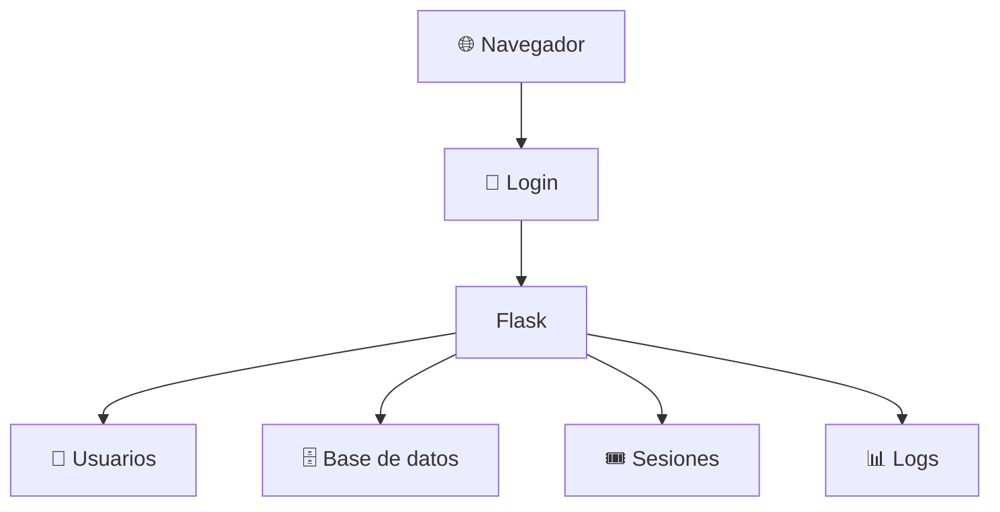

1. **Fase 1 — Login vulnerable:** crear un login simple y observar qué problemas existen (contraseña segura, almacenamiento, MFA, intentos permitidos, rate limiting, creación/expiración de sesión).
2. **Fase 2 — Mejorar contraseñas:** reemplazar el almacenamiento directo por hashing seguro (`Contraseña → Hash seguro para passwords → Base de datos`).
3. **Fase 3 — Protección contra automatización:** implementar un mecanismo de control de múltiples intentos.
4. **Fase 4 — MFA:** agregar un segundo factor de demostración (código temporal) dentro del entorno de pruebas.
5. **Fase 5 — Gestión de sesión:** verificar generación, aleatoriedad, regeneración post-login, expiración, invalidación al cerrar sesión y atributos seguros de cookies.

**Pruebas sugeridas:** contraseñas débiles, intentos repetidos, cierre de sesión, expiración, y verificación de MFA.

### 🛡️ Herramientas para estudiar A07

- **OWASP ZAP** — análisis de aplicaciones web en pruebas de seguridad.
- **Burp Suite** — observación y análisis de solicitudes HTTP/HTTPS autorizadas.
- **DevTools** — inspección de cookies, headers, solicitudes, respuestas y almacenamiento.

### 📊 Matriz de vulnerabilidades A07

| Vulnerabilidad | Ejemplo | Impacto |
|---|---|---|
| Contraseña débil | `123456` | 🔴 Alto |
| Credenciales predeterminadas | `admin/admin` | 🔴 Alto |
| Fuerza bruta | Muchos intentos | 🔴 Alto |
| Credential Stuffing | Reutilización de credenciales | 🔴 Alto |
| Sin MFA | Solo contraseña | 🟠 Medio/Alto |
| Hashing incorrecto | Contraseñas en texto plano | 🔴 Crítico |
| Sesión sin expiración | Token permanente | 🟠 Alto |
| Session Fixation | Sesión reutilizada | 🔴 Alto |
| Session Hijacking | Robo de sesión | 🔴 Alto |
| Recuperación insegura | Preguntas fáciles | 🟠 Alto |

### 🛡️ Buenas prácticas para prevenir A07

- **Contraseñas:** políticas adecuadas, sin predeterminadas, hashing seguro, evitar reutilización.
- **MFA:** usar cuando sea apropiado, priorizar cuentas administrativas y mecanismos resistentes al phishing.
- **Protección contra automatización:** rate limiting, control de intentos, monitoreo, detección de anomalías.
- **Sesiones:** identificadores impredecibles, regeneración post-login, expiración, invalidación al cerrar sesión, cookies protegidas, HTTPS.
- **Recuperación de cuentas:** mecanismos temporales, tokens aleatorios con expiración, sin preguntas de seguridad débiles.
- **Frameworks estandarizados:** preferir librerías y frameworks de autenticación maduros (OAuth 2.0, OIDC) en lugar de implementaciones propias.

> 🔑 **Una contraseña correcta no es suficiente para considerar segura una autenticación. La seguridad debe proteger todo el ciclo de vida de la identidad y la sesión.**

---

## 8️⃣ A08:2025 — Fallas de Integridad de Software o Datos

### 🧩 Introducción

Cuando hablamos de A03 vimos que una aplicación puede depender de una cadena de suministro comprometida. A08 va un paso más específico: no se trata solo de si un componente o pipeline fue comprometido, sino de si a **nivel de código, archivo u objeto de datos individual** tenemos alguna forma de verificar que lo que estamos usando realmente viene de donde creemos que viene y no fue alterado en el camino.

El riesgo **A08:2025 – Software or Data Integrity Failures** **se mantiene en el puesto #8** de la lista, y OWASP la distingue explícitamente de A03 (Cadena de Suministro): esta categoría se enfoca en fallar en mantener límites de confianza (*trust boundaries*) y verificar la integridad de artefactos de software, código y datos a un nivel más bajo o puntual, mientras que A03 abarca el ecosistema completo (dependencias, builds, pipelines, distribución).

> 💡 En términos sencillos: A08 ocurre cuando una aplicación confía "a ciegas" en un archivo, una actualización o un objeto de datos puntual, sin verificar su procedencia ni su integridad — mientras que A03 se enfoca en que toda la cadena que produjo ese artefacto sea confiable.

### 🧠 ¿Qué significa "integridad" aquí?

```text
        🔺 TRIADA CIA
              │
   ┌──────────┼──────────┐
   ▼          ▼          ▼
Confidencialidad   Integridad   Disponibilidad
```

- **Confidencialidad:** que solo quien debe ver la información pueda verla.
- **Integridad:** que la información no haya sido alterada sin autorización.
- **Disponibilidad:** que la información esté accesible cuando se necesita.

A08 se enfoca en el segundo pilar, tanto de software (código, paquetes, actualizaciones) como de datos (objetos serializados, cookies, tokens).

### 🔴 ¿Cuándo aparece A08?

- Utilizamos plugins, librerías o contenido servido desde un CDN sin verificar su integridad.
- Una aplicación implementa actualizaciones automáticas sin verificar la firma del paquete.
- Se deserializan objetos que provienen del cliente sin comprobar que no fueron manipulados.
- Se confía en cookies o parámetros para tomar decisiones de seguridad sin validarlos en el servidor.

### 📊 Ejemplo — cadena de confianza rota

```text
   Repositorio oficial
          │
          ▼
   Pipeline CI/CD
          │
   ┌──────┴──────┐
   ▼             ▼
Verificación   Sin verificación
   │             │
   ▼             ▼
 ✅ Seguro     ⚠️ Riesgo de A08
```

### 🕵️ Deserialización insegura

```text
Cliente → Objeto serializado → Servidor → Deserialización
→ ¿El objeto fue validado?
     /        \
   Sí          No
   │            │
   ▼            ▼
 Seguro     ⚠️ Ejecución de código
```

Si el servidor no valida el contenido antes de reconstruir el objeto, un atacante puede manipular esos datos para alterar el comportamiento de la aplicación, e incluso, en algunos lenguajes y frameworks, lograr ejecución remota de código.

### 💥 Ejemplos de escenarios reales

- **Actualización sin firma:** un dispositivo (router, decodificador, IoT) descarga actualizaciones de firmware sin verificar una firma digital; un atacante que intercepta o suplanta el servidor de actualizaciones puede distribuir una versión maliciosa.
- **Objeto de datos manipulado:** una aplicación confía en una cookie o token serializado sin verificar su firma, permitiendo que un atacante modifique su contenido para escalar privilegios.

### 🛠️ Herramientas relacionadas

| Herramienta | Utilización |
|---|---|
| **Cosign / Sigstore** | Firma y verificación de artefactos e imágenes de contenedores |
| **GPG** | Firma y verificación de paquetes y commits |
| **Escáneres de deserialización (Java)** | Identificación de puntos vulnerables a deserialización insegura |

### 🛡️ ¿Cómo prevenir A08?

- Utilizar firmas digitales para verificar que el software o los datos provienen de la fuente esperada.
- Establecer revisión de código y de configuración antes de fusionar cambios.
- No deserializar datos no confiables sin verificación de integridad o firma digital.
- Validar en el servidor cualquier dato proveniente del cliente que se use para tomar decisiones de seguridad.

### 🧪 Laboratorio propuesto — A08

**Objetivo:** comprender de forma práctica el concepto de verificación de integridad de un archivo descargado.

1. Descargar un archivo de ejemplo.
2. Calcular su hash (`sha256sum archivo`).
3. Comparar contra el hash publicado por la fuente oficial.
4. Modificar intencionalmente el archivo (laboratorio propio).
5. Calcular el hash nuevamente y comparar la diferencia.

> Este ejercicio evidencia por qué verificar la integridad (hashes o firmas) permite detectar si un archivo fue alterado antes de confiar en él.

### 🎯 Conclusión A08

A08 nos recuerda que no basta con que un componente exista o funcione correctamente: también debemos poder confiar en que nadie lo alteró en el camino, desde el repositorio hasta la ejecución en producción. La integridad es un pilar de seguridad tan importante como la confidencialidad, y suele pasar desapercibido hasta que ya es demasiado tarde.

---

## 9️⃣ A09:2025 — Fallas de Registro y Alertamiento de Seguridad

### 🧩 Introducción

Hasta ahora hemos analizado vulnerabilidades que un atacante puede explotar directamente. A09 es distinto: no es una falla que se "ataque" en sí misma, sino una falla que permite que todo lo demás pase desapercibido.

El riesgo **A09:2025 – Security Logging & Alerting Failures** **se mantiene en el puesto #9**, con un cambio de nombre respecto a 2021: antes se llamaba *"Security Logging and Monitoring Failures"*, y ahora enfatiza explícitamente la palabra **"Alerting" (alertamiento)**, porque tener un excelente registro de eventos sin ningún mecanismo de alerta tiene un valor mínimo a la hora de identificar incidentes de seguridad a tiempo. Al igual que en 2021, esta categoría suele estar subrepresentada en los datos automatizados y fue nuevamente incluida gracias a la encuesta de la comunidad.

> 💡 En términos sencillos: A09 ocurre cuando "las luces están apagadas" — un atacante puede estar operando dentro del sistema y nadie se entera, ya sea porque no se registró el evento o porque, aunque se registró, nadie fue alertado.

### 🧠 ¿Por qué es tan importante el registro y el alertamiento?

```text
Ataque en curso
      │
      ▼
 ¿Existe registro?
    /         \
  Sí            No
  │              │
  ▼              ▼
¿Existe alerta?  ⚠️ Persistencia
  /      \          │
Sí        No        │
│          │         │
▼          ▼         ▼
Respuesta  Sin respuesta a tiempo
```

Sin registro (logging) los ataques no pueden detectarse. Y sin **alertamiento**, aunque exista registro, nadie reacciona a tiempo. Por eso esta categoría abarca tres capas relacionadas: registrar, monitorear y **alertar activamente**.

### 🔴 ¿Cuándo tenemos un problema A09?

- No se registran eventos auditables como inicios de sesión fallidos o transacciones sensibles.
- Las advertencias y errores no generan mensajes de registro claros.
- Los registros se almacenan solo localmente, sin respaldo ni protección contra manipulación.
- No existen umbrales de alerta ni procesos de escalamiento.
- Hay tantos falsos positivos que las alertas reales se pierden entre el ruido.
- Se registra información sensible (contraseñas, datos personales) dentro de los propios logs.
- Existen registros completos y correctos, pero **ningún mecanismo automatizado dispara una alerta** cuando ocurre un evento anómalo.

### 📊 Ejemplo sencillo

```text
   🏢 EMPRESA
        │
   ┌────┴────┐
   ▼         ▼
Con logging Y   Sin logging o
alertamiento    sin alertamiento
   │             │
   ▼             ▼
Detecta el      Brecha pasa
ataque en       desapercibida
minutos/horas   durante meses/años
```

### 💥 Ejemplos de escenarios reales

- **Ausencia total de monitoreo:** una plataforma de salud sufrió el acceso y modificación no autorizada de millones de registros médicos sensibles; sin registro ni monitoreo, la brecha pudo haber estado activa durante años sin que nadie lo notara.
- **Brecha en un proveedor externo:** una aerolínea sufrió la exposición de más de una década de datos personales de pasajeros, originada en un proveedor externo de hosting en la nube que tardó en notificar el incidente.
- **Ataques a sistemas de pago sin alerta oportuna:** una aerolínea europea sufrió el robo de cientos de miles de registros de pago, derivando en una sanción millonaria por no detectar ni reportar la brecha a tiempo.

### 🔍 ¿Qué debería registrarse y alertarse?

```text
Evento
   │
   ├── Inicios de sesión (éxito y fallo)
   ├── Cambios de permisos
   ├── Transacciones de alto valor
   ├── Errores de validación del lado del servidor
   ├── Accesos a datos sensibles
   └── Actividad administrativa
```

### 🛠️ Herramientas relacionadas

| Herramienta | Utilización |
|---|---|
| **ELK Stack** (Elasticsearch, Logstash, Kibana) | Correlación y visualización de logs |
| **Splunk** | Gestión centralizada de logs y alertas |
| **OWASP ModSecurity Core Rule Set** | Protección y registro a nivel de WAF |
| **SIEM** (genérico) | Correlación de eventos de seguridad y generación de alertas |

### 🛡️ ¿Cómo prevenir A09?

- Registrar todos los eventos relevantes con suficiente contexto (usuario, IP, acción, resultado).
- Proteger la integridad de los registros contra manipulación (p. ej. almacenamiento append-only).
- Definir umbrales de alerta y manuales de procedimiento (*playbooks*) para el equipo de respuesta, no solo generar el log.
- Usar **honeytokens**: datos señuelo que nunca deberían usarse en operación normal, de modo que cualquier acceso a ellos dispare una alerta confiable.
- Adoptar un plan formal de respuesta a incidentes (p. ej. basado en NIST SP 800-61).
- Reducir los falsos positivos para que las alertas reales no se pierdan en el ruido.

### 🧪 Laboratorio propuesto — A09

**Objetivo:** configurar un registro básico de eventos de autenticación, definir un umbral de alerta y observar cómo permite detectar un patrón de ataque.

1. Retomar la aplicación de login del laboratorio A07.
2. Agregar registro de cada intento (éxito/fallo, usuario, IP, hora).
3. Simular varios intentos fallidos consecutivos.
4. Revisar el archivo/registro generado.
5. Identificar visualmente el patrón de ataque.
6. Proponer y **configurar un umbral de alerta real** (p. ej. 5 fallos en 1 minuto → notificación automática).

### 🎯 Conclusión A09

A09 nos enseña que la seguridad no termina en prevenir un ataque, ni siquiera en registrarlo: también debemos poder **enterarnos activamente** cuando ocurre. Una aplicación puede tener excelentes controles preventivos y registros completos y, aun así, quedar expuesta durante años si nadie recibe una alerta sobre lo que sucede dentro de ella.

---

## 🔟 A10:2025 — Manejo Inadecuado de Condiciones Excepcionales (NUEVA)

### 🆕 ¿Por qué es una categoría nueva?

**A10:2025 – Mishandling of Exceptional Conditions** es una categoría completamente nueva en esta edición, con **24 CWE** asociadas. Cubre errores de manejo de excepciones, errores lógicos, mecanismos de **"fail open"** (donde un sistema, ante un fallo, termina permitiendo acceso o continuando de forma insegura en vez de bloquear) y otros escenarios que surgen cuando la aplicación se enfrenta a condiciones anómalas que no supo manejar correctamente.

> 💡 En términos sencillos: A10 ocurre cuando algo sale mal —una excepción, un error, un tercero no disponible, una condición de carrera— y en vez de fallar de forma segura, la aplicación reacciona de una manera que termina beneficiando a un atacante.

### 🧠 ¿Qué cubre esta categoría?

```text
                CONDICIÓN EXCEPCIONAL
                        │
        ┌───────────────┼───────────────┐
        ▼                ▼               ▼
  Manejo de errores   Errores lógicos   "Fail open"
  (excepciones no      (validaciones     (el sistema falla
   controladas,         incompletas,      hacia el estado
   mensajes filtrados)  race conditions)  menos seguro)
```

- **Manejo de excepciones deficiente:** una excepción no controlada revela detalles internos (stack traces, rutas de archivos, versiones de librerías) o deja el sistema en un estado inconsistente.
- **Errores lógicos:** condiciones de carrera (*race conditions*), validaciones que se omiten en ciertos flujos de ejecución poco comunes, o estados intermedios mal definidos.
- **"Fail open" vs. "fail closed":** cuando ante un error (por ejemplo, un servicio de autorización que no responde) el sistema decide *permitir* la operación en lugar de *denegarla* por defecto.
- **Dependencias externas no disponibles:** una aplicación que, al no poder contactar un servicio externo crítico (por ejemplo, un servicio de verificación de fraude), continúa el proceso como si todo estuviera correcto.

### 🔴 ¿Cuándo aparece A10?

- El código captura excepciones genéricas y continúa la ejecución sin evaluar si es seguro hacerlo.
- Los mensajes de error expuestos al usuario final incluyen información técnica sensible.
- Existen condiciones de carrera en operaciones críticas (por ejemplo, verificación de saldo y descuento del mismo no son atómicos).
- Un mecanismo de seguridad (autenticación, autorización, límite de intentos) fallando internamente termina "abriendo la puerta" en lugar de bloquear el acceso.
- No se contempla el comportamiento de la aplicación ante timeouts, servicios caídos o respuestas inesperadas de terceros.

### 💥 Ejemplos

**Ejemplo 1 — Fail open en autorización.**

```text
Solicitud → Servicio de autorización
                  │
          ┌───────┴───────┐
          ▼               ▼
      Responde OK     No responde / error
          │               │
          ▼               ▼
   Verificar permiso   ⚠️ ¿Se permite igual
                          por diseño ("fail open")?
```

Si el diseño decide continuar y otorgar acceso cuando el servicio de autorización falla, un atacante que logre provocar ese fallo (por ejemplo, saturando el servicio) puede obtener acceso no autorizado.

**Ejemplo 2 — Condición de carrera en un proceso de pago.** Dos solicitudes casi simultáneas de "canjear un mismo cupón" o "retirar fondos" pueden pasar la validación al mismo tiempo si la operación de verificar-y-descontar no es atómica, permitiendo un doble uso del recurso.

**Ejemplo 3 — Mensaje de error detallado.** Una excepción no controlada en producción devuelve al usuario un stack trace completo con nombres de clases internas, rutas del sistema de archivos y, en algunos casos, fragmentos de consultas SQL.

### ⚠️ Impacto

| Escenario | Posible consecuencia |
| --- | --- |
| Fail open en autenticación/autorización | Acceso no autorizado |
| Condición de carrera en transacciones | Fraude, doble gasto |
| Excepciones no controladas | Divulgación de información interna |
| Dependencias externas caídas mal manejadas | Bypass de controles de seguridad |
| Estados inconsistentes | Corrupción de datos |

### 🛠️ Herramientas relacionadas

| Herramienta | Utilización |
|---|---|
| **Burp Suite / OWASP ZAP** | Provocar errores y condiciones límite mediante solicitudes manipuladas |
| **Herramientas de fuzzing** | Enviar entradas inesperadas para forzar excepciones no controladas |
| **Herramientas de pruebas de concurrencia** | Detectar condiciones de carrera en operaciones críticas |
| **Chaos engineering** (p. ej. simulación de caída de dependencias) | Validar el comportamiento ante servicios externos no disponibles |

### 🛡️ ¿Cómo prevenir A10?

- Diseñar explícitamente el comportamiento de "fail closed" (denegar por defecto) para cualquier mecanismo de seguridad, no solo el "happy path".
- Manejar las excepciones de forma específica, evitando capturas genéricas que oculten el verdadero problema.
- No exponer detalles técnicos internos en los mensajes de error mostrados al usuario final.
- Diseñar operaciones críticas (pagos, canjes, descuentos de inventario) como transacciones atómicas.
- Definir y probar explícitamente el comportamiento de la aplicación ante timeouts y caídas de servicios externos.
- Incluir pruebas de condiciones límite y de manejo de errores dentro del ciclo de pruebas de seguridad, no solo pruebas funcionales del camino esperado.

### 🧪 Laboratorio propuesto — A10

**Objetivo:** comprender de forma práctica el concepto de "fail open" frente a "fail closed" en un mecanismo de autorización.

1. Crear un endpoint simple que consulte un servicio de autorización simulado.
2. Implementar una primera versión donde, ante un error del servicio de autorización, la solicitud se **permite** por defecto (fail open).
3. Forzar el fallo del servicio de autorización (apagarlo o simular un timeout) y observar que el acceso se otorga igualmente.
4. Modificar el código para que, ante cualquier error, la solicitud se **deniegue** por defecto (fail closed).
5. Repetir la prueba y confirmar que el acceso ya no se otorga cuando el servicio de autorización falla.

### 🎯 Conclusión A10

A10 recuerda que la seguridad de una aplicación no solo depende de cómo se comporta en su flujo normal ("happy path"), sino de cómo reacciona cuando algo sale mal. Un sistema que solo es seguro cuando todo funciona correctamente, y que se abre ante el primer error o condición inesperada, sigue siendo un sistema inseguro.

---

## 🏁 Conclusión general

El estudio conjunto de las diez categorías del OWASP Top 10:2025 permite comprender que la seguridad de una aplicación web no depende de un único control, sino de la combinación de múltiples capas de defensa a lo largo de todo el ciclo de vida del software.

```text
🔒 A01 — Control de Acceso (+SSRF)     ¿Quién puede hacer qué, y hacia dónde?
⚙️ A02 — Configuración Incorrecta       ¿Está bien configurado el sistema?
🏭 A03 — Cadena de Suministro (NUEVA)   ¿Confiamos en todo el ecosistema sin verificar?
🔑 A04 — Fallos Criptográficos          ¿Protegemos la información?
💉 A05 — Inyección                      ¿Separamos datos de código?
🏗️ A06 — Diseño Inseguro                 ¿La arquitectura contempla el abuso?
🔐 A07 — Fallas de Autenticación        ¿Protegemos identidades y sesiones?
📦 A08 — Integridad de SW/Datos         ¿Podemos confiar en lo que ejecutamos?
📊 A09 — Registro y Alertamiento        ¿Nos enteramos activamente si algo sale mal?
⚡ A10 — Condiciones Excepcionales (NUEVA) ¿Qué pasa cuando algo falla?
```

Las categorías **A01** (que ahora incluye SSRF) y **A04** muestran que fallar en decidir *quién puede hacer qué —y hacia dónde puede apuntar el servidor—* y fallar en *proteger la información* suelen presentarse combinados en ataques reales. **A02**, **A05** y **A06** demuestran que un mismo sistema puede fallar en distintas etapas: implementación/despliegue (configuración), desarrollo (inyección) y diseño (arquitectura y lógica de negocio). **A03** amplía la vieja preocupación por "componentes vulnerables" a todo el ecosistema de la cadena de suministro, mientras que **A07** recuerda que también debemos proteger adecuadamente las identidades y sesiones de los usuarios. Finalmente, **A08**, **A09** y **A10** cierran el ciclo abordando aspectos que suelen quedar en segundo plano frente a vulnerabilidades más "vistosas", pero igual de críticos: verificar el origen y la integridad puntual de lo que ejecutamos, poder **detectar y ser alertados** ante un ataque, y asegurarnos de que el sistema falle de forma segura cuando algo sale mal.

> 🔑 **La seguridad de una aplicación no depende de un único control, sino de la combinación de principios como mínimo privilegio, defensa en profundidad, validación del lado del servidor, parametrización, hardening, integridad de la cadena de suministro, visibilidad con alertamiento activo, manejo seguro de errores y validación estricta de cada dato que proviene del exterior — incluyendo aquellos que parecen tan simples como una URL.**

---

## 📚 Referencias generales

**OWASP Foundation**

- OWASP Top 10:2025 (edición vigente) — <https://owasp.org/Top10/2025/>
- A01:2025 – Broken Access Control — <https://owasp.org/Top10/2025/A01_2025-Broken_Access_Control/>
- A02:2025 – Security Misconfiguration — <https://owasp.org/Top10/2025/A02_2025-Security_Misconfiguration/>
- A03:2025 – Software Supply Chain Failures — <https://owasp.org/Top10/2025/A03_2025-Software_Supply_Chain_Failures/>
- A04:2025 – Cryptographic Failures — <https://owasp.org/Top10/2025/A04_2025-Cryptographic_Failures/>
- A05:2025 – Injection — <https://owasp.org/Top10/2025/A05_2025-Injection/>
- A06:2025 – Insecure Design — <https://owasp.org/Top10/2025/A06_2025-Insecure_Design/>
- A07:2025 – Authentication Failures — <https://owasp.org/Top10/2025/A07_2025-Authentication_Failures/>
- A08:2025 – Software or Data Integrity Failures — <https://owasp.org/Top10/2025/A08_2025-Software_or_Data_Integrity_Failures/>
- A09:2025 – Security Logging and Alerting Failures — <https://owasp.org/Top10/2025/A09_2025-Security_Logging_and_Alerting_Failures/>
- A10:2025 – Mishandling of Exceptional Conditions — <https://owasp.org/Top10/2025/A10_2025-Mishandling_of_Exceptional_Conditions/>
- OWASP Top 10:2021 (edición anterior, superada) — <https://owasp.org/Top10/2021/>
- OWASP Dependency-Check
- OWASP Software Component Verification Standard
- OWASP Web Security Testing Guide — <https://owasp.org/www-project-web-security-testing-guide/>
- OWASP Cheat Sheet Series — <https://cheatsheetseries.owasp.org/>
- OWASP Authentication Cheat Sheet
- OWASP Session Management Cheat Sheet
- OWASP Multifactor Authentication Cheat Sheet
- OWASP Password Storage Cheat Sheet
- OWASP Forgot Password Cheat Sheet
- OWASP Credential Stuffing Prevention Cheat Sheet
- OWASP Cheat Sheet: Software Supply Chain Security
- OWASP Cheat Sheet: Deserialization
- OWASP Cheat Sheet: Logging
- OWASP Cheat Sheet: Server-Side Request Forgery Prevention

**Otras entidades de referencia**

- NIST — National Vulnerability Database (NVD)
- NIST — Software Bill of Materials (SBOM)
- NIST — Digital Identity Guidelines
- NIST SP 800-61 — Computer Security Incident Handling Guide
- MITRE — Common Vulnerabilities and Exposures (CVE)
- MITRE — Common Weakness Enumeration (CWE)
- MITRE CWE — Authentication related weaknesses
- FIRST — Common Vulnerability Scoring System (CVSS)