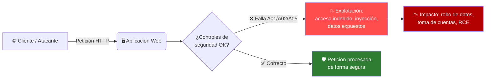

# 🛡️ OWASP Top 10 : 2025 — Vulnerabilidades Críticas en Aplicaciones Web

> 📚 **Trabajo académico — Clase de Ciberseguridad**
> Investigación, análisis de explotación y estrategias de mitigación de las 10 vulnerabilidades más críticas en aplicaciones web según la edición **2025** del OWASP Top 10 (publicada oficialmente en enero de 2026 tras el anuncio en el OWASP Global AppSec Conference, Washington D.C., noviembre 2025).
>

---
## 📖 Índice

1. [¿Qué es el OWASP Top 10?](#-qué-es-el-owasp-top-10)
2. [Metodología y cambios respecto a 2021](#-metodología-y-cambios-respecto-a-2021)
3. [Resumen visual del Top 10 : 2025](#-resumen-visual-del-top-10--2025)
4. [A01 — Broken Access Control (Control de Acceso Roto)](#-a01--broken-access-control-control-de-acceso-roto)
5. [A02 — Security Misconfiguration (Configuración de Seguridad Incorrecta)](#-a02--security-misconfiguration-configuración-de-seguridad-incorrecta)
6. [A03 — Software Supply Chain Failures (Fallas en la Cadena de Suministro)](#-a03--software-supply-chain-failures-fallas-en-la-cadena-de-suministro)
7. [A04 — Cryptographic Failures (Fallas Criptográficas)](#-a04--cryptographic-failures-fallas-criptográficas)
8. [A05 — Injection (Inyección)](#-a05--injection-inyección)
9. [A06 — Insecure Design (Diseño Inseguro)](#-a06--insecure-design-diseño-inseguro)
10. [A07 — Authentication Failures (Fallas de Autenticación)](#-a07--authentication-failures-fallas-de-autenticación)
11. [A08 — Software or Data Integrity Failures (Fallas de Integridad)](#-a08--software-or-data-integrity-failures-fallas-de-integridad)
12. [A09 — Security Logging and Alerting Failures (Fallas de Registro y Alertas)](#-a09--security-logging-and-alerting-failures-fallas-de-registro-y-alertas)
13. [A10 — Mishandling of Exceptional Conditions (Mal Manejo de Condiciones Excepcionales)](#-a10--mishandling-of-exceptional-conditions-mal-manejo-de-condiciones-excepcionales)
14. [Tabla comparativa 2021 → 2025](#-tabla-comparativa-2021--2025)
15. [Conclusiones y guía para la exposición](#-conclusiones-y-guía-para-la-exposición)
16. [Fuentes](#-fuentes)

---

## 🔎 ¿Qué es el OWASP Top 10?

**OWASP** (*Open Worldwide Application Security Project*) es una fundación sin fines de lucro dedicada a mejorar la seguridad del software. El **OWASP Top 10** es su documento insignia: un ranking de concientización que identifica las **10 categorías de riesgo más críticas** en aplicaciones web, basado en:

- 📊 Análisis de **más de 175,000 CVEs** reales.
- 🧩 Mapeo de **248 CWEs** (*Common Weakness Enumerations*) distribuidos en las 10 categorías.
- 🗳️ Encuestas a **miles de organizaciones y profesionales de seguridad** de todo el mundo.

> 💡 **¿Para qué sirve?** No es una checklist técnica exhaustiva, sino una **guía de concientización** dirigida a desarrolladores, arquitectos de seguridad y equipos de gestión de riesgos, para priorizar dónde invertir esfuerzo en seguridad.

---

## 🔄 Metodología y cambios respecto a 2021

La edición **2025** (la primera actualización desde 2021) trae cambios importantes:

- 🆕 **2 categorías nuevas**: `A03 — Software Supply Chain Failures` y `A10 — Mishandling of Exceptional Conditions`.
- 🔀 **4 reordenamientos significativos** en el ranking.
- ✏️ **3 renombramientos** para mayor precisión (p. ej. *Identification and Authentication Failures* → *Authentication Failures*).
- 🔗 **SSRF** (*Server-Side Request Forgery*) fue absorbido dentro de `A01 — Broken Access Control`.
- 📈 `Security Misconfiguration` subió del puesto #5 (2021) al **#2** (2025) — la mala configuración es hoy más prevalente que nunca, en gran parte por la complejidad de la nube.

---

## 🎨 Resumen visual del Top 10 : 2025

| # | Categoría | Nivel de riesgo | CWEs asociados | Cambio vs 2021 |
|---|---|---|---|---|
| 🥇 A01 | **Broken Access Control** |  | 40 | Se mantiene en #1, ahora incluye SSRF |
| 🥈 A02 | **Security Misconfiguration** |  | 16 | Sube de #5 → #2 |
| 🥉 A03 | **Software Supply Chain Failures** |  | 5 | 🆕 Nueva (expande A06:2021) |
| 4 | **Cryptographic Failures** |  | 32 | Baja de #2 → #4 |
| 5 | **Injection** |  | 38 | Baja de #3 → #5 |
| 6 | **Insecure Design** |  | — | Baja de #4 → #6 |
| 7 | **Authentication Failures** |  | 36 | Se mantiene en #7, renombrada |
| 8 | **Software or Data Integrity Failures** |  | — | Se mantiene en #8 |
| 9 | **Security Logging and Alerting Failures** |  | 5 | Se mantiene en #9, renombrada |
| 10 | **Mishandling of Exceptional Conditions** |  | 24 | 🆕 Nueva categoría |

---

