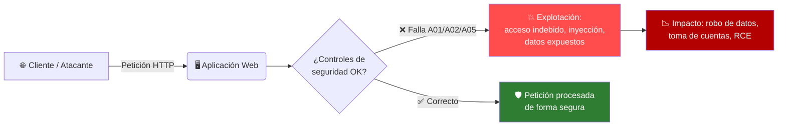

# 🛡️ OWASP Top 10 : 2025 — Vulnerabilidades Críticas en Aplicaciones Web

> 📚 **Trabajo académico — Clase de Ciberseguridad**
> Investigación, análisis de explotación y estrategias de mitigación de las 10 vulnerabilidades más críticas en aplicaciones web según la edición **2025** del OWASP Top 10 (publicada oficialmente en enero de 2026 tras el anuncio en el OWASP Global AppSec Conference, Washington D.C., noviembre 2025).
>

---
## 📖 Índice

1. [¿Qué es el OWASP Top 10?](#-qué-es-el-owasp-top-10)
2. [Metodología y cambios respecto a 2021](#-metodología-y-cambios-respecto-a-2021)
3. [Resumen visual del Top 10 : 2025](#-resumen-visual-del-top-10--2025)
4. [A01 — Broken Access Control (Control de Acceso Roto)](#-a01--broken-access-control-control-de-acceso-roto)
5. [A02 — Security Misconfiguration (Configuración de Seguridad Incorrecta)](#-a02--security-misconfiguration-configuración-de-seguridad-incorrecta)
6. [A03 — Software Supply Chain Failures (Fallas en la Cadena de Suministro)](#-a03--software-supply-chain-failures-fallas-en-la-cadena-de-suministro)
7. [A04 — Cryptographic Failures (Fallas Criptográficas)](#-a04--cryptographic-failures-fallas-criptográficas)
8. [A05 — Injection (Inyección)](#-a05--injection-inyección)
9. [A06 — Insecure Design (Diseño Inseguro)](#-a06--insecure-design-diseño-inseguro)
10. [A07 — Authentication Failures (Fallas de Autenticación)](#-a07--authentication-failures-fallas-de-autenticación)
11. [A08 — Software or Data Integrity Failures (Fallas de Integridad)](#-a08--software-or-data-integrity-failures-fallas-de-integridad)
12. [A09 — Security Logging and Alerting Failures (Fallas de Registro y Alertas)](#-a09--security-logging-and-alerting-failures-fallas-de-registro-y-alertas)
13. [A10 — Mishandling of Exceptional Conditions (Mal Manejo de Condiciones Excepcionales)](#-a10--mishandling-of-exceptional-conditions-mal-manejo-de-condiciones-excepcionales)
14. [Tabla comparativa 2021 → 2025](#-tabla-comparativa-2021--2025)
15. [Conclusiones y guía para la exposición](#-conclusiones-y-guía-para-la-exposición)
16. [Fuentes](#-fuentes)

---

## 🔎 ¿Qué es el OWASP Top 10?

**OWASP** (*Open Worldwide Application Security Project*) es una fundación sin fines de lucro dedicada a mejorar la seguridad del software. El **OWASP Top 10** es su documento insignia: un ranking de concientización que identifica las **10 categorías de riesgo más críticas** en aplicaciones web, basado en:

- 📊 Análisis de **más de 175,000 CVEs** reales.
- 🧩 Mapeo de **248 CWEs** (*Common Weakness Enumerations*) distribuidos en las 10 categorías.
- 🗳️ Encuestas a **miles de organizaciones y profesionales de seguridad** de todo el mundo.

> 💡 **¿Para qué sirve?** No es una checklist técnica exhaustiva, sino una **guía de concientización** dirigida a desarrolladores, arquitectos de seguridad y equipos de gestión de riesgos, para priorizar dónde invertir esfuerzo en seguridad.

---

## 🔄 Metodología y cambios respecto a 2021

La edición **2025** (la primera actualización desde 2021) trae cambios importantes:

- 🆕 **2 categorías nuevas**: `A03 — Software Supply Chain Failures` y `A10 — Mishandling of Exceptional Conditions`.
- 🔀 **4 reordenamientos significativos** en el ranking.
- ✏️ **3 renombramientos** para mayor precisión (p. ej. *Identification and Authentication Failures* → *Authentication Failures*).
- 🔗 **SSRF** (*Server-Side Request Forgery*) fue absorbido dentro de `A01 — Broken Access Control`.
- 📈 `Security Misconfiguration` subió del puesto #5 (2021) al **#2** (2025) — la mala configuración es hoy más prevalente que nunca, en gran parte por la complejidad de la nube.

---

## 🎨 Resumen visual del Top 10 : 2025

| # | Categoría | Nivel de riesgo | CWEs asociados | Cambio vs 2021 |
|---|---|---|---|---|
| 🥇 A01 | **Broken Access Control** |  | 40 | Se mantiene en #1, ahora incluye SSRF |
| 🥈 A02 | **Security Misconfiguration** |  | 16 | Sube de #5 → #2 |
| 🥉 A03 | **Software Supply Chain Failures** |  | 5 | 🆕 Nueva (expande A06:2021) |
| 4 | **Cryptographic Failures** |  | 32 | Baja de #2 → #4 |
| 5 | **Injection** |  | 38 | Baja de #3 → #5 |
| 6 | **Insecure Design** |  | — | Baja de #4 → #6 |
| 7 | **Authentication Failures** |  | 36 | Se mantiene en #7, renombrada |
| 8 | **Software or Data Integrity Failures** |  | — | Se mantiene en #8 |
| 9 | **Security Logging and Alerting Failures** |  | 5 | Se mantiene en #9, renombrada |
| 10 | **Mishandling of Exceptional Conditions** |  | 24 | 🆕 Nueva categoría |


---

## 🥇 A01 — Broken Access Control (Control de Acceso Roto)

 
### 📌 Descripción
El control de acceso aplica la política de que un usuario **no puede actuar fuera de sus permisos previstos**. Cuando falla, un atacante puede ver, modificar o eliminar contenido que no le corresponde, o ejecutar funciones fuera de su rol (por ejemplo, un usuario normal accediendo a funciones de administrador).

**Causas comunes:**
- Falta de verificación de permisos en cada endpoint/función (no solo en el menú/UI).
- **IDOR** (*Insecure Direct Object Reference*): manipular un ID en la URL o petición para acceder a recursos ajenos.
- Configuración CORS permisiva (`Access-Control-Allow-Origin: *` con credenciales).
- **SSRF**: el servidor es engañado para hacer peticiones a recursos internos (ahora integrado en esta categoría).
- Elevación de privilegios manipulando tokens/JWT.

**Impacto potencial:** exposición o alteración masiva de datos, toma de cuentas ajenas, acceso a redes internas (vía SSRF), pérdida de confianza y sanciones regulatorias.

### 💥 Métodos de explotación
- **IDOR**: cambiar `GET /api/facturas/1042` por `1043` y ver la factura de otro cliente.
- **Fuerza bruta de rutas ocultas** con `ffuf` / `gobuster` para encontrar paneles `/admin`, `/backup` sin protección.
- **SSRF** para consultar el servicio de metadatos de la nube (`http://169.254.169.254/`) y robar credenciales temporales.
- **Herramientas**: Burp Suite (Repeater/Intruder), extensión *Autorize* (prueba automatizada de fallos de autorización), OWASP ZAP.
- **Caso real**: la brecha de **Capital One (2019)** — una atacante explotó una mala configuración de firewall (WAF) para ejecutar un ataque **SSRF** contra el servicio de metadatos de AWS EC2, robando credenciales IAM y accediendo a datos de más de 100 millones de clientes.

### 🧪 Ejemplo técnico (del día a día)
```http
GET /api/v1/usuarios/1002/pedidos HTTP/1.1
Host: tienda.com
Authorization: Bearer <token-del-usuario-1001>
```
El backend nunca valida que el `1002` de la URL coincida con el dueño del token → el usuario 1001 puede leer/editar los pedidos del usuario 1002 con solo cambiar un número.

### 🎈 Ejemplo sencillo para exponer en clase
Imagina un **hotel donde la llave de tu habitación abre TODAS las habitaciones**, no solo la tuya. Nadie lo nota hasta que un huésped "curioso" prueba su llave en la puerta de al lado... y entra. Eso es exactamente lo que pasa cuando una app olvida verificar "¿este dato es realmente tuyo?".

### 🛡️ Prevención y mitigación
- ✅ **Denegar por defecto**: acceso explícitamente permitido, todo lo demás se rechaza.
- ✅ Validar permisos **en el servidor**, en cada petición — nunca confiar en la UI o el frontend.
- ✅ Usar un mecanismo **centralizado** de control de acceso (middleware/librería), no lógica dispersa.
- ✅ Aplicar el **principio de mínimo privilegio** por rol/recurso.
- ✅ Deshabilitar listados de directorios y metadatos de servidor.
- ✅ Mitigar SSRF con listas blancas de destinos y segmentación de red.
- ✅ Registrar y alertar fallos de control de acceso repetidos (posible ataque en curso).

---

## 🥈 A02 — Security Misconfiguration (Configuración de Seguridad Incorrecta)

 
### 📌 Descripción
Ocurre cuando la aplicación, el servidor, el framework o la infraestructura en la nube se despliegan con configuraciones **inseguras, por defecto o incompletas**. Es la categoría que **más subió** en 2025, impulsada por la complejidad de entornos cloud/multi-servicio.

**Causas comunes:** credenciales/paneles por defecto sin cambiar, mensajes de error detallados en producción, funciones/puertos innecesarios habilitados, buckets de almacenamiento (S3, GCS) públicos, cabeceras de seguridad ausentes, permisos de nube excesivos (IAM demasiado permisivo).

**Impacto potencial:** compromiso total del sistema, filtración masiva de datos, acceso administrativo no autorizado.

### 💥 Métodos de explotación
- **Reconocimiento con Shodan/Censys** para hallar servicios expuestos a internet (bases de datos, dashboards, cámaras).
- **Dorking / fuzzing de directorios** (`gobuster`, `dirb`) para encontrar `.env`, `.git/`, `config.php.bak`.
- **Herramientas de auditoría cloud**: ScoutSuite, Prowler, para detectar buckets S3 públicos o IAM mal configurado.
- **Caso real**: decenas de filtraciones masivas por **buckets S3 públicos mal configurados** (empresas como Verizon, Accenture, Dow Jones han sufrido incidentes de este tipo, exponiendo millones de registros sin que fuera necesario "hackear" nada — el dato simplemente estaba abierto al público).

### 🧪 Ejemplo técnico (del día a día)
Un backend Django/Flask desplegado a producción con `DEBUG = True`: cualquier error muestra el **stack trace completo**, incluyendo rutas del servidor, variables de entorno y hasta la `SECRET_KEY`, visible para cualquier visitante que provoque un error 500.

### 🎈 Ejemplo sencillo para exponer en clase
Es como una **tienda que olvida cambiar la clave de la alarma** después de instalarla y sigue usando `0000`, o deja la puerta trasera sin candado "solo por hoy". Nadie forzó nada: la puerta ya estaba abierta.

### 🛡️ Prevención y mitigación
- ✅ Proceso de despliegue **repetible y automatizado** (Infraestructura como Código) para evitar configuraciones manuales inconsistentes.
- ✅ Plataforma mínima: eliminar features, puertos, servicios y cuentas que no se usan.
- ✅ Revisar y actualizar configuraciones de forma periódica (benchmarks CIS).
- ✅ Cabeceras de seguridad: `Content-Security-Policy`, `X-Frame-Options`, `Strict-Transport-Security`.
- ✅ Escaneo automatizado de configuración en el pipeline CI/CD.
- ✅ Nunca dejar credenciales/paneles por defecto.

---

## 🥉 A03 — Software Supply Chain Failures (Fallas en la Cadena de Suministro)

 
### 📌 Descripción
Es la categoría **con mayor incidencia promedio (5.19%)** en los datos de 2025 y la más votada como #1 en la encuesta a la comunidad. Expande a la antigua *"Vulnerable and Outdated Components"* (A06:2021): ya no se trata solo de usar una librería con una vulnerabilidad conocida, sino de **cualquier compromiso en el proceso de construir, distribuir o actualizar software** — dependencias, pipelines de CI/CD, registries de paquetes, proveedores externos.

**Causas comunes:** dependencias sin actualizar o abandonadas, paquetes descargados de fuentes no verificadas, ausencia de firma/verificación de integridad, pipelines de build sin control de acceso.

**Impacto potencial:** compromiso masivo y silencioso de miles de organizaciones a la vez (efecto dominó), backdoors persistentes, robo de secretos en CI/CD.

### 💥 Métodos de explotación
- **Typosquatting**: publicar un paquete malicioso con nombre parecido a uno legítimo (`reqeusts` en vez de `requests`) esperando que un desarrollador se equivoque al escribir `pip install`.
- **Compromiso de dependencias populares** inyectando código malicioso en una actualización legítima.
- **Herramientas del atacante**: scripts automatizados de exfiltración en *post-install hooks* de npm/pip.
- **Casos reales**:
  - 🔴 **XZ Utils (2024, CVE-2024-3094)**: un mantenedor "de confianza" (en realidad un actor malicioso tras años de ingeniería social) insertó una puerta trasera en una librería de compresión usada por millones de servidores Linux vía OpenSSH.
  - 🔴 **SolarWinds Orion (2020)**: atacantes comprometieron el pipeline de build e insertaron código malicioso (Sunburst) distribuido a ~18,000 clientes, incluyendo agencias gubernamentales de EE. UU.

### 🧪 Ejemplo técnico (del día a día)
Un pipeline de CI/CD ejecuta `npm install` sin lockfile ni verificación de checksums; una dependencia transitiva es secuestrada y su script `postinstall` exfiltra las variables de entorno (tokens, claves de API) del entorno de build.

### 🎈 Ejemplo sencillo para exponer en clase
Es como comprar un **producto "de marca" a un vendedor ambulante** en la calle: el empaque se ve idéntico al original, pero nadie garantiza qué hay realmente adentro. Confiaste en la etiqueta, no en la fuente.

### 🛡️ Prevención y mitigación
- ✅ **SBOM** (*Software Bill of Materials*) para tener visibilidad completa de cada componente usado.
- ✅ Herramientas de **SCA** (*Software Composition Analysis*): Dependabot, Snyk, OWASP Dependency-Check.
- ✅ Usar **lockfiles** y fijar versiones específicas; actualizar de forma deliberada, no automática.
- ✅ Descargar componentes solo de **fuentes oficiales**, preferir paquetes **firmados** (Sigstore/cosign).
- ✅ Monitorear CVEs de las dependencias usadas (NVD, OSV).
- ✅ Aislar y proteger el entorno de build/CI-CD con control de acceso estricto.

---

## A04 — Cryptographic Failures (Fallas Criptográficas)


### 📌 Descripción
Antes llamada *"Sensitive Data Exposure"*, el nombre actual pone el foco en la **causa raíz**: uso ausente, débil o incorrecto de criptografía, que termina exponiendo datos sensibles (contraseñas, tarjetas, datos personales, salud).

**Causas comunes:** transmitir datos sensibles en texto plano (HTTP en vez de HTTPS), algoritmos obsoletos (MD5, SHA-1, DES), claves hardcodeadas en el código, certificados TLS mal validados, contraseñas sin *salt* o con hash débil.

**Impacto potencial:** robo masivo de credenciales y datos personales, incumplimiento de normativas (PCI-DSS, GDPR/LFPDPPP), secuestro de sesiones.

### 💥 Métodos de explotación
- **Sniffing de tráfico** en redes no cifradas con **Wireshark**.
- **Cracking de hashes débiles** con `hashcat` o `John the Ripper` cuando se filtra una base de datos con MD5 sin sal.
- **Auditoría de TLS** con `testssl.sh` / `sslyze` para detectar cifrados obsoletos.
- **Caso real**: la brecha de **Adobe (2013)** expuso ~153 millones de cuentas; las contraseñas estaban cifradas (no *hasheadas*) con **3DES en modo ECB**, que preserva patrones — permitiendo a los atacantes agrupar contraseñas idénticas y descifrar en masa sin fuerza bruta completa.

### 🧪 Ejemplo técnico (del día a día)
```python
import hashlib
password_hash = hashlib.md5(password.encode()).hexdigest()  # ❌ sin sal, algoritmo roto
```
Frente a la forma correcta:
```python
from argon2 import PasswordHasher
ph = PasswordHasher()
password_hash = ph.hash(password)  # ✅ Argon2, con sal automática
```

### 🎈 Ejemplo sencillo para exponer en clase
Es como escribir tu diario secreto usando el **"cifrado César"** que aprendiste en primaria (correr cada letra una posición): a simple vista parece un código, pero cualquiera lo descifra en segundos. La "protección" es solo apariencia.

### 🛡️ Prevención y mitigación
- ✅ Cifrar **en tránsito** (TLS 1.2+/1.3 obligatorio, HSTS) y **en reposo** (AES-256).
- ✅ Usar algoritmos de hash para contraseñas diseñados para eso: **bcrypt, Argon2, scrypt** (nunca MD5/SHA1 solos).
- ✅ Gestión adecuada de llaves (KMS/HSM), nunca hardcodeadas en el repositorio.
- ✅ No almacenar datos sensibles que no sean estrictamente necesarios (minimización de datos).
- ✅ Deshabilitar cifrados y protocolos obsoletos en el servidor.

---

## A05 — Injection (Inyección)


### 📌 Descripción
Ocurre cuando datos no confiables (entrada del usuario) se envían a un intérprete (SQL, sistema operativo, LDAP, motor de plantillas) **como parte de un comando o consulta**, sin la debida validación o separación. Incluye SQLi, NoSQLi, inyección de comandos del SO, y conceptualmente XSS.

**Causas comunes:** concatenar strings para construir queries dinámicamente, falta de validación/sanitización de entrada, uso de APIs de intérprete "crudas" en vez de seguras.

**Impacto potencial:** robo o destrucción total de la base de datos, ejecución remota de código (RCE), bypass de autenticación.

### 💥 Métodos de explotación
- **SQL Injection clásica**: payload `' OR '1'='1' --` en un campo de login.
- **Herramientas**: `sqlmap` (automatiza detección y explotación de SQLi), `commix` (inyección de comandos OS), Burp Suite Scanner.
- **Caso real**: el ataque a **MOVEit Transfer (2023)** por el grupo de ransomware **Cl0p**, que explotó una vulnerabilidad de **SQL injection** para robar datos de miles de organizaciones a nivel mundial (gobiernos, aerolíneas, bancos) — uno de los incidentes de inyección más grandes de la historia reciente.

### 🧪 Ejemplo técnico (del día a día)
```sql
-- Consulta vulnerable (concatenación de strings):
"SELECT * FROM usuarios WHERE user='" + usuario + "' AND pass='" + clave + "'"

-- Con el payload usuario = admin' -- 
SELECT * FROM usuarios WHERE user='admin' -- ' AND pass=''
-- El "--" comenta el resto: ¡login sin necesitar la contraseña!
```
Solución correcta con **consulta parametrizada**:
```python
cursor.execute("SELECT * FROM usuarios WHERE user=%s AND pass=%s", (usuario, clave))
```

### 🎈 Ejemplo sencillo para exponer en clase
El clásico cómic de **"Bobby Tables"** (xkcd): una escuela le pide a los padres el nombre de su hijo para el registro. Un padre escribe como nombre: `Roberto"); DROP TABLE Alumnos;--`. Si el sistema de la escuela no valida ese texto y lo mete directo en su base de datos, **borra la lista completa de alumnos** solo por "confiar ciegamente" en un campo de texto.

### 🛡️ Prevención y mitigación
- ✅ **Consultas parametrizadas / prepared statements** siempre — nunca concatenar strings.
- ✅ Usar un **ORM** que maneje el escapado automáticamente.
- ✅ Validación de entrada con **listas blancas** (formato, tipo, longitud esperada).
- ✅ Escapar la salida según el contexto (HTML, SQL, shell).
- ✅ Principio de **mínimo privilegio** en la cuenta de base de datos de la app.
- ✅ WAF como capa adicional de defensa (nunca como única defensa).

---

## A06 — Insecure Design (Diseño Inseguro)


### 📌 Descripción
A diferencia de un bug de implementación, aquí el problema está en el **diseño mismo**: faltan controles de seguridad desde la arquitectura, sin importar qué tan bien se implemente el código después. Es la diferencia entre "está mal construido" y "se construyó lo incorrecto".

**Causas comunes:** ausencia de *threat modeling* (modelado de amenazas) en el ciclo de desarrollo, lógica de negocio que confía en el cliente, falta de límites de uso/recursos por diseño.

**Impacto potencial:** abuso de lógica de negocio, fraude, agotamiento de recursos, pérdidas económicas directas.

### 💥 Métodos de explotación
- **Abuso de lógica de negocio**: interceptar y modificar con Burp Suite un precio enviado desde el cliente antes de que llegue al servidor.
- **Enumeración/abuso de flujos** sin límites (p. ej., reintentos ilimitados de un cupón de descuento).
- No existe una "herramienta automática" estándar — requiere **análisis manual** y pruebas de caso de abuso, ya que el código "funciona bien" pero el diseño permite el fraude.
- **Caso real (patrón documentado en múltiples programas de bug bounty)**: tiendas en línea donde el **precio final del carrito se recalculaba en el navegador** en vez del servidor, permitiendo a un atacante interceptar la petición y pagar $1 por un producto de $999.

### 🧪 Ejemplo técnico (del día a día)
```json
POST /api/checkout
{ "producto_id": 55, "precio_unitario": 1, "cantidad": 1 }
```
El servidor confía en el `precio_unitario` que **envía el cliente** en vez de recalcularlo desde su propia base de datos → el atacante decide cuánto paga.

### 🎈 Ejemplo sencillo para exponer en clase
Es como una **máquina expendedora que te deja escribir tú mismo el precio** en vez de leerlo de su lista interna. No importa qué tan "bien construida" esté la máquina por dentro: **el diseño mismo** ya tiene el fallo.

### 🛡️ Prevención y mitigación
- ✅ **Modelado de amenazas** (threat modeling, ej. STRIDE) desde las primeras etapas del diseño.
- ✅ Nunca confiar en datos de negocio críticos (precios, permisos, límites) que vengan del cliente — **recalcular siempre en el servidor**.
- ✅ Límites de uso de recursos por usuario/servicio (rate limiting, cuotas).
- ✅ Escribir **casos de abuso** además de casos de uso en los requisitos.
- ✅ Segregar niveles de confianza entre capas de la aplicación.

---

## A07 — Authentication Failures (Fallas de Autenticación)


### 📌 Descripción
Debilidades relacionadas con **confirmar la identidad de un usuario** y gestionar su sesión de forma segura. Renombrada desde *"Identification and Authentication Failures"* para mayor precisión.

**Causas comunes:** permitir contraseñas débiles o por defecto, ausencia de protección contra fuerza bruta / *credential stuffing*, IDs de sesión predecibles o expuestos en la URL, falta de autenticación multifactor (MFA).

**Impacto potencial:** toma de cuentas (*account takeover*), suplantación de identidad, acceso no autorizado persistente.

### 💥 Métodos de explotación
- **Credential stuffing**: usar bases de datos de contraseñas filtradas en otros sitios (ej. la filtración *"Collection #1"*, 773 millones de credenciales) para probarlas automáticamente en otro servicio, aprovechando que la gente reutiliza contraseñas.
- **Fuerza bruta** con `Hydra` o `Medusa` contra formularios de login sin límite de intentos.
- **Herramientas de credential stuffing**: OpenBullet, listas combinadas (*combolists*).
- **Caso real**: la brecha de **23andMe (2023)** — atacantes usaron **credential stuffing** (contraseñas reutilizadas de otras filtraciones) contra cuentas que **no tenían MFA activado**, accediendo a datos genéticos y familiares de ~7 millones de usuarios.

### 🧪 Ejemplo técnico (del día a día)
Un endpoint `POST /login` que no implementa *rate limiting* ni bloqueo de cuenta permite un script como:
```bash
for pass in $(cat rockyou.txt); do
  curl -X POST https://app.com/login -d "user=admin&pass=$pass"
done
```
sin ser detenido ni detectado.

### 🎈 Ejemplo sencillo para exponer en clase
Imagina un **guardia de seguridad que deja que cualquiera pruebe el código de la puerta las veces que quiera**, sin sospechar nunca ni avisar a nadie, aunque lleven 10,000 intentos fallidos en una hora. Tarde o temprano, alguien adivina `1234`.

### 🛡️ Prevención y mitigación
- ✅ **MFA (autenticación multifactor)** obligatoria, especialmente en cuentas sensibles.
- ✅ **Rate limiting** y bloqueo temporal de cuenta tras intentos fallidos (cuidando no habilitar DoS).
- ✅ Verificar contraseñas nuevas contra bases de datos de contraseñas filtradas (ej. API de *Have I Been Pwned*).
- ✅ Gestión segura de sesión: IDs aleatorios, cookies `Secure`, `HttpOnly`, `SameSite`, rotación tras login.
- ✅ Flujos robustos de recuperación de contraseña (sin preguntas de seguridad débiles).

---

## A08 — Software or Data Integrity Failures (Fallas de Integridad)


### 📌 Descripción
Se enfoca en código e infraestructura que **no verifica la integridad** de lo que ejecuta o procesa: actualizaciones automáticas sin verificar firma, *deserialización insegura* de datos no confiables, o pipelines de CI/CD con permisos débiles que permiten inyectar cambios maliciosos antes del despliegue.

> 🔍 **Diferencia con A03**: A03 se enfoca en **de dónde viene** el componente (la cadena de suministro); A08 se enfoca en si, **una vez dentro**, se verifica su integridad en tiempo de ejecución/despliegue.

**Causas comunes:** deserializar objetos de fuentes no confiables sin validación, actualizaciones de software sin verificación de firma digital, pipelines CI/CD sin control de acceso ni revisión de código.

**Impacto potencial:** ejecución remota de código (RCE), despliegue de actualizaciones maliciosas a todos los usuarios.

### 💥 Métodos de explotación
- **Deserialización insegura en Java**: enviar un objeto serializado malicioso que, al deserializarse, ejecuta una cadena de "gadgets" (*gadget chain*) hasta lograr RCE.
- **Herramienta**: `ysoserial`, que genera payloads de deserialización maliciosos para distintos frameworks Java.
- **Caso real**: múltiples RCEs críticos en productos empresariales (servidores de aplicaciones, herramientas de colaboración) explotados vía **deserialización insegura de Java** usando cadenas de gadgets de librerías como Apache Commons Collections — un patrón recurrente en boletines de seguridad de la industria durante la última década.

### 🧪 Ejemplo técnico (del día a día)
```java
ObjectInputStream ois = new ObjectInputStream(request.getInputStream());
Object obj = ois.readObject(); // ❌ deserializa lo que sea, sin validar origen ni tipo
```
Un atacante envía un objeto serializado diseñado para ejecutar comandos del sistema en cuanto se deserializa.

### 🎈 Ejemplo sencillo para exponer en clase
Es como **comerte un producto empacado sin sello de garantía** solo porque "se ve parecido" al original. Sin un sello de integridad (como el que traen los medicamentos), no hay forma de saber si alguien lo abrió y le puso algo dañino antes de que llegara a ti.

### 🛡️ Prevención y mitigación
- ✅ Verificar **firmas digitales** de actualizaciones y paquetes antes de instalarlos.
- ✅ Evitar deserializar datos de fuentes no confiables; si es inevitable, usar formatos seguros (JSON con validación de esquema en vez de serialización binaria nativa).
- ✅ Pipelines de CI/CD con **control de acceso estricto** y revisión de código obligatoria antes de merge/deploy.
- ✅ **Subresource Integrity (SRI)** para scripts de terceros cargados en el navegador.

---

## A09 — Security Logging and Alerting Failures (Fallas de Registro y Alertas)


### 📌 Descripción
Sin registro (*logging*) ni **alertas activas**, las brechas pasan desapercibidas durante semanas o meses, dando tiempo al atacante de explorar, escalar privilegios y exfiltrar datos sin ser detectado. El nombre cambió de *"Monitoring"* a **"Alerting"** para enfatizar que **no basta con registrar** — alguien (o algo) debe **reaccionar** a esos registros.

**Causas comunes:** no registrar eventos críticos (logins fallidos, fallos de autorización, errores de validación), logs almacenados solo localmente (fáciles de borrar por el atacante), ausencia de un pipeline de alertas en tiempo real, sin plan de respuesta a incidentes.

**Impacto potencial:** tiempo de permanencia del atacante prolongado (*dwell time*), incapacidad de responder a tiempo, incumplimiento normativo.

### 💥 Métodos de explotación
- No es una "vulnerabilidad explotable" directamente, sino una **ausencia de defensa** que el atacante aprovecha para **operar sin ser detectado** (borrar logs locales, generar tráfico "silencioso" por debajo de cualquier umbral).
- **Herramientas del defensor** (para contraste): SIEM como Splunk, Elastic (ELK) Stack, Wazuh.
- **Caso real**: la brecha de **Marriott/Starwood** permaneció **sin detectar durante aproximadamente 4 años** (2014–2018), exponiendo datos de ~500 millones de huéspedes — un ejemplo extremo de fallas de logging y alertamiento que permitieron una permanencia prolongada del atacante.

### 🧪 Ejemplo técnico (del día a día)
Una API registra intentos de login fallidos en un archivo local de texto que **nadie revisa nunca** y sin ningún umbral de alerta configurado. Un ataque de fuerza bruta "lento" (unas pocas peticiones por minuto desde una botnet) nunca dispara ninguna notificación.

### 🎈 Ejemplo sencillo para exponer en clase
Es como tener **cámaras de seguridad grabando 24/7**, pero **nadie las revisa nunca** ni hay una alarma que suene si detectan movimiento sospechoso. El robo se "descubre" semanas después, al revisar la grabación por otro motivo — ya es demasiado tarde.

### 🛡️ Prevención y mitigación
- ✅ Registrar todos los eventos de seguridad relevantes: logins, fallos de autorización, errores de validación de entrada, con suficiente contexto (quién, qué, cuándo, desde dónde).
- ✅ Centralizar logs en un **SIEM** resistente a manipulación (los logs no deben poder borrarse desde el mismo servidor comprometido).
- ✅ Definir **umbrales y alertas en tiempo real** para patrones anómalos.
- ✅ Tener y **probar** un plan de respuesta a incidentes.
- ✅ Cuidado con la *inyección de logs*: nunca insertar entrada de usuario sin sanitizar directamente en los registros.

---

## A10 — Mishandling of Exceptional Conditions (Mal Manejo de Condiciones Excepcionales)

 
### 📌 Descripción
Categoría nueva en 2025 (24 CWEs) que agrupa fallas en **cómo el sistema reacciona ante lo inesperado**: manejo de errores incorrecto, "fallar abierto" en vez de "fallar cerrado", ignorar valores de retorno de funciones de seguridad, y errores de lógica que solo aparecen bajo condiciones anómalas.

**Causas comunes:** bloques `catch` genéricos que por defecto **otorgan acceso** en vez de negarlo, sistemas de autenticación que permiten el paso si la base de datos no responde, cifrado que cae silenciosamente a texto plano si la llave no está disponible, falta de manejo explícito de casos límite.

**Impacto potencial:** bypass silencioso de controles de seguridad justo cuando el sistema está bajo estrés o fallando — el peor momento posible.

### 💥 Métodos de explotación
- **Provocar deliberadamente errores** (timeouts, entradas límite, servicios caídos) para forzar al sistema a caer en su "modo de emergencia" inseguro (*fail open*).
- **Fuzzing** con herramientas como `AFL` o el fuzzer de Burp Suite para encontrar condiciones límite no manejadas.
- **Chaos engineering** (ej. Chaos Monkey) usado también por atacantes/pentesters para descubrir cómo se comporta el sistema cuando algo se rompe.
- **Casos ilustrativos**: el incidente de **Knight Capital (2012)**, donde una condición inesperada durante un despliegue activó código obsoleto no removido, generando pérdidas de **$440 millones en 45 minutos**; y la caída global de **Cloudflare (2019)**, causada por una expresión regular que entró en un bucle catastrófico (*ReDoS*) ante una entrada no anticipada, tumbando el servicio a nivel mundial durante ~30 minutos.

### 🧪 Ejemplo técnico (del día a día)
```java
try {
    boolean autorizado = servicioPermisos.verificar(usuario, recurso);
    if (!autorizado) denegarAcceso();
} catch (Exception e) {
    // ❌ Si el servicio de permisos falla (timeout, caída), se PERMITE el acceso
    otorgarAcceso();
}
```
Un atacante que logra provocar un timeout en el servicio de permisos (saturándolo, por ejemplo) obtiene acceso automático, sin haber "roto" nada más que la disponibilidad del chequeo.

### 🎈 Ejemplo sencillo para exponer en clase
Es como un **elevador programado para abrir las puertas automáticamente** cada vez que su sistema de control tiene un error, "por si acaso alguien queda atrapado". La intención es buena (seguridad física), pero ese mismo diseño se convierte en una puerta abierta: basta con **provocar un error** para que las puertas se abran solas, sin importar en qué piso estén.

### 🛡️ Prevención y mitigación
- ✅ **Fallar de forma segura/cerrada (fail-secure)** por defecto: ante un error, la respuesta correcta casi siempre es **negar**, no permitir.
- ✅ Manejo de errores **centralizado y estructurado**, evitando bloques `catch` genéricos que oculten decisiones de seguridad.
- ✅ Validación estricta de entradas, incluyendo casos límite y valores nulos/vacíos.
- ✅ Pruebas explícitas de condiciones anómalas: **fuzzing** y **chaos testing** como parte del ciclo de pruebas.
- ✅ Patrones de resiliencia (*circuit breakers*, *graceful degradation*) que degraden funcionalidad sin sacrificar seguridad.

---

## 📊 Tabla comparativa 2021 → 2025

| Categoría 2021 | Puesto 2021 | → | Categoría 2025 | Puesto 2025 |
|---|---|---|---|---|
| Broken Access Control | #1 | ➡️ | **Broken Access Control** (+ SSRF) | **#1** |
| Cryptographic Failures | #2 | ⬇️ | Cryptographic Failures | #4 |
| Injection | #3 | ⬇️ | Injection | #5 |
| Insecure Design | #4 | ⬇️ | Insecure Design | #6 |
| Security Misconfiguration | #5 | ⬆️ | **Security Misconfiguration** | **#2** |
| Vulnerable and Outdated Components | #6 | 🔀 | **Software Supply Chain Failures** | **#3 (🆕 ampliada)** |
| Identification and Authentication Failures | #7 | ➡️ | Authentication Failures (renombrada) | #7 |
| Software and Data Integrity Failures | #8 | ➡️ | Software or Data Integrity Failures | #8 |
| Security Logging and Monitoring Failures | #9 | ➡️ | Security Logging and Alerting Failures (renombrada) | #9 |
| Server-Side Request Forgery (SSRF) | #10 | 🔀 | *(absorbida en A01)* | — |
| — | — | 🆕 | **Mishandling of Exceptional Conditions** | **#10 (nueva)** |

---

## 🎓 Conclusiones y guía para la exposición

- 🔴 **Broken Access Control** y **Security Misconfiguration** dominan el top 2, reflejando que hoy los mayores riesgos vienen de **fallos de verificación básica** y **complejidad de la nube**, no solo de bugs de código sofisticados.
- 🆕 Las dos categorías nuevas (**Supply Chain** y **Exceptional Conditions**) muestran que el perímetro de la seguridad ya no es solo "tu código": incluye **todo lo que confías sin verificar** (dependencias, pipelines) y **cómo te comportas cuando algo sale mal**.
- 🧠 **Idea central para la clase**: casi todas estas vulnerabilidades comparten una raíz común — **confiar en algo (una entrada, un componente, un estado) sin verificarlo**.

> 💬 **Sugerencia para la exposición**: para cada vulnerabilidad, presenten primero el **ejemplo sencillo/analogía** (llave universal del hotel, vendedor ambulante, elevador con puertas rotas) para que el público entienda el concepto en segundos, y **después** el ejemplo técnico con código para mostrar cómo se ve realmente en una aplicación. Cerrar cada bloque con las 2-3 mitigaciones más importantes marcadas con ✅.

---

## 📚 Fuentes

- [OWASP Top 10:2025 — Sitio oficial](https://owasp.org/Top10/2025/)
- [OWASP Top 10:2025 — Introducción oficial](https://owasp.org/Top10/2025/0x00_2025-Introduction/)
- [A03:2025 — Software Supply Chain Failures (oficial)](https://owasp.org/Top10/2025/A03_2025-Software_Supply_Chain_Failures/)
- [A10:2025 — Mishandling of Exceptional Conditions (oficial)](https://owasp.org/Top10/2025/A10_2025-Mishandling_of_Exceptional_Conditions/)
- [OWASP Top 10 — Repositorio oficial en GitHub](https://github.com/OWASP/Top10)
- [Parasoft — OWASP Top 10 2025: What Changed & New Vulnerabilities](https://www.parasoft.com/blog/owasp-top-10/)
- [Orca Security — OWASP Top 10 2025: Key Changes](https://orca.security/resources/blog/owasp-top-10-2025-key-changes/)
- [Qualys — What Changed in OWASP Top 10 2025?](https://blog.qualys.com/qualys-insights/2026/06/15/what-changed-in-owasp-top-10-2025-and-recommendations-for-each-category)
- [Endor Labs — OWASP Top 10 Adds A03:2025: Software Supply Chain Failures](https://www.endorlabs.com/learn/owasp-top-10-adds-a03-2025-software-supply-chain-failures)
---

<p align="center">
  
  <br/>
  <sub>Documento elaborado con fines educativos para la materia de Ciberseguridad · Agosto 2026</sub>
</p>
