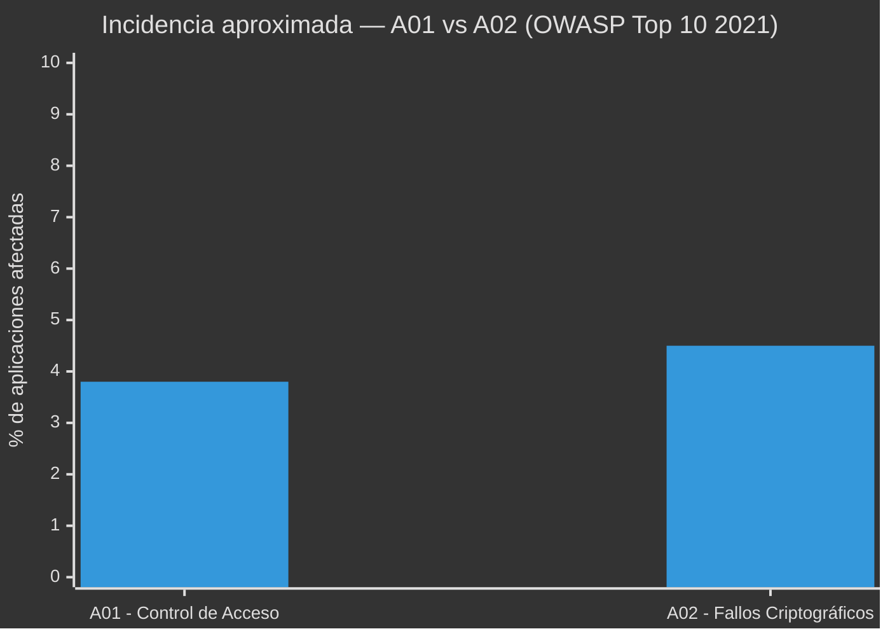
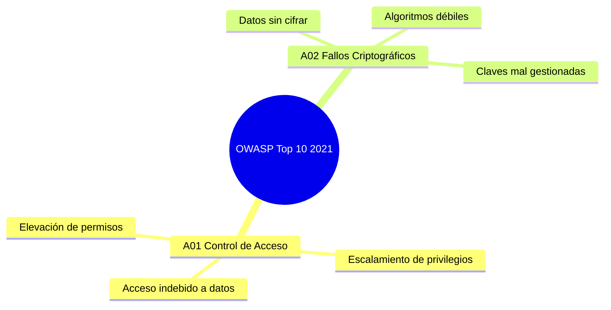

# 🔐 OWASP Top 10 (2021) — A01 y A02: Riesgos de Seguridad en Aplicaciones Web

---

## 👥 Integrantes

| Nombre |
|---|
| William Andres Mosquera Vela |
| Juan Nicolas Pineda Alvarado |
| Johnny Albeiro Mallama Mejia |
| Juan Esteban Contreras Gonzalez |

---

## 📖 Introducción

La seguridad en el desarrollo de software es hoy uno de los pilares fundamentales para proteger la información de los usuarios y la integridad de los sistemas. El **OWASP Top 10** es un documento de referencia elaborado por la *Open Web Application Security Project (OWASP)*, una fundación sin ánimo de lucro dedicada a mejorar la seguridad del software a nivel mundial.

Este documento resume, mediante un consenso amplio de expertos en seguridad, los **diez riesgos más críticos** que afectan a las aplicaciones web. Su propósito es concientizar a desarrolladores, arquitectos de software y equipos de seguridad sobre las vulnerabilidades más comunes y graves, para que puedan prevenirlas desde las primeras etapas del ciclo de vida del desarrollo (diseño, codificación, pruebas y despliegue).

En este repositorio se presenta un análisis detallado de las **dos primeras categorías** de la edición **2021** del OWASP Top 10:

- **A01:2021 — Fallos de Control de Acceso** (la categoría con más incidencia registrada en 2021)
- **A02:2021 — Fallos Criptográficos**

El objetivo es servir como material de estudio y consulta para proyectos académicos y profesionales relacionados con la seguridad informática.

> 📌 Fuente oficial: [owasp.org/Top10/2021](https://owasp.org/Top10/2021/)

---

## 📊 Panorama general

El siguiente gráfico ilustra, de forma aproximada, el porcentaje de aplicaciones analizadas que presentaron cada una de estas dos categorías de vulnerabilidad según los datos recopilados por OWASP para la edición 2021:

---

## 🧩 Detalle de las categorías

### 1️⃣ A01:2021 — Fallos de Control de Acceso

🔒 **¿Qué es?**
El control de acceso es el conjunto de mecanismos que determina qué puede hacer o ver un usuario dentro de una aplicación, según su rol o identidad (por ejemplo, un usuario normal no debería poder ver ni modificar datos de un administrador). Un fallo de control de acceso ocurre cuando estas restricciones no se aplican correctamente en el backend, permitiendo que un usuario actúe fuera de los permisos que le corresponden.

Esta categoría subió de la quinta posición (en la edición 2017) al **primer lugar** en 2021, lo que refleja lo extendido y crítico que es este problema: se detectaron ocurrencias en la gran mayoría de las aplicaciones analizadas por OWASP.

**🧠 Causas más comunes:**
- Verificar permisos solo en el frontend (interfaz visual) y no en el backend (servidor).
- Confiar en el identificador enviado por el propio usuario (IDOR — *Insecure Direct Object Reference*) sin validar si le pertenece.
- No aplicar el principio de "denegar por defecto": otorgar acceso amplio y luego restringir, en vez de al revés.
- Rutas o endpoints de administración accesibles sin autenticación adecuada.
- CORS mal configurado, permitiendo peticiones desde orígenes no autorizados.

**💥 Ejemplos:**
1. Un usuario cambia el valor `id=1023` por `id=1024` en la URL (`miapp.com/perfil?id=1024`) y accede a la información de otra persona.
2. Un empleado normal accede directamente a `/admin/panel` sin que el sistema verifique su rol.
3. Una API permite eliminar registros de otros usuarios simplemente conociendo su identificador (`DELETE /api/pedidos/58`).

**⚠️ Impacto:**
Exposición de datos privados, modificación o eliminación no autorizada de información, fraude, escalamiento de privilegios hasta llegar a comprometer cuentas administrativas.

**🛡️ Recomendaciones de prevención:**
- Aplicar el principio de mínimo privilegio: cada usuario solo accede a lo estrictamente necesario.
- Validar permisos en cada solicitud del lado del servidor, no confiar en el cliente.
- Registrar (loggear) los intentos de acceso denegados para detectar posibles ataques.
- Usar pruebas automatizadas que verifiquen los controles de acceso en cada rol.

---

### 2️⃣ A02:2021 — Fallos Criptográficos

🔑 **¿Qué es?**
Antes llamada "Exposición de Datos Sensibles" (2017), esta categoría fue renombrada para reflejar su causa raíz: fallos en el uso de la criptografía, más que el simple hecho de exponer datos. Ocurre cuando una aplicación no protege adecuadamente la información sensible —contraseñas, datos financieros, información médica, tokens de sesión— ya sea **en tránsito** (mientras viaja por la red) o **en reposo** (mientras está almacenada).

**🧠 Causas más comunes:**
- Transmitir datos sensibles sin cifrado (uso de HTTP en lugar de HTTPS).
- Almacenar contraseñas usando algoritmos débiles o sin "salt" (por ejemplo, MD5 o SHA-1 sin protección adicional) en vez de funciones diseñadas para contraseñas como bcrypt o Argon2.
- Uso de algoritmos de cifrado obsoletos o claves criptográficas demasiado cortas.
- Gestión deficiente de claves: claves cifradas guardadas junto con los datos que protegen, o "hardcodeadas" directamente en el código fuente.
- Certificados SSL/TLS vencidos, autofirmados o mal configurados.

**💥 Ejemplos:**
1. Un formulario de inicio de sesión que envía usuario y contraseña por HTTP en lugar de HTTPS, exponiendo las credenciales a cualquiera que intercepte el tráfico de red.
2. Una base de datos que almacena contraseñas en texto plano o con un algoritmo de hash débil y sin "salt".
3. Una aplicación móvil que guarda tokens de autenticación sin cifrar en el almacenamiento local del dispositivo.

**⚠️ Impacto:**
Robo de credenciales, exposición de datos financieros o médicos, suplantación de identidad, incumplimiento de normativas de protección de datos (como GDPR o leyes locales de habeas data), y pérdida de confianza de los usuarios.

**🛡️ Recomendaciones de prevención:**
- Forzar el uso de HTTPS/TLS en toda la aplicación (incluyendo redirecciones automáticas de HTTP a HTTPS).
- Cifrar los datos sensibles en reposo con algoritmos actualizados y robustos.
- Usar funciones de hash específicas para contraseñas (bcrypt, scrypt o Argon2) en lugar de algoritmos de propósito general.
- Clasificar los datos según su sensibilidad y aplicar controles proporcionales a cada nivel.
- No almacenar datos sensibles que no sean estrictamente necesarios.

---

## 🖼️ Recursos visuales

| Categoría | Icono | Enfoque principal | Ejemplo típico |
|---|---|---|---|
| A01 | 🔒 | Control de acceso | Modificar una URL para ver datos ajenos |
| A02 | 🔑 | Criptografía | Enviar contraseñas por HTTP sin cifrar |

---

## 🎯 Conclusión

Los **Fallos de Control de Acceso (A01)** y los **Fallos Criptográficos (A02)** representan, según OWASP, dos de los riesgos más críticos y frecuentes en las aplicaciones web actuales. El primero falla en decidir *quién puede hacer qué*, y el segundo falla en *proteger la información* una vez que se accede a ella; por eso suelen presentarse combinados en ataques reales. Aplicar controles adecuados —como validación estricta de permisos en el servidor y cifrado robusto de la información— es un primer paso fundamental para reducir la superficie de ataque de cualquier sistema.

---

## 📚 Referencias

- OWASP Foundation. *OWASP Top 10:2021*. Disponible en: https://owasp.org/Top10/2021/
- OWASP Foundation. *OWASP Top Ten Web Application Security Risks*. Disponible en: https://owasp.org/www-project-top-ten/