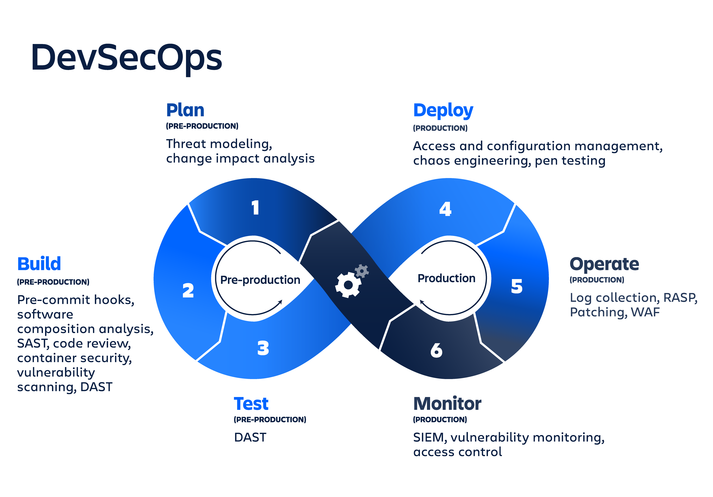

# DEVSECOPS2026_2
**Repositorio Materia Seguridad en Entornos Cloud y DevOps**





## Referencias:

- https://github.com/bagelhole/devops-security-agent-skills
- https://laboratoriolinux.es/index.php/-noticias-mundo-linux-/software/40370-google-libera-un-nuevo-framework-open-source-para-impedir-que-agentes-de-ia-introduzcan-fallos-de-seguridad-en-el-codigo.html
- https://github.com/omerbsezer/


---

# Ejemplo dockerfile:


---

### Paso 1. Ubicarse en el directorio de trabajo

Desde el Símbolo del sistema, se accede a la carpeta deseada:

```cmd
cd G:\UNIMINUTO_2021_2\2026\DOCKERFILE

```

---

### Paso 2. Crear el archivo `index.html`

Se ejecuta el siguiente comando para generar el archivo web con el mensaje solicitado:

```cmd
(
echo ^<!DOCTYPE html^>
echo ^<html lang="es"^>
echo ^<head^>
echo     ^<meta charset="UTF-8"^>
echo     ^<title^>DevSecOps^</title^>
echo ^</head^>
echo ^<body style="font-family: Arial, sans-serif; text-align: center; margin-top: 50px;"^>
echo     ^<h1^>Bienvenidos a DevSecOps^</h1^>
echo ^</body^>
echo ^</html^>
) > index.html

```

---

### Paso 3. Crear el archivo `Dockerfile` (sin extensiones)

Se ejecuta el siguiente bloque para crear el `Dockerfile` optimizado con Debian actualizado:

```cmd
(
echo FROM debian:bookworm-slim
echo RUN apt-get update ^&^& apt-get install -y --no-install-recommends nginx ^&^& rm -rf /var/lib/apt/lists/*
echo COPY index.html /var/www/html/
echo EXPOSE 80
echo CMD ["nginx", "-g", "daemon off;"]
) > Dockerfile

```

---

### Paso 4. Verificar la existencia de los archivos

Se comprueba que ambos archivos se encuentren en el directorio sin extensiones adicionales como `.txt`:

```cmd
dir

```

En la salida deben aparecer listados:

* `Dockerfile`
* `index.html`

---

### Paso 5. Construir la imagen Docker

Se compila la imagen asignándole la etiqueta `devops`:

```cmd
docker build -t devops .

```

---

### Paso 6. Ejecutar el contenedor

Una vez finalizada la construcción, se inicia el contenedor mapeando el puerto `8080` del host al puerto `80` interno:

```cmd
docker run -d -p 8080:80 --name servidor-devsecops devops

```

---

### Paso 7. Comprobar el funcionamiento

Se abre el navegador web y se ingresa a:

```text
http://localhost:8080

```

En pantalla se observará el encabezado con el mensaje **Bienvenidos a DevSecOps**.
